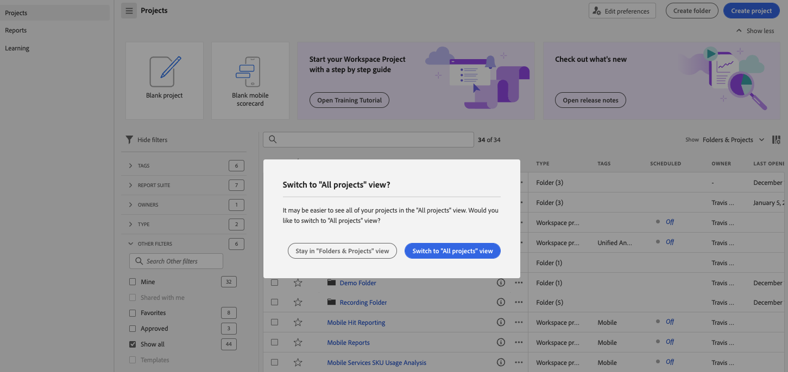

# Adobe Analytics landing page

The landing page for Adobe Analytics brings together both [!DNL Analysis Workspace] and [!DNL Reports & Analytics] in a single interface and access point under the [!DNL Workspace] umbrella. It features a project manager home page, an updated reports menu, modernized reports, and a learning section to help you with getting started more effectively. Here is a video overview:

>[!VIDEO](https://video.tv.adobe.com/v/334278/?quality=12)

## New landing page features {#new-features}

| Feature | Description | Screenshot |
| --- | --- | --- |
| Expand [!UICONTROL Projects] table to full screen | To expand the table, just click the hamburger menu icon. This action will collapse the left-rail tabs. |  |
| Customize column width | Previously, the column width was fixed. Now you can adjust it by dragging the column separator. |   |
| Reorder pinned items | To move pinned items up and down, click the ellipsis next to the pinned item and select **[!UICONTROL Move up]** or **[!UICONTROL Move down]**. |  |
| New table columns | Click the [!UICONTROL Customize table] icon at the top right of the table. New table columns include: <ul><li>**[!UICONTROL Scheduled]**: Set to [!UICONTROL On] when a project is scheduled or [!UICONTROL Off] when it is not. Clicking the [!UICONTROL On] link lets you see information about the scheduled project. You can also [edit the project schedule](/help/analyze/analysis-workspace/curate-share/t-schedule-report.md) if you are the project owner.</li><li>**[!UICONTROL Project ID]**: The project ID can be used for debugging projects.</li><li>**[!UICONTROL Longest Date Range]**: Longer date ranges increase project complexity and may increase processing and load times. </li><li>**[!UICONTROL Number of Queries]**: The total number of requests made to Analytics when the project loads. A higher number of project queries increases project complexity and may increase processing and load times. This data is available only after a project has loaded or a scheduled project was sent. </li></ul> |   |
| Single click to open a report | Previously, you had to double click. |  |
| New links to **[!UICONTROL Reports & Analytics]** reports | <ul><li>**[!UICONTROL Reports]** > **[!UICONTROL Audience]** > **[!UICONTROL Bots]**</li><li>**[!UICONTROL Reports]** > **[!UICONTROL Audience]** > **[!UICONTROL Bot Pages]**<li>**[!UICONTROL Reports]** > **[!UICONTROL Engagement]** > **[!UICONTROL Real-Time]**</li></ul> |  |
| New out-of-the-box reports | <ul><li>**[!UICONTROL Reports]** > **[!UICONTROL Most popular]** > **[!UICONTROL Next page]**</li><li>**[!UICONTROL Reports]** > **[!UICONTROL Most popular]** > **[!UICONTROL Previous page]**</li><li>**[!UICONTROL Reports]** > **[!UICONTROL Engagement]** > **[!UICONTROL Page analysis]** > **[!UICONTROL Page summary]**</li></ul>Note that these reports are in [!UICONTROL Workspace] format and require configuration and build. The output consists of a panel of high-level metrics, trended data, [!UICONTROL Flow] visualization, and more. You can modify these reports and change dimensions, dimension items, etc. These reports are also available as panels under Workspace panels. |  |
| **[!UICONTROL Create Project]** modal is back | When you click **[!UICONTROL Create Project]** in Workspace, you once again get the choice between a [!UICONTROL Blank project] and a [!UICONTROL Blank mobile scorecard]. You can also choose from any templates your company has created. |  |
| Also available in Customer Journey Analytics | This landing page, in a modified form, is also available in Customer Jourey Analytics. |  |

{style="table-layout:auto"}

## Top menu structure {#top-menu}

* Top Analytics menu: Most reports are now in the [!UICONTROL Reports] menu in the left rail.
* The left rail has three tabs: [!UICONTROL Projects], [!UICONTROL Reports], and [!UICONTROL Learning].

### Terminology 

* **[!UICONTROL Projects]** are customized designs that combine data components, tables, and visualizations that you built or that someone else built and shared with you. [!UICONTROL Projects] also refers to blank projects and blank mobile scorecards.
* **[!UICONTROL Reports]** refers to anything that was pre-built by Adobe, such as reports in Reports & Analytics and templates in Workspace.
* **[!UICONTROL Templates]** is no longer used as a term for Adobe's pre-built Workspace projects. They are now under [!UICONTROL Reports]. The term [!UICONTROL Templates] is still used for templates your company created.

## Navigate the [!UICONTROL Projects] tab {#navigate-projects}

[!UICONTROL Projects] serves as the [!UICONTROL Workspace] home page. The Projects tab displays the Company folder, any personal folders you created, your projects, and Mobile scorecards. Use this page to view, create, and modify folders, projects, and mobile scorecards. For more information, see [About Folders in Analytics](/help/analyze/analysis-workspace/build-workspace-project/workspace-folders/about-folders.md).

>[!NOTE]
>
>Several of the following settings persist during the session and across sessions. For example, the tab you selected, the selected filters, selected columns, and the column sort direction. Search results are not persistent.

| UI element | Definition |
| --- | --- |
| Edit preferences | Lets you [!UICONTROL View Tutorials], and [Edit user preferences](/help/analyze/analysis-workspace/user-preferences.md). |
| [!UICONTROL Create new] | Opens the project modal where you can create a Workspace project or a Mobile scorecard or open a company template.  |
| [!UICONTROL Show less  Show more] | Toggles between not showing and showing the banner:  |
| [!UICONTROL Workspace project] | Creates a blank [Workspace project](https://experienceleague.adobe.com/docs/analytics/analyze/analysis-workspace/home.html) for you to  design and build. |
| [!UICONTROL Mobile scorecard] | Creates a blank [mobile scorecard](https://experienceleague.adobe.com/docs/analytics/analyze/mobapp/curator.html) for you to design and build. |
| [!UICONTROL Open Training Tutorial] | Opens the Workspace training tutorial that guides you through the process of building a new starter project in a step-by-step tutorial.|
| [!UICONTROL Open release notes] | Opens the Adobe Analytics section of the latest Adobe Experience Cloud release notes. |
| Filter icon | Filters by tags, report suites, owners, types, and other filters (Mine, Shared with me, Favorites, and Approved)  |
| Search bar | Searches all columns in the table. |
| Selection box | Selects one or more projects to display the project management actions you can perform: **Delete**, **Share**, **Rename**, **Copy**, **Unpin**, **Move Up**, **Move Down**, **Tag**, **Approve**, **Export CSV**, and **Move to**. You may not have permissions to perform all listed actions. |
| [!UICONTROL Favorites] | Adds a star next to a favorite project or folder that can be used as a filter. |
| [!UICONTROL Name] | Identifies the name of the project. |
| Pin icon | Pins items so they always appear at the top of your list but you can re-adjust the order by moving them up or down in the order. Use the ellipsis option menu and select **Move Up** or **Move down** in the list. |
| Info (i) icon | Displays the following information about a project: Type, Project Role, Owner, Description, and who it is shared with. It also indicates who can [edit or duplicate](https://experienceleague.adobe.com/docs/analytics/analyze/analysis-workspace/curate-share/share-projects.html) this project. |
| Ellipsis (...) | Displays the project management actions you can perform: **Delete**, **Share**, **Rename**, **Copy**, **Unpin**, **Move Up**, **Move Down**, **Tag**, **Approve**, **Export CSV**, and **Move to**. You may not have permissions to perform all listed actions. |
| [!UICONTROL Type] | Indicates whether this type is a Workspace project, a Mobile scorecard, or a folder. |
| [!UICONTROL Tags] | Tags projects to organize them into groups. |
| [!UICONTROL Project Role] | Identifies the project roles: whether you are the project Owner and whether you have permissions to Edit or Duplicate the project.  |
| [!UICONTROL Report Suite] | Identifies the Report Suites that are associated with the project. Tables and visualizations within a panel derive data from the report suite selected in the top right of the panel. The report suite also determines what components are available in the left rail. Within a project, you can use one or many report suites depending on your analysis use cases. The list of report suites is sorted on relevance. Adobe defines relevance based on how recently and frequently the suite has been used by the current user, and how frequently the suite is used within the organization. |
| [!UICONTROL Owner] | Identifies the person who created the project. |
| [!UICONTROL Last opened] | Identifies the date you last opened the project. |
| Customize table icon | Selects which columns to view in the table. To add or remove columns from the list of projects, click the column icon ( ) in the top-right, then select or deselect column titles.|
| SHOW: Folders & Projects or All Projects | Changes the view setting on the table to show folders and projects according to your folder organization **or** show all of your projects in an unorganized list. |
| < (Back button) | Returns you to your most recent landing page configuration in a Workspace project or a report. The page configuration you had when you left the landing page will persist when you return. |

### Deprecation of the Project Manager Page {#deprecate-pm-page}

With the release of the new landing page, we deprecated Project Manager as listed under the Components manager. The new landing page handles all of the functionality of the old Project Manager page and more. 
 
One common use case for the Project Manager page was to view all your projects. 

To view all of your projects on the new landing page by using the filter rail, select **OTHER FILTERS** and then select **Show all**. 

If you're in the "Folders & Projects" view, a modal will pop-up asking if you want to switch to the "All projects" view which makes it easier to view all of your projects outside of any folders that they may be organized in.   Select **Switch to "All projects" view** to better view all of the projects you have access to. 

Another use case for Admins is to manage company reports in order to delete, rename, tag, or approve reports. For information about managing reports, see [Managing company reports](#manage-company-reports).

## Navigate the [!UICONTROL Reports] tab {#navigate-reports} 

The [!UICONTROL Reports] tab consolidates three sets of reports:

* The pre-built [!UICONTROL Workspace] templates that were previously located under [!UICONTROL Workspace] > [!UICONTROL Project] > [!UICONTROL New]. Adobe no longer uses the word "template" in this context.
* Most of the pre-built reports under the previous Adobe Analytics [!UICONTROL Reports] top menu. These reports are now displayed in [Analysis Workspace](https://experienceleague.adobe.com/docs/analytics/analyze/analysis-workspace/home.html).

>[!IMPORTANT]
>
>Under Reports, a Favorites folder shows up only if you mark a new report as a favorite. No pre-existing Reports & Analytics favorites are carried forward.

As previously mentioned, only the most commonly used reports that were formerly grouped in Reports & Analytics are available here. A handful of rarely used or no-longer-relevant reports were not migrated over. See the FAQ below for more detail.

### Menus and submenus {#menus}

Here are the menus and their submenus. If you cannot find a specific report, do a "Search on page" to find it.

| Menu item | Reports under this menu item | 
| --- | --- |
| **[!UICONTROL Most Popular]** | <ul><li>Training Tutorial (Pre-existing Workspace template)</li><li>Pages (What are my top pages?)</li><li>Page views (How many page views am I generating?)</li><li>Visits (How many visits am I getting?)</li><li>Visitors (How many visitors am I getting?)</li><li>Key metrics (How are my most important metrics performing?)</li><li>Site sections (Which sections of my site generated the most page views?</li><li>Next page (What are the next pages my visitors go to?)</li><li>Previous page (What are the previous pages my visitors went to?)</li><li>Campaigns (What campaigns are driving my key metrics?)</li><li>Products (What products are driving my key metrics?)</li><li>Last touch channel (Which last touch channel is performing best?</li><li>Last touch channel detail (Which specific last touch channel is outperforming others?)</li><li>Revenue (How is my revenue performing?)</li><li>Orders (How are my orders performing?)</li><li>Units (How many units am I selling?)</li></ul> |
| **[!UICONTROL Engagement]** | <ul><li>Key metrics (How are my most important metrics performing?)</li><li>Page views (How many page views am I generating?)</li><li>Pages (What are my top pages?)</li><li>Visits (How many visits am I getting?)</li><li>Visitors (How many visitors am I getting?)</li><li>Time spent per visit (How much time do my users spend per visit?)</li><li>Time prior to event (How much time do my users spend prior to a success event?)</li><li>Site sections (Which sections of my site generated the most page views?</li><li>Web content consumption (Which content is consumed most and is engaging users?)</li><li>Media content consumption (Which content is consumed most and is engaging users?)</li><li>Next and previous page flow (What are/were the next/previous paths my visitors take/took?)</li><li>Fallout (Where am I seeing fallout through my digital properties?)</li><li>Cross-device analysis (Using cross-device analysis in Analysis Workspace)</li><li>Web retention (Who are my loyal users and what do they do?)</li><li>Media audio consumption (What are trends and top metrics of audio consumption?)</li><li>Media recency, frequency, loyalty (Who are my loyal readers?)</li><li>Page analysis > Reloads (Which pages generate the most reloads?)</li><li>Page analysis > Time spent on page (How much time do my users spend on my pages?)</li><li>Entries & exits > Entry pages (What are my top entry pages?)</li><li>Entries & exits > Original entry pages (What page did my visitor originally enter from?)</li><li>Entries & exits > Single-page visits (Which pages generated the most single-page visits?)</li><li>Entries & exits > Exit pages (What are my top exit pages?)</li></ul> |
| **[!UICONTROL Conversion]** | <ul><li>Products > Products (Which products are driving my key metrics?)</li><li>Products > Product performance (Which products are performing best?)</li><li>Products > Categories (What are my best performing product categories?</li><li>Shopping cart > Carts (How many users added a product to cart?</li><li>Shopping cart > Cart views (How many times did my visitors view their carts?)</li><li>Shopping cart > Cart additions (How often are users adding a product to their cart?)</li><li>Shopping cart > Cart removals (How often are users removing a product from their cart?)</li><li>Purchases > Revenue (How is my revenue performing?)</li><li>Purchases > Orders (How are my orders performing?)</li><li>Purchases > Units (How many units am I selling?)</li><li>[Magento: marketing and commerce](https://experienceleague.adobe.com/docs/analytics/analyze/analysis-workspace/build-workspace-project/starter-projects.html#commerce)</li></ul> |
| **[!UICONTROL Audience]** |<ul><li>People metric (How many people are interacting with my brand?)</li><li>Visitor profile > Location overview (Which locations are driving the most usage among users)</li><li>Visitor profile > Geosegmentation > Geo Counties, Geo US States, Geo Regions, Geo Cities, Geo US DMA (Which geographies are my users visiting from?)</li><li>Visitor profile > Languages (Which language do my users prefer?)</li><li>Visitor profile > Time zones (Which time zones are my users visiting from?)</li><li>Visitor profile > Domains (Which ISPs are my visitors using to access my site?)</li><li>Visitor profile > Top level domains (Which domains are driving traffic to my site?)</li><li>Visitor profile > Technology > Technology overview (What technologies are people using to access my site?)</li><li>Visitor profile > Technology > Browsers, Browser type, Browser width, Browser height (Which company's browser, browser version, and its width and height, are people using to access my site?)</li><li>Visitor profile > Technology > Operating system, Operating system types (Which OS and which version of it do my visitors use?)</li><li>Visitor profile > Technology > Mobile carrier (Which mobile carriers do my visitors use to access my site?)</li><li>Visitor retention > Return frequency (How much time passes between my user's current visit and previous visits?)</li><li>Visitor retention > Return visits (How many of my visits are returning users?)</li><li>Visitor retention > Visit number (Which visit number bucket drives most of my key metrics)</li><li>Visitor retention > Sales cycle > Customer loyalty (Which loyalty segment do my users belong to?)</li><li>Visitor retention > Sales cycle > Days before first purchase (How many days passed between my users' first visit and their first purchase?)</li><li>Visitor retention > Sales cycle > Days since last purchase (How many days have passed between my users' current visit and their last purchase? )</li><li>Visitor retention > Mobile > Devices and Device types (Which devices and device types are my visitors using?)</li><li>Visitor retention > Mobile > Manufacturer (Which mobile device manufacturer do my visitors use?)</li><li>Visitor retention > Mobile > Screen size, Screen height, Screen width (Which mobile screen size/height/width do my visitors have?)</li><li>Visitor retention > Mobile > [Mobile app usage](https://experienceleague.adobe.com/docs/analytics/analyze/analysis-workspace/build-workspace-project/starter-projects.html#mobile)</li><li>Visitor retention > Mobile > [Mobile app journeys](https://experienceleague.adobe.com/docs/analytics/analyze/analysis-workspace/build-workspace-project/starter-projects.html#mobile)</li><li>Visitor retention > Mobile > [Mobile app metrics](https://experienceleague.adobe.com/docs/analytics/analyze/analysis-workspace/build-workspace-project/starter-projects.html#mobile)</li><li>Visitor retention > Mobile > [Mobile app messaging](https://experienceleague.adobe.com/docs/analytics/analyze/analysis-workspace/build-workspace-project/starter-projects.html#mobile)</li><li>Visitor retention > Mobile > [Mobile app performance](https://experienceleague.adobe.com/docs/analytics/analyze/analysis-workspace/build-workspace-project/starter-projects.html#mobile)</li><li>Visitor retention > Mobile > [Mobile app retention](https://experienceleague.adobe.com/docs/analytics/analyze/analysis-workspace/build-workspace-project/starter-projects.html#mobile)</li></ul> |
| **[!UICONTROL Acquisition]** |<ul><li>Marketing channels > First touch channel, First touch channel detail (Which first touch channel, and which specific first touch channel is performing best?)</li><li>Marketing channels > First last channel, First last channel detail (Which last touch channel, and which specific last touch channel is performing best?)</li><li>Campaigns > Campaigns (Which campaigns are driving my key metrics?)</li><li>Campaigns > Campaign performance (What campaigns are driving the most revenue?)</li><li>Campaigns > Tracking code (Which campaign tracking codes perform the best?)</li><li>[Web acquisition](https://experienceleague.adobe.com/docs/analytics/analyze/analysis-workspace/build-workspace-project/starter-projects.html#web)</li><li>[Mobile acquisition](https://experienceleague.adobe.com/docs/analytics/analyze/analysis-workspace/build-workspace-project/starter-projects.html#mobile)</li><li>[Advertising Analytics: paid search](https://experienceleague.adobe.com/docs/analytics/analyze/analysis-workspace/build-workspace-project/starter-projects.html#advertising)</li><li>Search keywords - all, paid, natural (Which search keywords and paid/natural search keywords drive my key metrics the best?)</li><li>Search engines - all, paid, natural (Which search engines and paid/natural search engines drive my key metrics the best?)</li><li>All search page ranking (Which search page are my users visiting from?)</li><li>Referring domains (Which domains are driving traffic to my site?)</li><li>Original referring domains (What was the first domain users were on before visiting my site?)</li><li>Referrers (Which URLs were my users on before clicking through to my site?)</li><li>Referrer types (Which category do my referring URLs belong to?)</li></ul> |

### Location of templates (now called reports) {#templates}

| Report (template) name | Report location |
| --- | --- |
| Training Tutorial | Most Popular > Training tutorial |
| Web Content Consumption | Engagement > Web Content Consumption |
| Media Content Consumption | Engagement > Media Content Consumption |
| Cross-Device Analysis | Engagement > Cross-Device Analysis |
| Web Retention | Engagement > Web Retention |
| Media Audio Consumption | Engagement > Media Audio Consumption |
| Media Recency, Frequency, Loyalty | Engagement > Media Recency, Frequency, Loyalty |
| ITP Impact | Engagement > ITP Impact |
| Product Performance | Conversion > Products > Product Performance |
| Magento: Marketing & Commerce | Conversion > Magento: Marketing & Commerce |
| People Metric | Audience > People Metric |
| Location Overview | Audience > Visitor Profile > Location Overview |
| Technology Overview | Audience > Visitor Profile > Technology > Technology Overview |
| Mobile App Usage | Audience > Mobile > Mobile App Usage |
| Mobile App Journeys | Audience > Mobile > Mobile App Journeys |
| Mobile App Metrics | Audience > Mobile > Mobile App Messaging |
| Mobile App Performance | Audience > Mobile > Mobile App Performance |
| Mobile App Retention | Audience > Mobile > Mobile App Retention |
| Campaign Performance | Acquisition > Campaigns > Campaign Performance |
| Mobile Acquisition | Acquisition > Mobile Acquisition |
| Web Acquisition | Acquisition > Web Acquisition |
| Advertising Analytics: Paid Search | Acquisition > Advertising Analytics: Paid Search |

### Use the Reports tab {#use-reports}

For current users of Reports & Analytics, here is a short intro on how to use the reports you are used to and that now display within Workspace. Reports act like existing templates: if you make changes to them, you get prompted to save/discard your changes when navigating away or to a different report. And if you do want to save changes, it saves the report as a new project.

1. Go to the [!UICONTROL Reports] tab.
1. Select the report you want to view, for example, under [!UICONTROL Most popular], select the [!UICONTROL Pages] report.
1. To the right, click **[!UICONTROL Open report]**.

   

1. The Pages report, as displayed in Analysis Workspace, shows two [visualizations](/help/analyze/analysis-workspace/visualizations/freeform-analysis-visualizations.md) ([Bar chart](/help/analyze/analysis-workspace/visualizations/bar.md) and [Summary number](/help/analyze/analysis-workspace/visualizations/summary-number-change.md)) and a [Freeform table](/help/analyze/analysis-workspace/visualizations/freeform-table/freeform-table.md). The metric used is Occurrences.
1. From here, you have multiple options. Here are some of those options:

   * You can use the report as is.
   * You can drag one or more segments into the Segment drop zone at the top. For example, drag the segment [!UICONTROL Mobile Customers] and watch the results change. 
   * You can change the date range by going to the calendar at the top right.
   * You can add dimension breakdowns, drag in other metrics, and generally customize the report in any way you wish.

### Create a custom company report {#company-report}

Custom reports created and saved for others in your login company to use, are called company reports. Previously created company reports and newly created company reports are listed in the Create Project modal as shown below.

To create a new Company report, 

1. Build the Workspace to your desired state.
1. Open the [!UICONTROL Project] menu and click **[!UICONTROL Save as company report…]**.
   
   

1. Add all desired fields to the modal and save it.

   The report is added to the Company Reports list in the Create Project modal and is available to those in your login company. 

More learning options:

* Notice that you have access to a 20-minute video overview of Analysis Workspace at the top left of any report you open.
* For new users, we recommend the [Training Tutorial](https://www.youtube.com/watch?v=lCH1Kl1q9Wk) video that walks you through building a new project.
* Here is a link to the [complete Analysis Workspace documentation](/help/analyze/analysis-workspace/home.md).
* Here is the complete [YouTube playlist for Analysis Workspace](https://www.youtube.com/playlist?list=PL2tCx83mn7GuNnQdYGOtlyCu0V5mEZ8sS).

### Managing company reports {#manage-company-reports}

Admins can filter the project list to display and manage company reports. Pinned items remain pinned followed by the list of company reports that are identified by the  report icon . In this view, you can delete, rename, tag, or approve one or more reports.

To display and manage company reports

1.  In the filter rail, select **OTHER FILTERS** and then select **Company reports**. 
    A list of the company reports are displayed. All regular projects, unless they're pinned, are not displayed.

    

    With company reports displayed, Admins can delete, rename, add a tag, or approve the report. 

1.  In the report list, select a single report or select multiple reports.

1.  Click the **...** elilpsis icon next to a report to view the available options (Delete, Rename, Tag, and Approve). 

    

1.  Select an option (Delete, Rename, Tag, and Approve).

1.  To return to the regular view when your done, in the filter rail, uncheck the Company reports option again.

### Delete a company report

Admins can delete a report using the Company report list option (described above) or delete a report from the Create project modal.

## Use the Learning tab {#navigate-learning}

The Learning page contains hands-on video tours, tutorials, and links to documentation.

Use the Learning page in Adobe Analytics to learn beginner, intermediate, or advanced features and use-cases in Adobe Analytics.

### Access the Learning page

1. In Adobe Analytics, select [!UICONTROL **Workspace**] > [!UICONTROL **Learning**].

### Learning page features

* **Filter content:** The Filter icon in the left rail allows you to filter learning content by experience level (Beginner, Intermediate, or Advanced) and by content type (Document, Video, or Tours & tutorials).
* **Track progress:** After you select a piece of content, a **[!UICONTROL Viewed]** tag appears. This tag helps you track your progress through the learning content. You can select the **[!UICONTROL Viewed]** tag to remove it from a piece of content.
* **View additional content:** While viewing any video, select the **[!UICONTROL Learn more]** button to view related documentation content on Experience League. Or, from the Learning page, select either of the following options to view additional content:
  * **[!UICONTROL Visit YouTube]:** View the full Analysis Workspace YouTube playlist.
  * [!UICONTROL **Visit Experience League**]: View the full suite of Adobe Analytics documentation on Experience League. 
* **Fundamentals for new users:** The [!UICONTROL Workspace Fundamentals] tour is recommended for new users. This tour takes you directly to Workspace and walks you through the most common actions. This tour can also be relaunched any time in Workspace via the tooltip pop-over from the panel header.

## Set your landing page {#set-landing}

Users can set their preferred landing page.

1. Go to Analytics > [!UICONTROL Components] > [!UICONTROL Preferences] > [!UICONTROL General].
1. Check which landing page you would prefer:

   

## Hide Report tab {#hide-reports}

Admins can hide the Reports tab for all users within their organization.

1. Go to [!UICONTROL Analytics] > [!UICONTROL Components] > [!UICONTROL Preferences] > [!UICONTROL Company].
1. Check **[!UICONTROL Hide Reports Tab]**.

## Landing page FAQ {#landing-faq}

| Question | Answer |
| --- | --- |
| Where are the templates that I am used to seeing in [!UICONTROL Workspace]? | These templates are grouped under the [!UICONTROL Reports] tab. |
| Does the work I do in the beta program UI carry over to the production [!UICONTROL Workspace] experience? | Yes, any work done in the beta carries over to the old/current [!UICONTROL Workspace] experience. |
| Are my current [!DNL Reports & Analytics] favorites carried over? | No, they are NOT carried forward. However, any [!UICONTROL Workspace] project favorites are carried over. |
| Is there a maximum number of projects I can pin? | No, there is no limit on the number of projects you can pin. |
| Can admins designate this landing page for their users? | No, admins cannot designate the landing page on behalf of users. Individual users must turn on the toggle themselves. |
| Are all reports that currently exist in [!DNL Reports & Analytics] still available? | No, the following reports were phased out, based on overall usage data: <ul><li>Any custom eVars/props/events/classifications<li>My Recommended Reports</li><li>Hourly/Daily/Weekly/Monthly/Quarterly/Yearly unique visitors</li><li>DailyWeekly/Monthly/Quarterly/Yearly unique customers</li><li>Action name depth</li><li>Action name summary</li><li>Add dashboard</li><li>Age</li><li>Audio support</li><li>Billing information</li><li>Clicks to page</li><li>Color depth</li><li>Cookie support</li><li>Cookies</li><li>Connection types</li><li>Creative elements</li><li>Credit card type</li><li>Cross sell</li><li>Custom event funnels</li><li>Custom links</li><li>Customer ID</li><li>Day of week</li><li>Entry action name</li><li>Exit action name</li><li>Exit links</li><li>Fallout</li><li>File downloads</li><li>Find in store</li><li>Full paths</li><li>Gender</li><li>Hit ype VISTA rule</li><li>Image support</li><li>Java</li><li>JavaScript</li><li>JavaScript version</li><li>Manage bookmarks</li><li>Manage dashboards</li><li>Monitor color depth</li><li>Monitor resolutions</li><li>Newsletter signups</li><li>Next action name</li><li>Next action name flow</li><li>Null searches</li><li>Operating system</li><li>Order review</li><li>Page of day</li><li>Pages not found</li><li>Pathfinder</li><li>Path length</li><li>Previous action name</li><li>Previous action name flow</li><li>Product activity</li><li>Product cost</li><li>Product department</li><li>Product inventory category</li><li>Product name</li><li>Product reviews</li><li>Product season</li><li>Product shares</li><li>Product zooms</li><li>Reload</li><li>Searches</li><li>Servers</li><li>Single page visits</li><li>Shipping information</li><li>Site hierarchy</li><li>Social mentions</li><li>Time of day</li><li>Time spent on action name</li><li>Video support</li><li>Visitor state</li></ul> |
