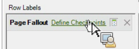

# Filter a Fallout Report Using the Request Wizard

Describes the steps involved in applying filters to a fallout report.

This example shows the Page Fallout report.

1. In Adobe Report Builder, click **[!UICONTROL Create]** to open the Request Wizard.
1. Select the right report suite.
1. In the tree view on the left, select **[!UICONTROL Paths]** > **[!UICONTROL Page]** > **[!UICONTROL Page Fallout]**.

   

1. Configure the appropriate [date ranges](/help/analyze/report-builder/data-requests/configuring-report-dates/custom-calendar.md).
1. Click **[!UICONTROL Next]**.
1. In Step 2 of the Wizard, under **[!UICONTROL Row Labels]**, click the **[!UICONTROL Define Checkpoints]** link. (In a fallout report, you always have to define path elements, unlike in a path report, where a pattern is pre-applied.)

   

1. Select the **[!UICONTROL Filter]** option.

1. In the **[!UICONTROL Define Site Section Fallout Checkpoints]** dialog, define checkpoints from a range of cells or from a list. Then click **[!UICONTROL OK]**.
1. Decide whether to select from a range of cells or from a list.
1. If you select from a list, click **[!UICONTROL Add]** to select checkpoints to add to the fallout path. You can define between 3 and 8 checkpoints. (Search for available elements by clicking **[!UICONTROL More]**.)

   For more information on refining the filter, see [Filter Dimensions](/help/analyze/report-builder/layout/c-filter-dimensions/filter-dimensions.md). 1. Move **[!UICONTROL Available Elements]** from the left column to the right by selecting them and clicking the orange arrow.
1. Click **[!UICONTROL OK]** three times, then click **[!UICONTROL Finish]**.

   The report should refresh now.
