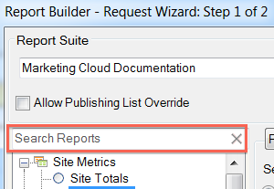

# Report types overview

You can select the base report type for your data request, such as Site Metrics, Site Content, and Video.

You can choose only one base report type for a range of spreadsheet cells. If you are editing a previously created request, you can change the report type on the [!UICONTROL Request Wizard: Step 1] window without reconfiguring other settings in the request.

You can search for reports using the auto-complete search bar. After selecting a report from this control, the tree view automatically selects the matching node.

