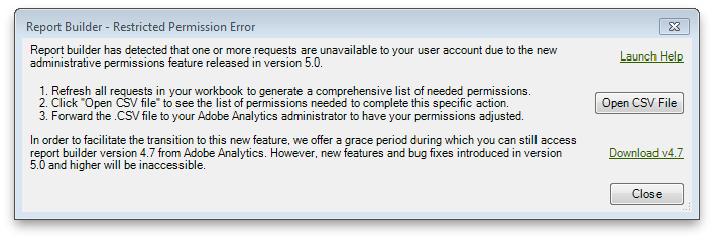

# User access permissions for dimensions and metrics

Adobe Report Builder features permission settings that are similar to those in the Analytics Admin Tools.

As a non-Admin user, you may have previously created workbooks with requests that point to dimensions and metrics that you do not have access to. These permissions are now enforced.

For example, if you refresh a request that includes dimensions or metrics to which you have no access, you will get a Restricted Permission Error. The error message states a request is unavailable to your user account due to administrative permissions.

Follow these instructions for **each** Report Builder workbook that you maintain:

1. Open the workbook.
1. Refresh all requests.
1. If you get prompted with a User Access Permission error, click **[!UICONTROL Open CSV File]** to get access to the list of restricted permissions errors.
1. Create a file "AllRestrictedPermissionErrors.xlsx" and copy/paste the list of restricted permission errors form the CSV file into this file.
1. Close the Report Builder workbook.

Once you have processed all workbooks, you should have a comprehensive list of restricted permission errors in "AllRestrictedPermissionErrors.xlsx". Send this list to your Adobe Analytics user access administrator, asking him to grant you access to the metrics and dimensions.
