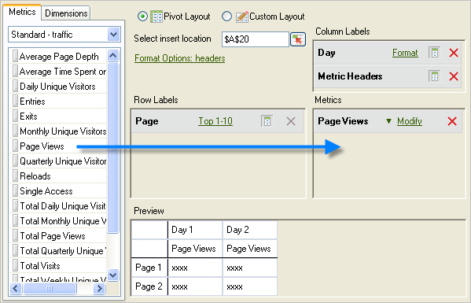

# Add metrics and dimensions

Steps to add metrics and dimensions to a request.

1. Use the [!UICONTROL Request Wizard: Step 1] form to [Create the data request](/help/analyze/report-builder/data-requests/data-requests.md)  then click **[!UICONTROL Next]**.
1. In the [!UICONTROL Request Wizard: Step 2] form, double-click metrics, or drag them to the desired position.

   

    When you add metrics, they are not removed from the [!UICONTROL Metrics] tab, because you can display metrics multiple times within a request. For example, you can display the metric subtotal in addition to each value. However, the list of available metrics changes each time you add or remove a dimension.

    You can add only metrics to the [!UICONTROL Metrics] layout section. Metrics are added to the [!UICONTROL Column Label] layout as a [!UICONTROL Metric Header]. If you move a [!UICONTROL Metric Header] from [!UICONTROL Column Layout] to [!UICONTROL Row Layout], it is displayed there and is used as a metric as a breakdown.

    Note that a Search bar is shown on the Metrics tab, just above the Metric list.

    

## Guidelines

Consider the following guidelines when you add metrics and dimensions.

* When you enter a search term, the list automatically updates to display metrics that have labels matching the search term.
* The match is case insensitive and equivalent to a *contains* search.
* Full-word searches and other special search flags (starts with, ends with, AND, OR, etc.) are not supported.

The search term is cleared if you exit the Request Wizard when you click [!UICONTROL Finish] or [!UICONTROL Cancel], or go back to Request Wizard Step 1, or change the Metric category.

The search term isn't cleared:

* When you drag and drop (or double click) a metric item from the list so it gets added to the Pivot Layout/Custom Layout Metrics Panel.
* When you remove a metric item(s) from the Pivot Layout/Custom Layout Metric Panel.
* When you click the Dimension tab, then return to the Metric tab.
* When you invoke other sub forms (modal or modeless) that upon exit will return to the Request Wizard Step 2. Examples of these forms are

    * Dimension Filter Forms 
    * Date Range Formatting Forms 
    * Format Options Form 
    * Prepend-Postpend Text Form 
    * Output Range Location Form

## Sort a request by metric

You can optionally sort a request by metric.

To sort a request by metric

1. Click the metric label.
1. Add dimensions. Add dimensions the same way that you add metrics. See Steps 1 and 2 above.

   On the [!UICONTROL Dimensions] tab, the system displays dimensions that break down or are a classification of any base report you select on [!UICONTROL Request Wizard: Step 1], and on the configuration of the report suite. When you drop a dimension to the layout grids, it's removed from the tree view and recalculates the list of remaining dimensions available.

   The [!UICONTROL Date] dimension is added automatically. Available date dimensions change depending on the selected granularity from the [!UICONTROL Request Wizard: Step 1]. Valid values are:

   * Hour
   * Day
   * Week
   * Month 
   * Year
   * Date range (when no granularity is specified)

1. Modify metrics and dimensions by configuring [format options](/help/analyze/report-builder/layout/t-format-display-headers.md) and filters.
1. Click **[!UICONTROL Finish]**.
In the following example, dimensions relate to the [!UICONTROL Page] metric. The [!UICONTROL Referring Domain] dimension creates a breakdown report between [!UICONTROL Page] and [!UICONTROL Referring Domain]. The [!UICONTROL Dimension] tab is updated with only dimensions that you can add to a breakdown report.

   
