# Create a mobile scorecard

The following information instructs curators of Adobe Analytics data on how to configure and present mobile scorecards for executive users. To start with, you can view the Adobe Analytics dashboards Scorecard Builder video:

>[!VIDEO](https://video.tv.adobe.com/v/34544)

An Adobe Analytics scorecard displays key data visualizations for executive users in a tiled layout, as shown below:

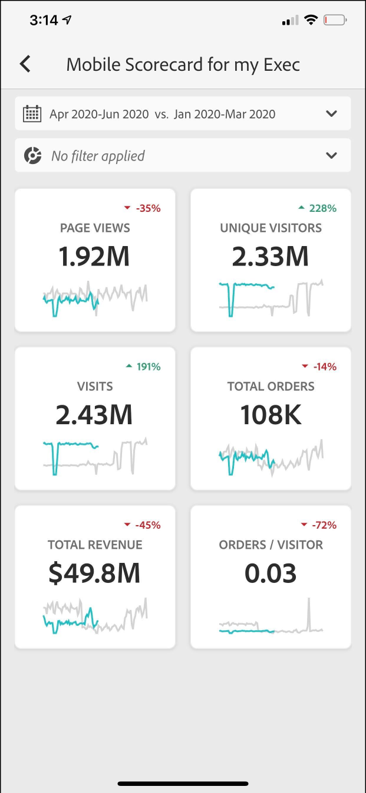

As a curator of this scorecard, you can use the Scorecard Builder to configure which tiles appear on the scorecard for your executive consumer. You also configure how the detailed views, or the breakdowns, can be adjusted once the tiles are tapped. The Scorecard Builder interface is shown below:

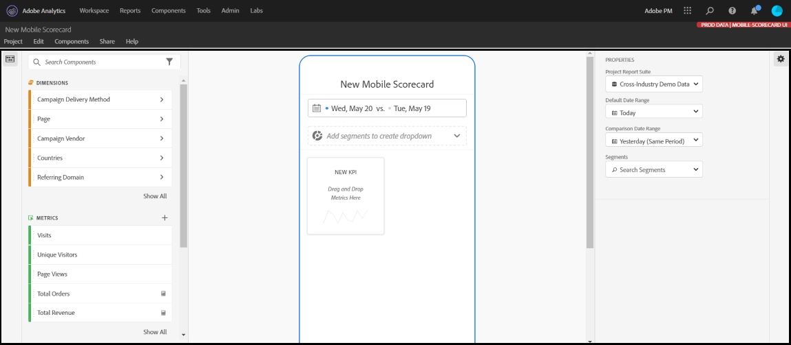

To create the Scorecard, you need to do the following:

1. Access the [!UICONTROL Blank Mobile Scorecard] template.
2. Configure the scorecard with data and save it.

## Access the [!UICONTROL Blank Mobile Scorecard] template {#template}

You can access the [!UICONTROL Blank Mobile Scorecard] template either by creating a new project, or from the Tools menu.

### Create a new project {#create}

1. Open Adobe Analytics and click the **[!UICONTROL Workspace]** tab.
1. Click **[!UICONTROL Create project]** and select the **[!UICONTROL Blank mobile scorecard]** project template.
1. Click **[!UICONTROL Create]**.

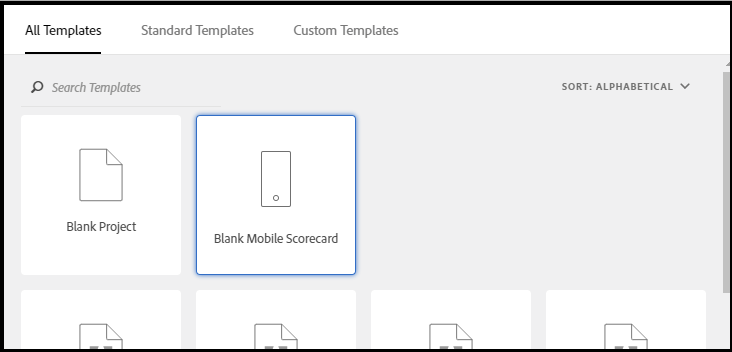

### Tools menu

1. From the **[!UICONTROL Tools]** menu, select **[!UICONTROL Analytics dashboards (Mobile App)]**.
1. On the subsequent screen, click **[!UICONTROL Create new scorecard]**.

## Configure the scorecard with data and save it {#configure}

To implement the Scorecard template:

1. Under **[!UICONTROL Properties]** (in the right-hand rail), specify a **[!UICONTROL Project report suite]** from which you want to use data.

    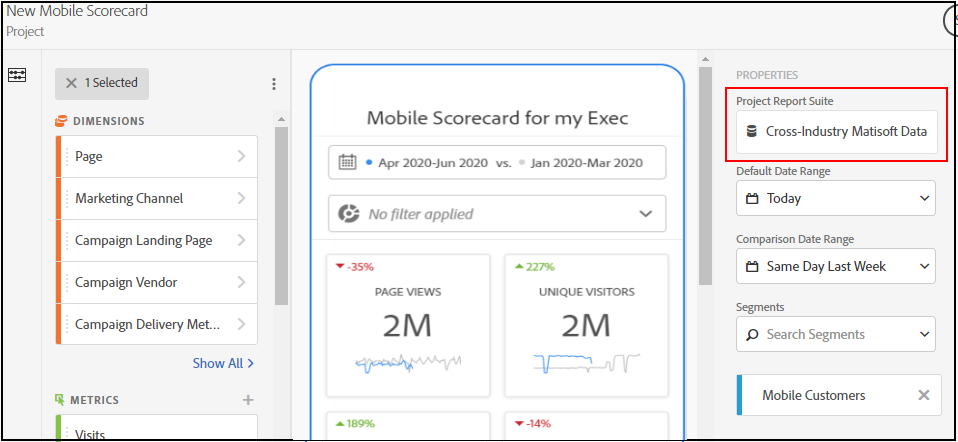

1. To add a new tile to your Scorecard, drag a metric from the left panel and drop it into the **[!UICONTROL Drag and Drop Metrics Here]** zone. You can also insert a metric between two tiles using a similar workflow.

    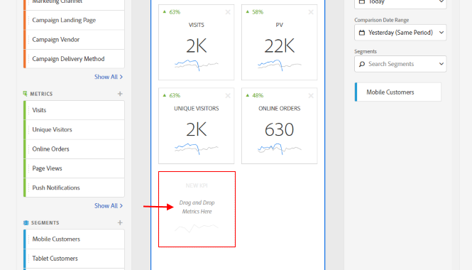

1. From each tile, you can access a detailed view that displays additional information about the metric, such as top items for a list of related dimensions.

## Add dimensions or metrics {#dimsmetrics}

To add a related dimension to a metric, drag a dimension from the left panel and drop it onto a tile.

For example, you can add appropriate dimensions (like **[!DNL Marketing Channel]**, in this example) to the **[!UICONTROL Unique Visitors]** metric by dragging and dropping it onto the tile. Dimensions breakdowns appear under the [!UICONTROL Drill Ins] section of the detail slide-specific **[!UICONTROL Properties]**. You can add multiple dimensions to each tile.

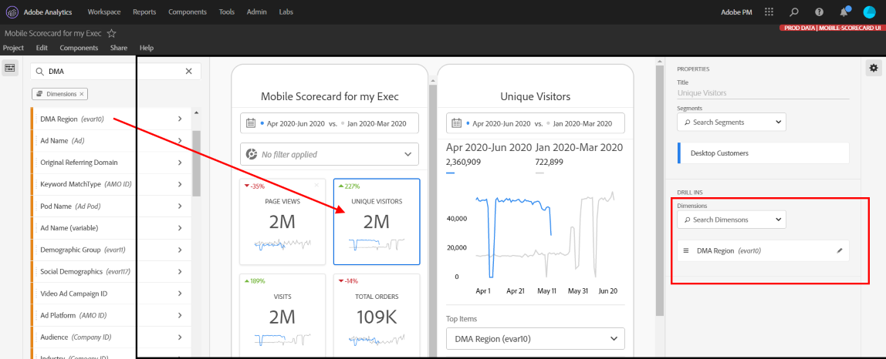

## Apply segments {#segments}

To apply segments to individual tiles, drag a segment from the left panel and drop it directly on top of the tile.

If you want to apply the segment to all the tiles in the Scorecard, drop the tile on top of the scorecard. Or, you can also apply segments by selecting segments in the filter menu beneath the date ranges. You [configure and apply filters for your Scorecards](https://experienceleague.adobe.com/docs/analytics-learn/tutorials/analysis-workspace/using-panels/using-drop-down-filters.html) the same way you would in Adobe Analytics Workspace.

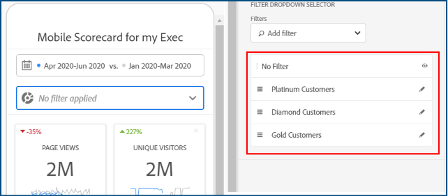

## Add date ranges {#dates}

Add and remove date range combinations that can be selected in your scorecard by selecting the date range drop down.

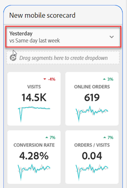

Each new scorecard starts with 6 date range combinations focusing on the data from today and yesterday. You can remove unnecessary date ranges by clicking on the x, or you can edit each date range combination by clicking the pencil.

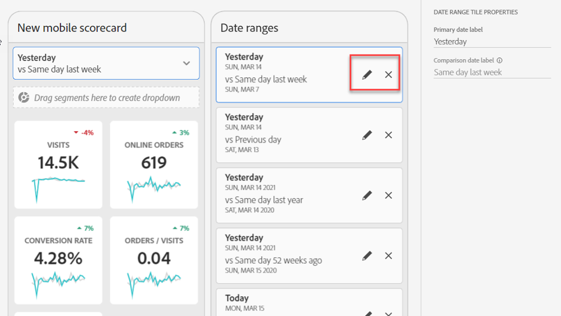

To create or change a primary date, use the drop down to select from available date ranges or drag and drop a date component from the right rail into the drop zone.

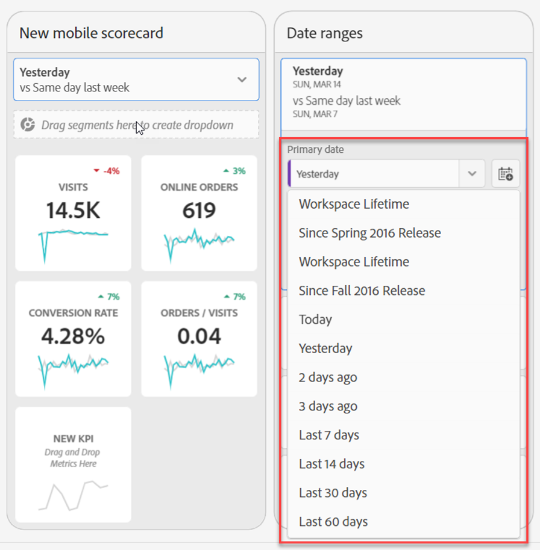

To create a comparison date, you can select from convenient pre-sets for common time comparisons in the drop-down menu. You can also drag and drop a date component from the right rail.

If the date range you want hasn’t been created yet, you can create a new one by clicking the calendar icon.

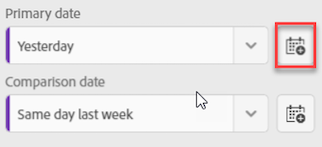

This will take you to the date range builder where you can create and save a new date range component.

### Show/Hide comparison date ranges {#show-comparison-dates}

To show or hide comparison date ranges, toggle the **Include comparison dates** setting.

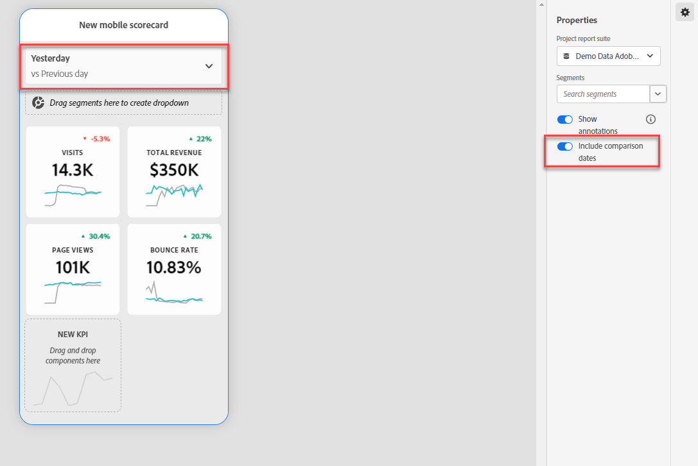

The setting is *on* by default. Deselect the option if you don't want to view comparison dates.

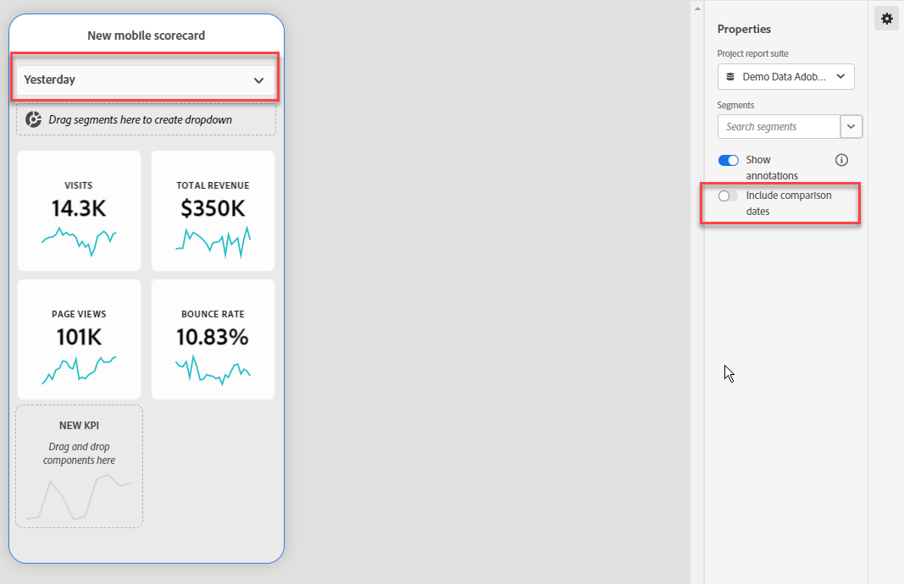

## Apply visualizations {#viz}

View a video on visualizations for mobile scorecards:

>[!VIDEO](https://video.tv.adobe.com/v/337570/?quality=12&learn=on)

Analytics dashboards offer four visualizations that give you great insight into dimension items and metrics. Change to a different visualization by changing the [!UICONTROL chart type] of a tile's [!UICONTROL Properties]. Just select the right tile and then change the chart type.

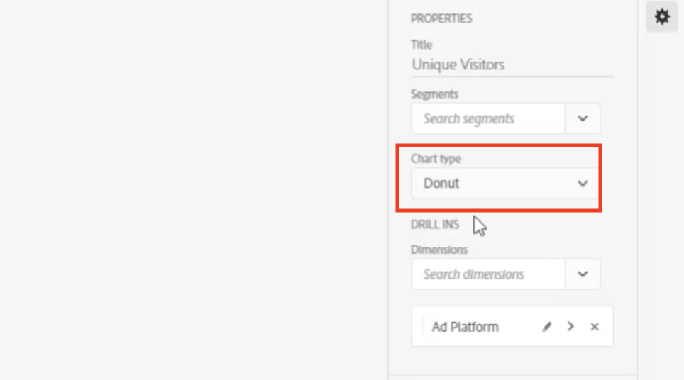

Or, click the [!UICONTROL Visualizations] icon in the left rail and drag and drop the right visualization onto the tile:

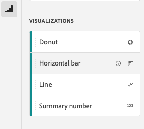

### [!UICONTROL Summary Number]

Use the Summary Number visualization to highlight a large number that is important in a project.

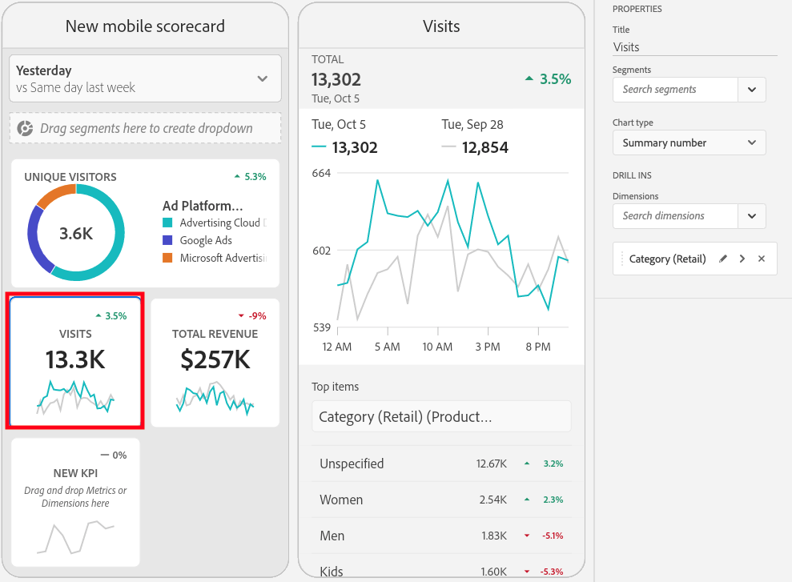

### [!UICONTROL Donut]

Similar to a pie chart, this visualization shows data as parts or segments of a whole. Use a donut graph when comparing percentages of a total. For example, let's say you want to see which ad platform contributed to the total number of unique visitors:

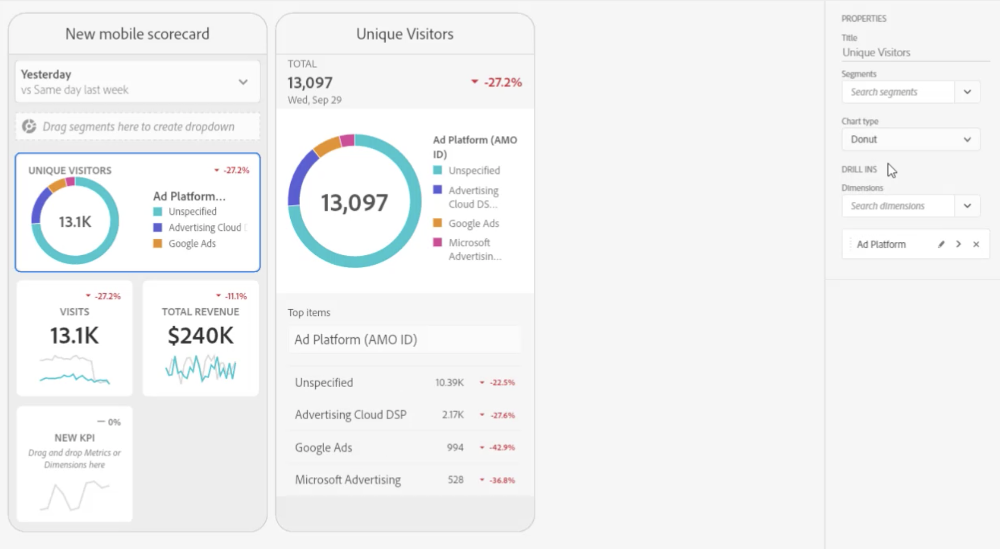

### [!UICONTROL Line]

The Line visualization represents metrics using a line in order to show how values change over a period of time. A line chart shows dimensions over time but works with any visualization. You are visualizing the product category dimension in this example.

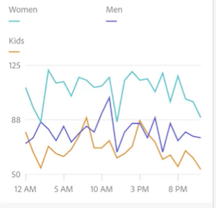

### [!UICONTROL Horizontal Bar]

This visualization shows horizontal bars representing various values across one or more metrics. For example, to easily see what your top products are, use [!UICONTROL Horizontal Bar] for your preferred visualization.

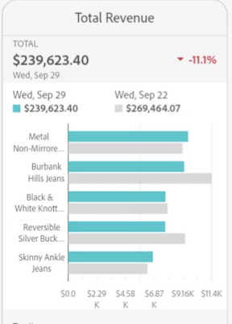

### Remove [!UICONTROL Unspecified] dimension items

If you want to remove [!UICONTROL Unspecified] dimension items from your data, do the following:

1. Select the correct tile.
1. In the right rail, under **[!UICONTROL Drill ins]**, select the right-arrow next to the dimension item whose **[!UICONTROL Unspecified]** items you want to remove.

    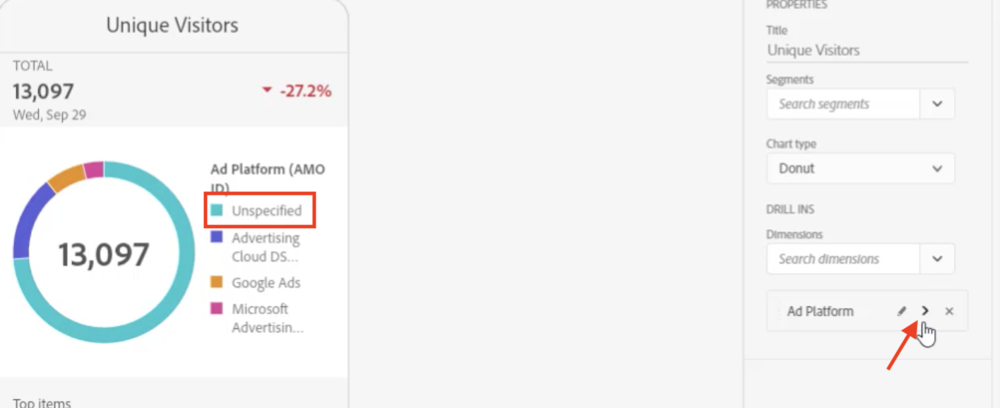

1. Click the icon next to **[!UICONTROL Unspecified]** to remove unspecified data from your reporting. (You can also remove any other dimension item.)

## View and configure tile properties {#tiles}

When you click a tile in the Scorecard Builder, the right-hand rail displays the properties and characteristics associated with that tile and its detail slide. In this rail, you can provide a new **Title** for the tile and alternatively configure the tile by applying segments.

## View detail slides {#view-detail-slides}

When you click on tiles, a dynamic pop-up window displays how the detail slide appears to the executive user in the app. You can add dimensions to break down your data for your specific needs. If a dimension hasn't been applied, the breakdown dimension will be **hour** or **days**, depending on the default date range.

Breakdowns refine your analysis by breaking down metrics by dimension items such as the following:

* Unique Visitors metric broken down by Ad Platform (AMO ID)
* Visits broken down by Product Category (Retail)
* Total Revenue broken down by Product Name

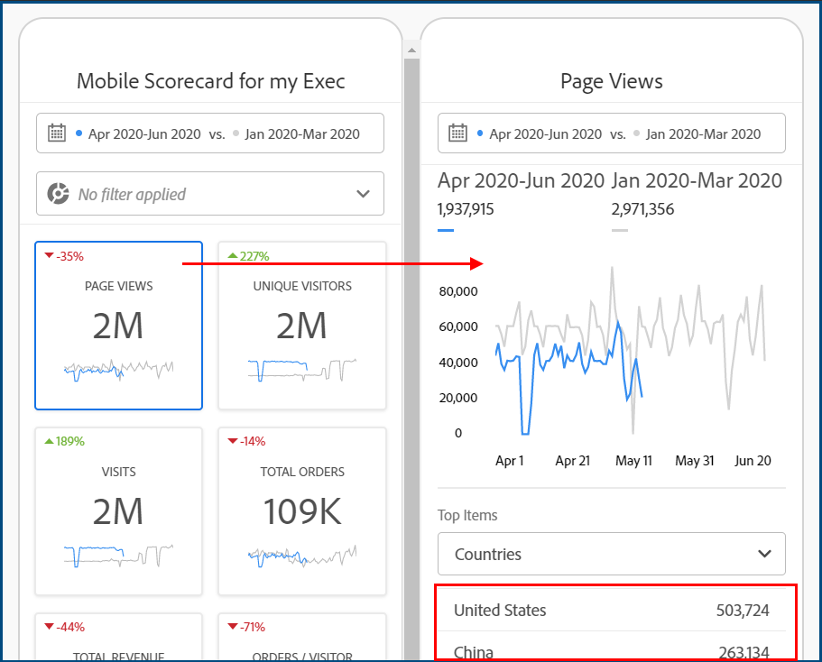

Each dimension added to the detail slide will show up in a drop-down list in the view of the detail slide in the app. The executive user can then choose among the options listed in the drop-down list.

## Customize detail slides {#customize-detail-slide}

Custom detail slides allow you to be even more targeted about what information you share with your audience.

>[!VIDEO](https://video.tv.adobe.com/v/3410002)

You can modify the layout for each detail slide and add text to better explain what the end user may see in the data. You can also change the chart type using the drop-down menu.

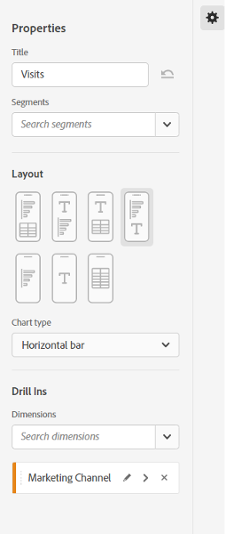

### Change the slide layout

Change the slide layout to focus on the most important information. For example, you can change the layout to show just a chart or just a table. To change the slide layout, select one of the pre-designed formats.

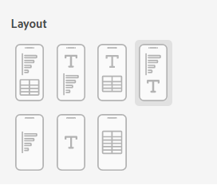

You can also change the slide layout by dragging and dropping visualization components from the left-hand rail onto the canvas. Each detail slide may only accommodate two visualizations at a time.

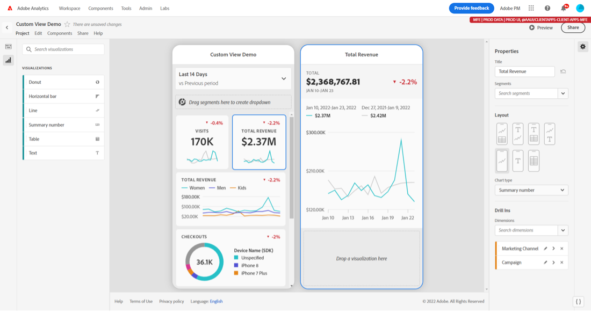

### Add descriptive text to a slide

You can add text to provide meaningful information about what is contained in the charts or nuances about the data.

To add text to a detail slide, select a layout that shows the `T` symbol, or drag and drop the Text visualization component over from the left rail. The text editor will automatically open when adding a new text visualization or choosing a slide layout with text. The Text editor provides all standard options for formatting your text. You can apply text styles such as paragraph, headings, and subheadings, and apply bold and italicized font. You can justify text, add bulleted and numbered lists, and add links. When you're finished editing, select the minimize button in the upper-right corner of the text editor to close it. To edit text you already added, select the pencil icon to open the text editor again.

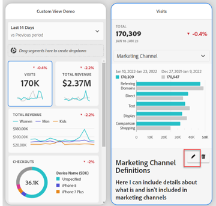

## Remove components {#remove}

Similarly, to remove a component that is applied to the entire Scorecard, click anywhere on the Scorecard outside of the tiles and then remove it by clicking the **x** that appears when you hover over the component, as shown below for the **First Time Visits** segment:

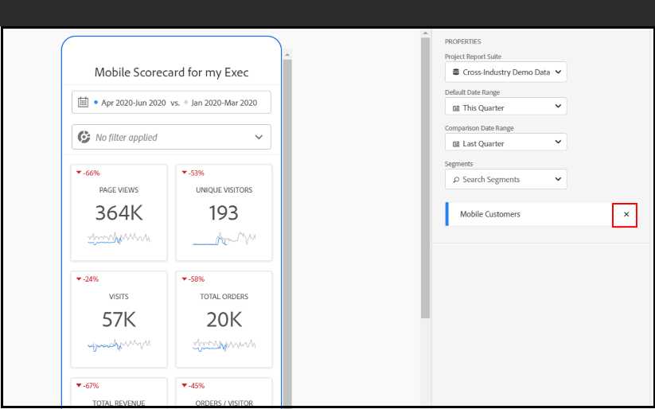

## Create data stories {#create-data-story}

A data story is a collection of supporting data points, business context, and related metrics built around a central theme or metric. 

For example, if you focus on web traffic, your most important metric may be visits, but you may also be interested in new visitors, unique visitors, and you may want to see data broken down by web page or by what device type the traffic is coming from. Data stories in mobile scorecard projects let you put your most important metrics front and center while telling the whole story behind the metrics with multiple detail slides. 

Watch the video to learn more about creating data stories in mobile scorecard projects in Analysis Workspace.

>[!VIDEO](https://video.tv.adobe.com/v/3416392/?quality=12&learn=on)

**To create a data story**

Build your data story by adding multiple detail slides to a tile.

1.  Start with a mobile scorecard project. 
1.  Select a tile that you want to create a story from.
    
    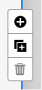{width=".50%"}
1.  Add slides to build your data story. Your first slide is generated by default.
    To add new slides, either hover over or click on a slide, then select from the available options: 
    *  Tap the + sign to create a new slide. 
    *  Tap the duplicate icon to duplicate the existing slide.
1.  If you create a blank slide, drag and drop components from the left rail, or choose a layout to automatically populate the slide with the data from the tile. 
    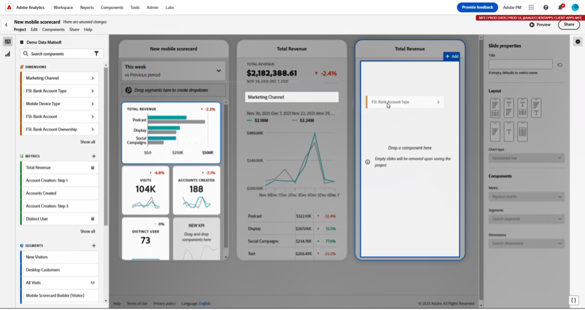
To delete a slide, tap the trash icon. 

### Customize a data story {#customize-data-story}

Data stories allow you to customize everything so you can share information that you want to share and exclude everything that you don't need. You can customize tiles and individual slides to add filters, show breakdowns, change the layout, and change the visualizations. 

**To customize tiles**

1.  Tap a tile. The selected tile is outlined in blue, and the right panel shows the Tile properties.
1.  Change the title, chart type, and other tile options.
1.  Drag a component onto the tile.
    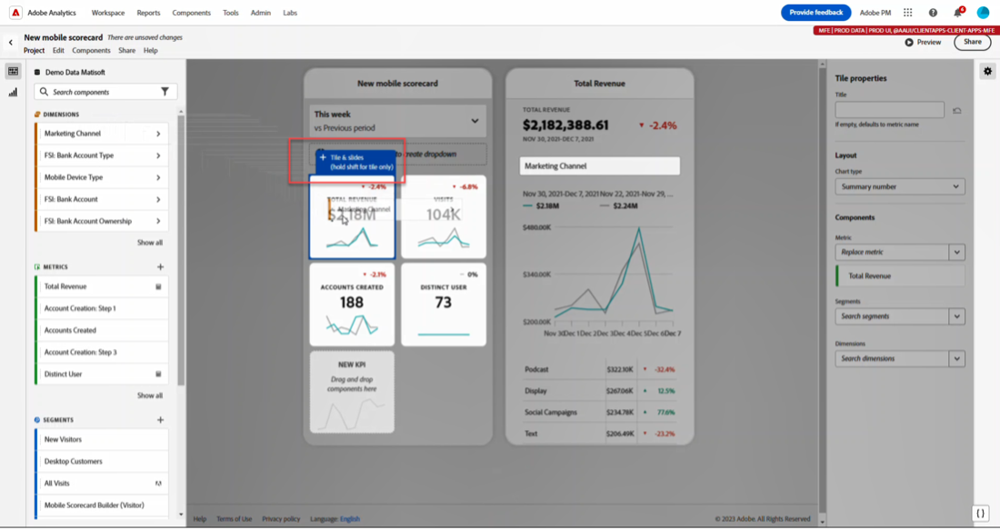
    When you drag and drop a component such as a visualization onto a tile, the component is applied to all data story slides.
1.  To apply a change only to the title, hold the Shift key to apply the change.
    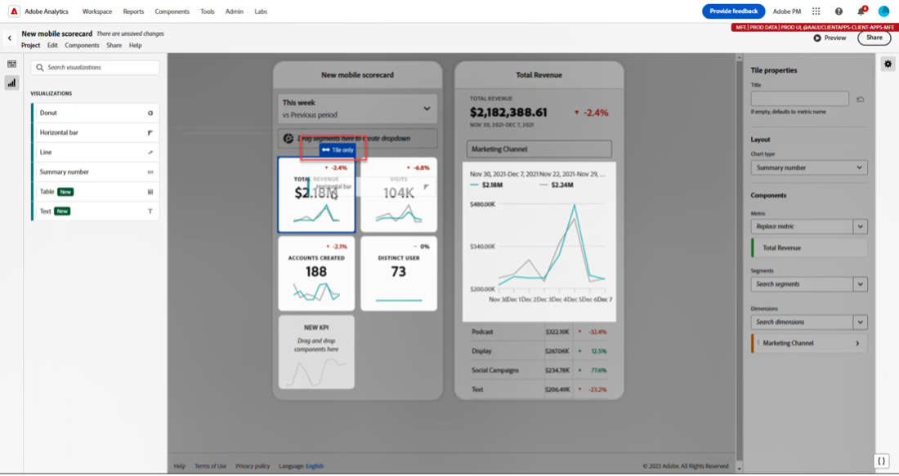

>[!NOTE]
>Slides inherit components from the tile, but tiles don’t inherit components from slides.

**To customize individual slides**

You can change the visualization for individual slides in a data story. For example, you can change a horizontal bar to a doughnut graph for a specific slide. You can also change the layout. See [Customize detail slides](#customize-detail-slide).

### Preview a data story {#preview-data-story}

After you create a data story, use the **Preview** button to view and interact with a data story as if you were an app user. For information about previewing your data story, see [Preview a scorecard](#preview)

### Navigate between tiles and slides {#navigate-tiles-slides}

The navigation bar displays icons that represent what's on each slide. The navigation bar makes it easy to navigate to a specific slide if you have a lot of slides. 

To move between the tile and slides, tap the navigation bar.
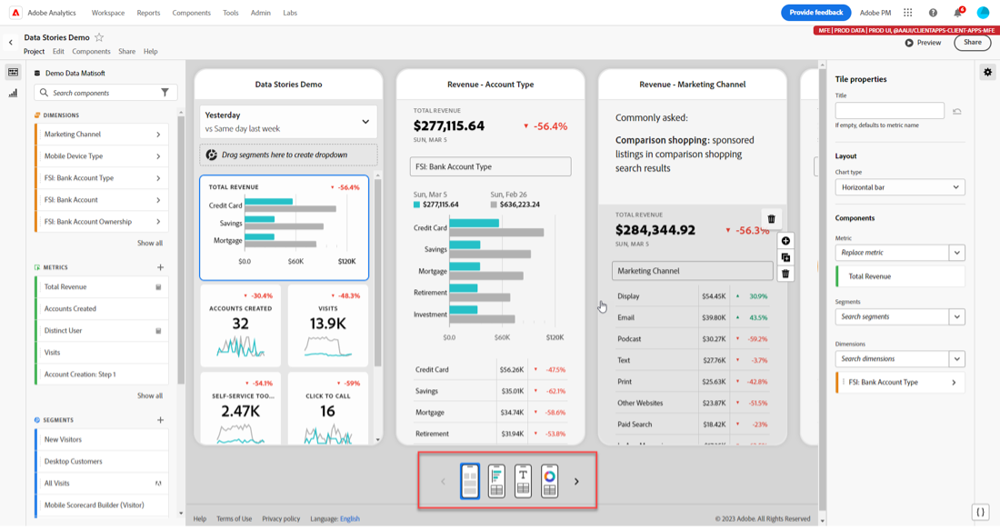
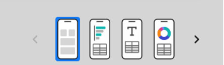{width="25%"}

You can also navigate back and forth by using the arrows on your keyboard or by selecting a component and holding it to the left or right of your screen to scroll.

## Preview scorecard {#preview}

You can preview how the scorecard will look and function once it is published in the Analytics dashboards app.

1. Click **[!UICONTROL Preview]** in the upper right hand corner of the screen.

    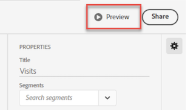

1. To view what the scorecard will look like on different devices, select a device from the [!UICONTROL Device preview] drop-down menu.

    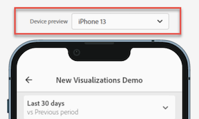

1. To interact with the preview, you can:

    * Left click to simulate tapping on the phone screen.

    * Use your computer's scroll function to simulate scrolling the phone screen with your finger.

    * Click and hold to simulate pressing and holding your finger on the phone screen. This is useful for interacting with the visualizations in the detailed view.

## Name a scorecard {#name}

To name the Scorecard, click the namespace in the upper-left of the screen and type the new name.

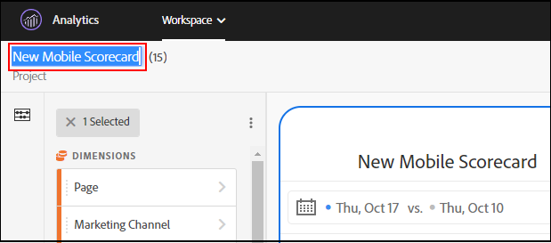

## Share a scorecard {#share}

To share the Scorecard with an executive user:

1. Click the **[!UICONTROL Share]** menu and select **[!UICONTROL Share scorecard]**.

1. In the **[!UICONTROL Share mobile scorecard]** form, complete the fields by:

    * Providing the name of the scorecard
    * Providing a description of the scorecard
    * Adding relevant tags
    * Specifying the recipients for the scorecard

1. Click **[!UICONTROL Share]**.

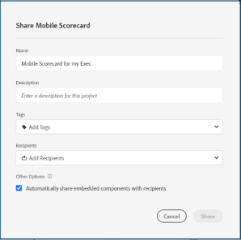

After you have shared a scorecard, your recipients can access it on their Analytics dashboards. If you make subsequent changes to the scorecard in the Scorecard Builder, they will be automatically updated in the shared scorecard. Executive users will then see the changes after refreshing the Scorecard on their app.

If you update the scorecard by adding new components, you may want to share the scorecard again (and check the **[!UICONTROL Share embedded components]** option) in order to make sure that your executive users have access to these changes.
