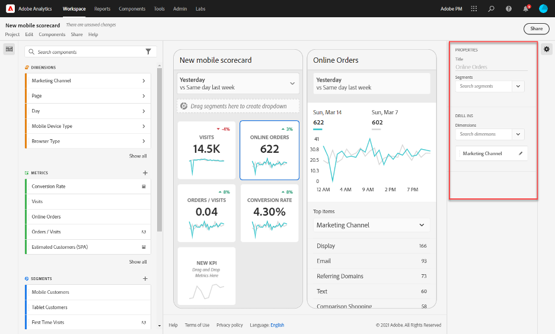

# Create a scorecard

An Adobe Analytics scorecard displays key data visualizations for executive users in a tiled layout, as shown below:

As a curator of this scorecard, you can use the Scorecard Builder to configure which tiles appear on the scorecard for your executive consumer. You also configure how the detailed views, or the breakdowns, can be adjusted once the tiles are tapped. The Scorecard Builder interface is shown below:

To create the Scorecard, you will need to do the following:

1. Access the [!UICONTROL Blank Mobile Scorecard] template.
2. Configure the Scorecard with data and save it.

### Access the [!UICONTROL Blank Mobile Scorecard] template

You can access the [!UICONTROL Blank Mobile Scorecard] template in one of the following ways:

**Create a new project**

1. Open Adobe Analytics and click the **[!UICONTROL Workspace]** tab.
2. Click **[!UICONTROL Create project]** and select the **[!UICONTROL Blank mobile scorecard]** project template.
3. Click **[!UICONTROL Create]**.

Or

1. From the **[!UICONTROL Tools]** menu select **[!UICONTROL Analytics dashboards (Mobile App)]**.
1. On the subsequent screen, click the **[!UICONTROL Create new scorecard]** button.

### Configure the scorecard with data and save it

To implement the Scorecard template:

1. Under **[!UICONTROL Properties]** (in the right-hand rail), specify a **[!UICONTROL Project report suite]** from which you want to use data.

    

2. To add a new tile to your Scorecard, drag a metric from the left panel and drop it into the **[!UICONTROL Drag and Drop Metrics Here]** zone. You can also insert a metric between two tiles using a similar workflow.

    

    *From each tile, you can access a detailed view that displays additional information about the metric, such as top items for a list of related dimensions.*

3. To add a related dimension to a metric, drag a dimension from the left panel and drop it onto a tile. For example, you can add appropriate dimensions (like **[!DNL DMA Region]**, in this example) to the **[!UICONTROL Unique Visitors]** metric by dragging and dropping it onto the tile; dimensions you add will appear under the breakdown section of the tile-specific **[!UICONTROL Properties]**. You can add multiple dimensions to each tile.

    

    When you click on a tile in the Scorecard Builder, the right-hand rail displays the properties and characteristics associated with that tile. In this rail, you can provide a new **[!UICONTROL Title]** for the tile and alternatively configure the tile by specifying components instead of dragging and dropping them from the left-hand rail.

    

    Also, if you click on tiles, a dynamic pop up will display how the Breakdown view appears to the executive user in the app. If no dimension has been applied to the tile, the breakdown dimension will be **hour** or **days**, depending on the default date range.

    

    Each dimension added to the tile will show up in a drop-down list in the detailed view of the app. The executive user can then choose among the options listed in the drop-down list.

4. To apply segments to individual tiles, drag a segment from the left panel and drop it directly on top of the tile. If you want to apply the segment to all the tiles in the Scorecard, drop the tile on top of the scorecard. Or, you can also apply segments by selecting segments in the filter menu beneath the date ranges. You [configure and apply filters for your Scorecards](https://experienceleague.adobe.com/docs/analytics-learn/tutorials/analysis-workspace/using-panels/using-drop-down-filters.html) the same way you would in Adobe Analytics Workspace.

    

5. Similarly, to remove a component that is applied to the entire Scorecard, click anywhere on the Scorecard outside of the tiles and then remove it by clicking the **x** that appears when you hover over the component, as shown below for the **First Time Visits** segment:

    

6. Add and remove date range combinations that can be selected in your scorecard by selecting the date range drop down.

    

   Each new scorecard starts with 6 date range combinations focusing on the data from today and yesterday. You can remove unnecessary date ranges by clicking on the x, or you can edit each date range combination by clicking the pencil.

    

   To create or change a primary date, use the drop down to select from available date ranges or drag and drop a date component from the right rail into the drop zone.

    

   To create a comparison date, you can select from convenient pre-sets for common time comparisons in the drop-down menu. You can also drag and drop a date component from the right rail.

    

   If the date range you want hasn’t been created yet, you can create a new one by clicking the calendar icon.

    

7. This will take you to the date range builder where you can create and save a new date range component. To name the Scorecard, click the namespace in the upper-left of the screen and type the new name.

    

## Share the scorecard

To share the Scorecard with an executive user:

1. Click the **[!UICONTROL Share]** menu and select **[!UICONTROL Share scorecard]**.

2. In the **[!UICONTROL Share mobile scorecard]** form, complete the fields by:

    * Providing the name of the Scorecard
    * Providing a description of the Scorecard
    * Adding relevant tags
    * Specifying the recipients for the Scorecard

3. Click **[!UICONTROL Share]**.

After you have shared a Scorecard, your recipients can access it on their Analytics dashboards. If you make subsequent changes to the Scorecard in the Scorecard Builder, they will be automatically updated in the shared Scorecard. Executive users will then see the changes after refreshing the Scorecard on their app.

If you update the Scorecard by adding new components, you may want to share the scorecard again (and check the **[!UICONTROL Share embedded components]** option) in order to make sure that your executive users have access to these changes.