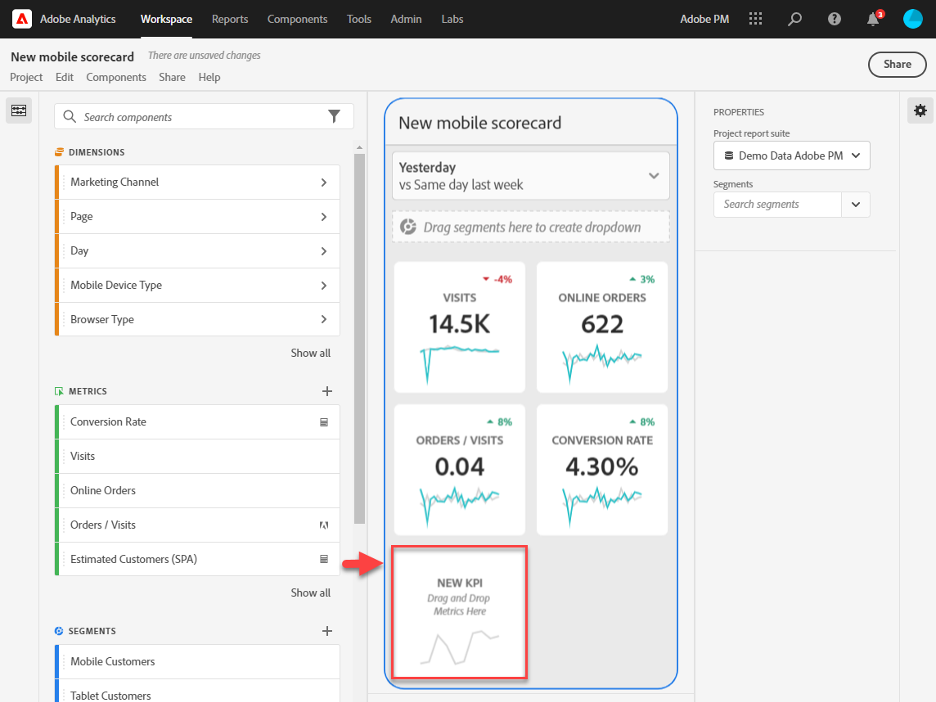
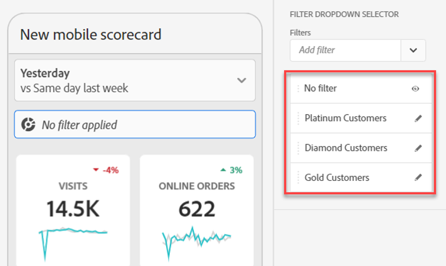

# Create a scorecard

The following information instructs curators of Adobe Analytics data on how to configure and present dashboards for executive users. To start with, you can view the Adobe Analytics dashboards Scorecard Builder video:

>[!VIDEO](https://video.tv.adobe.com/v/34544)

An Adobe Analytics scorecard displays key data visualizations for executive users in a tiled layout, as shown below:

As a curator of this scorecard, you can use the Scorecard Builder to configure which tiles appear on the scorecard for your executive consumer. You also configure how the detailed views, or the breakdowns, can be adjusted once the tiles are tapped. The Scorecard Builder interface is shown below:

To create the Scorecard, you need to do the following:

1. Access the [!UICONTROL Blank Mobile Scorecard] template.
2. Configure the scorecard with data and save it.

## Access the [!UICONTROL Blank Mobile Scorecard] template

You can access the [!UICONTROL Blank Mobile Scorecard] template either by creating a new project, or from the Tools menu.

### Create a new project

1. Open Adobe Analytics and click the **[!UICONTROL Workspace]** tab.
1. Click **[!UICONTROL Create project]** and select the **[!UICONTROL Blank mobile scorecard]** project template.
1. Click **[!UICONTROL Create]**.

### Tools menu

1. From the **[!UICONTROL Tools]** menu, select **[!UICONTROL Analytics dashboards (Mobile App)]**.
1. On the subsequent screen, click **[!UICONTROL Create new scorecard]**.

## Configure the scorecard with data and save it

To implement the Scorecard template:

1. Under **[!UICONTROL Properties]** (in the right-hand rail), specify a **[!UICONTROL Project report suite]** from which you want to use data.

    

1. To add a new tile to your Scorecard, drag a metric from the left panel and drop it into the **[!UICONTROL Drag and Drop Metrics Here]** zone. You can also insert a metric between two tiles using a similar workflow.

    

1. From each tile, you can access a detailed view that displays additional information about the metric, such as top items for a list of related dimensions.

### Add dimensions or metrics

To add a related dimension to a metric, drag a dimension from the left panel and drop it onto a tile. 

For example, you can add appropriate dimensions (like **[!DNL Marketing Channel]**, in this example) to the **[!UICONTROL Unique Visitors]** metric by dragging and dropping it onto the tile. Dimensions breakdowns appear under the [!UICONTROL Drill Ins] (breakdown) section of the tile-specific **[!UICONTROL Properties]**. You can add multiple dimensions to each tile.

### Apply segments

To apply segments to individual tiles, drag a segment from the left panel and drop it directly on top of the tile. 

If you want to apply the segment to all the tiles in the Scorecard, drop the tile on top of the scorecard. Or, you can also apply segments by selecting segments in the filter menu beneath the date ranges. You [configure and apply filters for your Scorecards](https://experienceleague.adobe.com/docs/analytics-learn/tutorials/analysis-workspace/using-panels/using-drop-down-filters.html) the same way you would in Adobe Analytics Workspace.

### Add date ranges

Add and remove date range combinations that can be selected in your scorecard by selecting the date range drop down.

Each new scorecard starts with 6 date range combinations focusing on the data from today and yesterday. You can remove unnecessary date ranges by clicking on the x, or you can edit each date range combination by clicking the pencil.

To create or change a primary date, use the drop down to select from available date ranges or drag and drop a date component from the right rail into the drop zone.

To create a comparison date, you can select from convenient pre-sets for common time comparisons in the drop-down menu. You can also drag and drop a date component from the right rail.

If the date range you want hasn’t been created yet, you can create a new one by clicking the calendar icon.

This will take you to the date range builder where you can create and save a new date range component. 

### Apply visualizations

Analytics dashboards offer four visualizations that give you great insight into dimension items and metrics. Change to a different visualization by changing the [!UICONTROL chart type] of a tile's [!UICONTROL Properties]. Just select the right tile and then change the chart type.

Or, click the [!UICONTROL Visualizations] icon in the left rail and drag and drop the right visualization onto the tile:

**[!UICONTROL Summary Number]**

Use the Summary Number visualization to highlight a large number that is important in a project. 

**[!UICONTROL Donut] visualization**

Similar to a pie chart, this visualization shows data as parts or segments of a whole. Use a donut graph when comparing percentages of a total. For example, let's say you want to see which ad platform contributed to the total number of unique visitors:

**[!UICONTROL Line] visualization**

The Line visualization represents metrics using a line in order to show how values change over a period of time. A Line chart can be used only when time is used as a dimension.

**[!UICONTROL Horizontal Bar] visualization**

This visualization shows horizontal bars representing various values across one or more metrics. For example, to easily see what your top products are, use [!UICONTROL Horizontal Bar] for your preferred visualization.

**Remove [!UICONTROL Unspecified]**

If you want to remove [!UICONTROL Unspecified] dimension items from your data, do the following:

1. Select the correct tile.
1. In the right rail, under **[!UICONTROL Drill ins]**, select the right-arrow next to the dimension item whose **[!UICONTROL Unspecified]** items you want to remove.

    

1. Click the icon next to **[!UICONTROL Unspecified]** to remove unspecified data from your reporting.

### View and configure tile properties

When you click a tile in the Scorecard Builder, the right-hand rail displays the properties and characteristics associated with that tile. In this rail, you can provide a new **[!UICONTROL Title]** for the tile and alternatively configure the tile by specifying components instead of dragging and dropping them from the left-hand rail.

When you click on tiles, a dynamic pop up displays how the Drill ins (Breakdown) view appears to the executive user in the app. If no dimension has been applied to the tile, the breakdown dimension will be **hour** or **days**, depending on the default date range.

Breakdowns refine your analysis by literally breaking down metrics and dimensions by other metrics and dimensions, such as in this retail example:

* Unique Visitors metric broken down by Ad Platform (AMO ID)
* Visits broken down by Product Category (Retail)
* Total Revenue broken down by Product Name

Each dimension added to the tile will show up in a drop-down list in the detailed view of the app. The executive user can then choose among the options listed in the drop-down list.

### Remove components

Similarly, to remove a component that is applied to the entire Scorecard, click anywhere on the Scorecard outside of the tiles and then remove it by clicking the **x** that appears when you hover over the component, as shown below for the **First Time Visits** segment:

## Name a scorecard

To name the Scorecard, click the namespace in the upper-left of the screen and type the new name.

## Share a scorecard

To share the Scorecard with an executive user:

1. Click the **[!UICONTROL Share]** menu and select **[!UICONTROL Share scorecard]**.

1. In the **[!UICONTROL Share mobile scorecard]** form, complete the fields by:

    * Providing the name of the scorecard
    * Providing a description of the scorecard
    * Adding relevant tags
    * Specifying the recipients for the scorecard

1. Click **[!UICONTROL Share]**.

After you have shared a scorecard, your recipients can access it on their Analytics dashboards. If you make subsequent changes to the scorecard in the Scorecard Builder, they will be automatically updated in the shared scorecard. Executive users will then see the changes after refreshing the Scorecard on their app.

If you update the scorecard by adding new components, you may want to share the scorecard again (and check the **[!UICONTROL Share embedded components]** option) in order to make sure that your executive users have access to these changes.