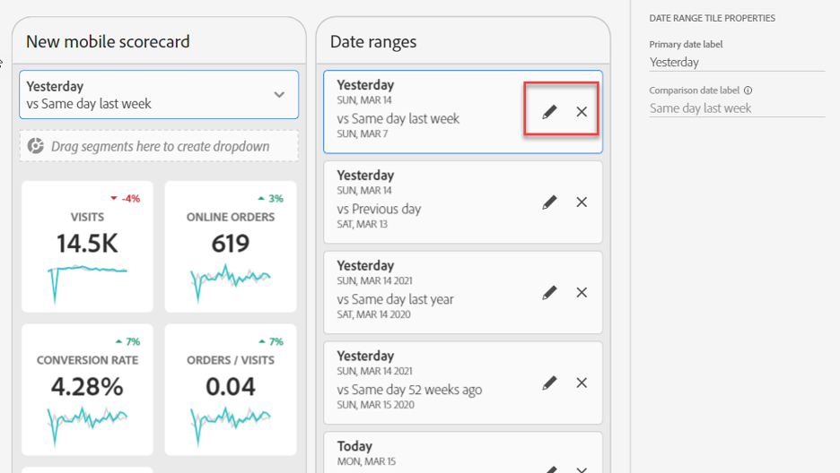
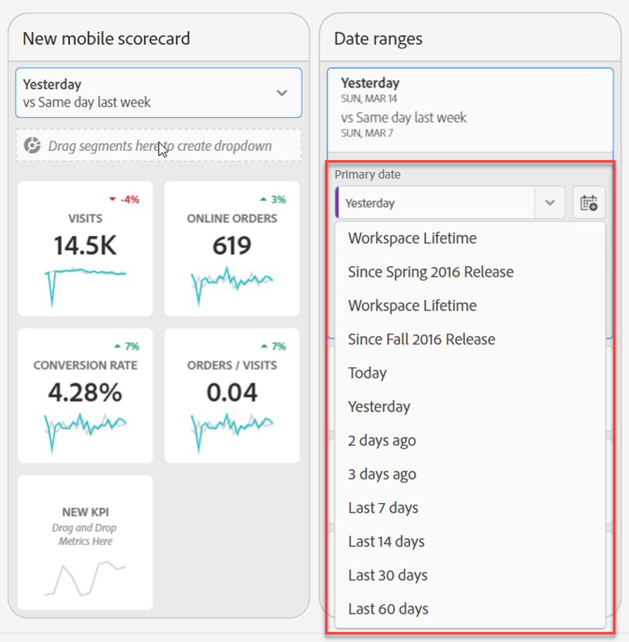
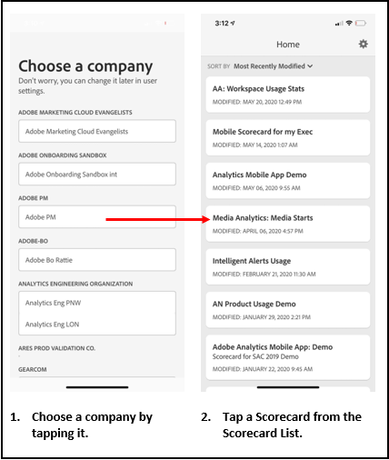

# Curator’s guide for Adobe Analytics dashboards

The following information instructs curators of Adobe Analytics data on how to configure and present dashboards for executive users. To see a video demonstrating this information, see the Adobe Analytics dashboards Scorecard Builder video:

>[!VIDEO](https://video.tv.adobe.com/v/34544)

## Introduction

Adobe Analytics dashboards provide anytime, anywhere insights from Adobe Analytics. The app allows users mobile access to intuitive scorecards that you create and share from Adobe Analytics’ desktop UI. Scorecards are a collection of key metrics and other components presented in a tiled layout that you can tap for more detailed breakdowns and trended reports. You can tailor Scorecards according to the data most important to you. Analytics dashboards are supported on both iOS and Android operating systems.

## More about this guide

This guide is intended to help curators of Adobe Analytics data configure Scorecards for their executive users on dashboards. Curators may be organizational administrators or persons in other roles who are responsible for setting up app Scorecards, which allow executive users to view a broad rendering of important summary data quickly and easily on their own mobile devices. Although executive users are the end-users for Analytics dashboards, this guide will help data curators set up the app effectively for those users.

## Glossary of terms

The following table describes the terms for understanding the audience, functions, and operation of the Analytics dashboards.

| Term | Definition |
|--- |--- |
| Consumer| Executive persona viewing key metrics and insights from Analytics on a mobile device |
| Curator | Data literate persona who finds and distributes insights from Analytics and configures the Scorecards to be viewed by consumer |
| Curation|The act of creating or editing a mobile Scorecard containing relevant metrics, dimensions and other components for the consumer |
| Scorecard | A dashboards view containing one or more tiles |
| Tile | A rendering for a metric within a Scorecard View |
| Breakdown | A secondary view accessible by tapping a tile in the Scorecard. This view expands on the metric displayed on the tile and optionally reports on additional breakdown dimensions. |
| Date Range | The primary date range for dashboards reporting |
| Comparison Date Range | The Date Range that is compared with the primary date range |

## Create a Scorecard for executive users

A Scorecard displays key data visualizations for executive users in a tiled layout, as shown below:

As a curator of this Scorecard, you can use the Scorecard Builder to configure which tiles appear on the Scorecard for your consumer. You also configure how the detailed views, or the Breakdowns, can be adjusted once the tiles are tapped. The Scorecard Builder interface is shown below:

To create the Scorecard, you will need to do the following:

1. Access the [!UICONTROL Blank Mobile Scorecard] template.
2. Configure the Scorecard with data and save it.

### Access the [!UICONTROL Blank Mobile Scorecard] template

You can access the [!UICONTROL Blank Mobile Scorecard] template in one of the following ways:

**Create a new project**

1. Open Adobe Analytics and click the **[!UICONTROL Workspace]** tab.
2. Click the **[!UICONTROL Create New Project]** button and select the **[!UICONTROL Blank Mobile Scorecard]** project template.
3. Click the **[!UICONTROL Create]** button.

**Add a project**

From the **[!UICONTROL Projects]** screen, under the **[!UICONTROL Components]** tab, click the **[!UICONTROL Add]** button and select **[!UICONTROL Mobile Scorecard]**.

**Or**

From the **[!UICONTROL Tools]** menu select **[!UICONTROL Analytics dashboards (Mobile App)]**. On the subsequent screen, click the **[!UICONTROL Create new scorecard]** button.

### Configure the Scorecard with data and save it

To implement the Scorecard template:

1. Under **[!UICONTROL Properties]** (in the right-hand rail), specify a **[!UICONTROL Project report suite]** from which you want to use data.

    

2. To add a new tile to your Scorecard, drag a metric from the left panel and drop it into the **[!UICONTROL Drag and Drop Metrics Here]** zone. You can also insert a metric between two tiles using a similar workflow.

    

    *From each tile, you can access a detailed view that displays additional information about the metric, such as top items for a list of related dimensions.*

3. To add a related dimension to a metric, drag a dimension from the left panel and drop it onto a tile. For example, you can add appropriate dimensions (like **[!DNL DMA Region]**, in this example) to the **[!UICONTROL Unique Visitors]** metric by dragging and dropping it onto the tile; dimensions you add will appear under the breakdown section of the tile-specific **[!UICONTROL Properties]**. You can add multiple dimensions to each tile.

    

    When you click on a tile in the Scorecard Builder, the right-hand rail displays the properties and characteristics associated with that tile. In this rail, you can provide a new **[!UICONTROL Title]** for the tile and alternatively configure the tile by specifying components instead of dragging and dropping them from the left-hand rail.

    

    Also, if you click on tiles, a dynamic pop up will display how the Breakdown view appears to the executive user in the app. If no dimension has been applied to the tile, the breakdown dimension will be **hour** or **days**, depending on the default date range.

    

    Each dimension added to the tile will show up in a drop-down list in the detailed view of the app. The executive user can then choose among the options listed in the drop-down list.

4. To apply segments to individual tiles, drag a segment from the left panel and drop it directly on top of the tile. If you want to apply the segment to all the tiles in the Scorecard, drop the tile on top of the scorecard. Or, you can also apply segments by selecting segments in the filter menu beneath the date ranges. You [configure and apply filters for your Scorecards](https://experienceleague.adobe.com/docs/analytics-learn/tutorials/analysis-workspace/using-panels/using-drop-down-filters.html) the same way you would in Adobe Analytics Workspace.

    

5. Similarly, to remove a component that is applied to the entire Scorecard, click anywhere on the Scorecard outside of the tiles and then remove it by clicking the **x** that appears when you hover over the component, as shown below for the **First Time Visits** segment:

    

6. Add and remove date range combinations that can be selected in your scorecard by selecting the date range drop down.

    

   Each new scorecard starts with 6 date range combinations focusing on the data from today and yesterday. You can remove unnecessary date ranges by clicking on the x, or you can edit each date range combination by clicking the pencil.

    

   To create or change a primary date, use the drop down to select from available date ranges or drag and drop a date component from the right rail into the drop zone.

    

   To create a comparison date, you can select from convenient pre-sets for common time comparisons in the drop-down menu. You can also drag and drop a date component from the right rail.

    

   If the date range you want hasn’t been created yet, you can create a new one by clicking the calendar icon.

    

7. This will take you to the date range builder where you can create and save a new date range component. To name the Scorecard, click the namespace in the upper-left of the screen and type the new name.

    

## Share the Scorecard

To share the Scorecard with an executive user:

1. Click the **[!UICONTROL Share]** menu and select **[!UICONTROL Share scorecard]**.

2. In the **[!UICONTROL Share mobile scorecard]** form, complete the fields by:

    * Providing the name of the Scorecard
    * Providing a description of the Scorecard
    * Adding relevant tags
    * Specifying the recipients for the Scorecard

3. Click **[!UICONTROL Share]**.

After you have shared a Scorecard, your recipients can access it on their Analytics dashboards. If you make subsequent changes to the Scorecard in the Scorecard Builder, they will be automatically updated in the shared Scorecard. Executive users will then see the changes after refreshing the Scorecard on their app.

If you update the Scorecard by adding new components, you may want to share the scorecard again (and check the **[!UICONTROL Share embedded components]** option) in order to make sure that your executive users have access to these changes.

## Set up executive users with the app

In some cases, executive users may need some additional assistance to access and use the app. This section provides information to help you provide that assistance.

### Help executive users gain access

To assist executive users access your Scorecards on the app, ensure that:

* The minimum mobile OS requirements on their devices are iOS version 10 or higher, or Android version 4.4 (KitKat) or higher
* They have a valid login into Adobe Analytics
* You have correctly created mobile Scorecards for them and have shared these Scorecards with them
* They have access to Analysis Workspace and the report suite that the Scorecard is based on
* They have access to the Components that the Scorecard includes. Note that you can select an option when sharing your Scorecards to **[!UICONTROL Share embedded components]**.

### Help executive users with the app

To help executive users:

1. Help them download and install the app. To do this, provide the following steps to extend access to your executive users, depending on whether they use an iOS or an Android device.

    **For executive users on iOS:**

    * Click the following link (it is also available in Analytics under **[!UICONTROL Tools]** > **[!UICONTROL Analytics dashboards (Mobile App)]**) and follow the prompts to download, install, and open the app:

        [iOS link](https://apple.co/2zXq0aN)

    **For executive users on Android:**

    * Click the following link (it is also available in Analytics under **[!UICONTROL Tools]** > **[!UICONTROL Analytics dashboards (Mobile App)]**) and follow the prompts to download, install, and open the app:

        [Android link](https://bit.ly/2LM38Oo)

    Once downloaded and installed, executive users can sign into the app using their existing Adobe Analytics credentials; we support both Adobe and Enterprise/Federated IDs.

    

2. Help them access your Scorecard. After executive users sign into the app, the **[!UICONTROL Choose a company]** screen appears. This screen lists the login companies to which the executive user belongs. To help them get to the Scorecard:

    * Tap the name of the login company or Experience Cloud Org that applies to the Scorecard you shared. The Scorecard list then shows all Scorecards that have been shared with the executive under that login company.
    * Help them sort this list by **[!UICONTROL Most recently modified]**, if applicable.
    * Tap the name of the Scorecard to view it.

    

    If the executive user logs in and sees a message saying that nothing has been shared:

    * The executive user may have selected the wrong Analytics instance

    * The Scorecard may not have been shared with the executive user

        

    * Verify that the executive user can log into the right Analytics instance and that the Scorecard has been shared.

3. Explain to the executive user how tiles appear in the Scorecards you share (the first Scorecard below is set in dark mode; see **[!UICONTROL Preferences]** below if you think your executive user prefers this viewing option):

    

    

    Additional information on tiles:

    * The granularity of the sparklines is dependent on the length of the date range:
        * One day shows an hourly trend
        * More than one day and less than a year shows a daily trend
        * One year or more shows a weekly trend
    * Percent value change formula is metric total (current date range) – metric total (comparison date range) / metric total (comparison date range).
    * You can pull the screen down to refresh the Scorecard.

4. Tap a tile to show how a detailed breakdown for the tile works.

    

    * Tap any point on a sparkline to see data associated with that point on the line.

    * A table is included to display data of dimensions added to the tile. Tap the down arrow to select dimensions. If no dimension was added to the tile, the table displays chart data.

5. To change date ranges for your Scorecard, tap the Date header and select the primary and comparison date range combination you want to view.

    

6. To leave feedback on this app:

    1. Tap the settings icon in the upper right of the app screen.
    2. On the **[!UICONTROL Settings]** screen, tap the **[!UICONTROL Feedback]** option.
    3. Tap to view the options for leaving feedback.

        

7. To change preferences, tap the **[!UICONTROL Preferences]** option shown above. In preferences, you can turn on biometric login or you can set the app for dark mode as shown below:

    

**To report a bug**:

Tap the option and choose a sub-category of the bug. In the form for reporting a bug, provide your email address in the top field and your description of the bug in the field below it. A screen shot of your account info is automatically attached to the message, but you can delete this if you want by tapping the **X** in the attachment image. You also have options for taking a screen recording, adding more screenshots, or attaching files. To send the report, tap the paper plane icon in the upper right of the form.

**To suggest an improvement**:

Tap the option and choose a sub-category for the suggestion. In the suggestion form, provide your email address in the top field and your description of the bug in the field below it. A screen shot of your account info is automatically attached to the message, but you can delete this if you want by tapping the **X** in the attachment image. You also have options for taking a screen recording, adding more screenshots, or attaching files. To send the suggestion, tap the paper plane icon in the upper right of the form.

**To ask a question**:

Tap the option and provide your email address in the top field and your question in the field below it. A screen shot is automatically attached to the message, but you can delete this if you want by tapping the **X** in the attachment image. You also have options for taking a screen recording, adding more screenshots, or attaching files. To send the question, tap the paper plane icon in the upper right of the form.

>[!IMPORTANT]
>
>Starting in October 2020, Adobe is gradually rolling out a series of enhancements to optimize the performance of the “Adobe Analytics dashboards” app. These enhancements center on caching historic Analytics data that is used to populate scorecards with dates (excluding the current day). This data will be cached for up to 24 hours in a secure Microsoft Azure public cloud storage account. Please contact your CSM if you would like to opt out of these performance enhancement features.
