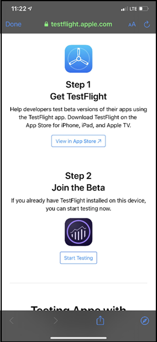
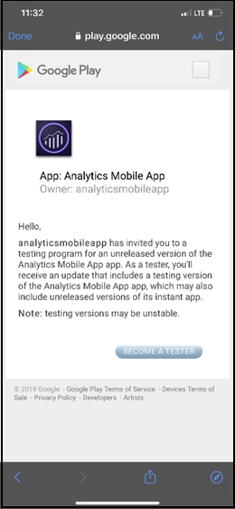
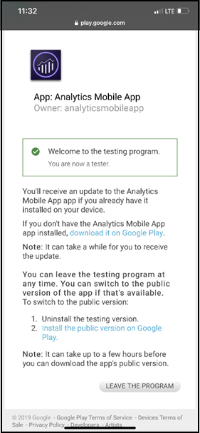
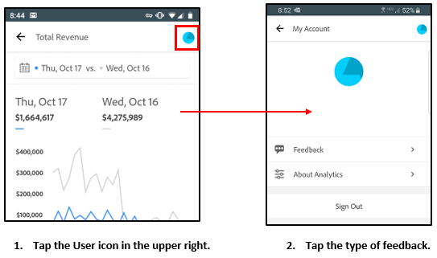
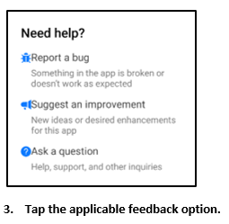

# Adobe Analytics dashboards : executive user quick start guide

>[!IMPORTANT]
>
>Adobe Analytics dashboards is not released and is only available for beta testing among invited customers. This documentation is intended >only for beta users and does not represent complete functionality of the feature. If you are interested in becoming a beta user for this >feature, please contact Ashok Gorrepati (gorrepati@adobe.com).

## Introduction

Adobe Analytics dashboards provides anytime, anywhere insights from Adobe Analytics.  The app allows users mobile access to intuitive scorecards. Scorecards are a collection of key metrics and other components presented in a tiled layout that you can tap for more detailed breakdowns and trended reports. Dashboards is supported on both iOS and Android operating systems.

## About this guide

This guide is intended to help executive users read and interpret Scorecards on Analytics dashboards. The app allows executive users to view a broad rendering of important summary data quickly and easily on their own mobile devices.

## Glossary of terms

| Term | Definition |
|--- |--- |
| Consumer| Executive persona viewing key metrics and insights from Analytics on a mobile device|
| Curator |Data literate persona who finds and distributes insights from Analytics and configures the Scorecards to be viewed by consumer |
| Curation | The act of creating or editing a mobile scorecard containing relevant metrics, dimensions and other components for the consumer |
| Scorecard | A dashboards view containing one or more tiles |
| Tile | A rendering for a metric within a Scorecard View |
| Breakdown | A secondary view accessible by tapping a tile in the Scorecard. This view expands on the metric displayed on the tile and optionally reports on additional breakdown dimensions. |
| Date Range | The primary date range for dashboards reporting |
| Comparison Date Range|The Date Range that is compared with the primary date range |

## Get dashboards set up on your device

To use the dashboards effectively, you will need to have your Scorecard curator help you set it up. This section provides information to help you get set up with the assistance of your curator.

### Get access

To access Scorecards on dashboards, ensure that: 

* You have a valid login into Adobe Analytics
* Your curator has correctly created mobile Scorecards and shared them with you

### Downloand and install dashboards

To download and install the app, follow the steps according to the operating system on your device.

**For iOS devices:**

1. Click the following public link (It is also available in Analytics under **Tools** > **dashboards**): 

    [iOS link](https://testflight.apple.com/join/WtXMQxlI): `https://testflight.apple.com/join/WtXMQxlI`

    After clicking the link, the following Testflight screen appears:

    

2. Tap the **View in App Store** link on the screen to download the Testflight app.

3. After installing the Testflight app, find and install Adobe Analytics dashboards from within Testflight as shown below:

    

**For Android devices:**

1. Tap the following Play Store link on the user's device (It is also available in Analytics under **Tools** > **dashboards**):

    [Android](https://play.google.com/apps/testing/com.adobe.analyticsmobileapp): `https://play.google.com/apps/testing/com.adobe.analyticsmobileapp`

    After tapping the link, tap the Become a Tester link on the following screen:

    

2. Tap the **download it on Google Play** link on the following screen:

    

## Use dashboards

To use dashboards:

1. Sign into the app. The sign in screen will appear upon launching dashboards. Follow the prompts using your existing Adobe Analytics credentials. We support both Adobe and Enterprise/Federated IDs.

    

2. Choose a company. After you sign into dashboards, the **Choose a company** screen appears. This screen lists the login companies to which you belong. Tap the company name associated with the Scorecard shared with you.

3. The Scorecard list then shows all Scorecards that have been shared with you. Tap the Scorecard you want to view.

    

    *Note : If you log in and see a message saying that nothing has been shared, verify the following with your curator:*

    * *You can log into the right Analytics instance*
    * *The Scorecard has been shared with you*

        

4. Examine how the tiles appear in the Scorecard. 

    

    Additional information on tiles:

    * The granularity of the sparklines is dependent on the length of the date range: 
    * One day shows an hourly trend
    * More than one day and less than a year shows a Daily trend
    * One year or more shows a weekly trend
    * Percent value change formula is metric total (current date range) – metric total (comparison date range) / metric total (comparison date range).
    * You can pull the screen down to refresh the Scorecard.

5. Tap a tile to show how a detailed breakdown for the tile works.
    
    

6. To change date ranges for your Scorecard:

    

    *Note: You can also change the date ranges within the Breakdown view shown above in the same way.*

    Depending on the interval you tap (**Day**, **Week**, **Month**, or **Year**), you will see two options for date ranges—either the present span of time or the one immediately preceding it. Tap one of these two options to select the first range. Under the **COMPARE TO** list, tap one of the presented options to compare the data of this time period with the first date range you selected. Tap **Done** in the upper right of the screen. The **Date Ranges** field and the Scorecard tiles are updated with the new comparison data from the new ranges you selected.

7. Get Scorecard updates. If a Scorecard does not include all of the metric or breakdowns that you may be interested in, please contact your Analytics team to have the Scorecard updated. Once updated, you can pull down the card on the screen to refresh it and load the recently-added data.

8. Leave feedback. To leave feedback:

    1. Tap the user icon in the upper right of the dashboards screen.
    2. On the **My Account** screen, tap the **Feedback** option.
    3. Tap to view the options for leaving feedback.

    
    

**To report a bug**:

Tap the option and choose a sub-category of the bug. In the form for reporting a bug, provide your email address in the top field and your description of the bug in the field below it. A screen shot of your account info is automatically attached to the message, but you can delete this if you want by tapping the **X** in the attachment image. You also have options for taking a screen recording, adding more screenshots, or attaching files. To send the report, tap the paper plane icon in the upper right of the form.

**To suggest an improvement**:

Tap the option and choose a sub-category for the suggestion. In the suggestion form, provide your email address in the top field and your description of the bug in the field below it. A screen shot of your account info is automatically attached to the message, but you can delete this if you want by tapping the **X** in the attachment image. You also have options for taking a screen recording, adding more screenshots, or attaching files. To send the suggestion, tap the paper plane icon in the upper right of the form.

**To ask a question**:

Tap the option and provide your email address in the top field and your question in the field below it. A screen shot is automatically attached to the message, but you can delete this if you want by tapping the **X** in the attachment image. You also have options for taking a screen recording, adding more screenshots, or attaching files. To send the question, tap the paper plane icon in the upper right of the form.
