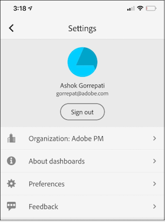

# Executive user quick start guide

The following information provides executive users with information on best practices for using and viewing Adobe Analytics dashboards. To see a video demonstrating this information, see [Adobe Analytics dashboards In-App Experience](https://youtu.be/QXqQ_PkArbA).

This guide is intended to help executive users read and interpret scorecards on Analytics dashboards. The app allows executive users to view a broad rendering of important summary data quickly and easily on their own mobile devices.

## Get dashboards set up on your device

To use the dashboards effectively, you will need to have your Scorecard curator help you set it up. This section provides information to help you get set up with the assistance of your curator.

### Get access

To access Scorecards on dashboards, ensure that:

* You have a valid login into Adobe Analytics
* Your curator has correctly created mobile Scorecards and shared them with you

### Download and install dashboards

To download and install the app, follow the steps according to the operating system on your device.

**For executive users on iOS:**

Click the following link (it is also available in Analytics under **[!UICONTROL Tools]** > **[!UICONTROL Analytics dashboards (Mobile App)]**) and follow the prompts to download, install, and open the app:

[iOS link](https://apple.co/2zXq0aN)

**For executive users on Android:**

Click the following link (it is also available in Analytics under **[!UICONTROL Tools]** > **[!UICONTROL Analytics dashboards (Mobile App)]**) and follow the prompts to download, install, and open the app:

[Android link](https://bit.ly/2LM38Oo)

Once downloaded and installed, executive users can sign into the app using their existing Adobe Analytics credentials.

## Use dashboards

To use dashboards:

1. Sign in to the app. The sign in screen will appear upon launching dashboards. Follow the prompts using your existing Adobe Analytics credentials. We support both Adobe and Enterprise/Federated IDs.

    

1. Choose a company. After you sign in to dashboards, the **[!UICONTROL Choose a company]** screen appears. This screen lists the login companies to which you belong. Tap the company name associated with the Scorecard shared with you.

1. The Scorecard list then shows all Scorecards that have been shared with you. Tap the Scorecard you want to view.

    

    If you log in and see a message saying that nothing has been shared, verify the following with your curator:

    * You can log into the right Analytics instance
    * The Scorecard has been shared with you

    

1. Examine how the tiles appear in the Scorecard (the first Scorecard is shown in dark mode; see **[!UICONTROL Preferences]** below for more information).

    

    Additional information on tiles:

    * The granularity of the sparklines is dependent on the length of the date range:

        * One day shows an hourly trend
        * More than one day and less than a year shows a daily trend
        * One year or more shows a weekly trend

    * Percent value change formula is metric total (current date range) – metric total (comparison date range) / metric total (comparison date range).

    * You can pull the screen down to refresh the Scorecard.

    The following example Scorecard is shown in normal mode:

    

1. Tap a tile to see how a detailed breakdown for the tile works.

    

1. To change date ranges for your Scorecard:

    

    * You can also change the date ranges within the Breakdown view shown above in the same way.

    * Depending on the interval you tap (**Day**, **Week**, **Month**, or **Year**), you will see two options for date ranges—either the present span of time or the one immediately preceding it. Tap one of these two options to select the first range. Under the **[!UICONTROL COMPARE TO]** list, tap one of the presented options to compare the data of this time period with the first date range you selected. Tap **[!UICONTROL Done]** in the upper right of the screen. The **[!UICONTROL Date Ranges]** field and the Scorecard tiles are updated with the new comparison data from the new ranges you selected.

1. To apply a segment filter to your Scorecard, tap the filter drop-down and select a segment that has been configured by your curator. [Filters](https://experienceleague.adobe.com/docs/analytics-learn/tutorials/analysis-workspace/using-panels/using-drop-down-filters.html) in the app function the same way they do in Analytics Workspace.

    

1. Get Scorecard updates. If a Scorecard does not include all of the metric or breakdowns that you may be interested in, please contact your Analytics team to have the Scorecard updated. Once updated, you can pull down the card on the screen to refresh it and load the recently-added data.

1. To leave feedback on this app:

    1. Tap the settings icon in the upper right of the app screen.
    2. On the **[!UICONTROL Settings]** screen, tap the **[!UICONTROL Feedback]** option.
    3. Tap to view the options for leaving feedback.

        

1. To change preferences, tap the **[!UICONTROL Preferences]** option shown above. In preferences, you can turn on biometric login or you can set the app for dark mode as shown below:

    

**To report a bug**:

Tap the option and choose a sub-category of the bug. In the form for reporting a bug, provide your email address in the top field and your description of the bug in the field below it. A screen shot of your account info is automatically attached to the message, but you can delete this if you want by tapping the **X** in the attachment image. You also have options for taking a screen recording, adding more screenshots, or attaching files. To send the report, tap the paper plane icon in the upper right of the form.

**To suggest an improvement**:

Tap the option and choose a sub-category for the suggestion. In the suggestion form, provide your email address in the top field and your description of the bug in the field below it. A screen shot of your account info is automatically attached to the message, but you can delete this if you want by tapping the **X** in the attachment image. You also have options for taking a screen recording, adding more screenshots, or attaching files. To send the suggestion, tap the paper plane icon in the upper right of the form.

**To ask a question**:

Tap the option and provide your email address in the top field and your question in the field below it. A screen shot is automatically attached to the message, but you can delete this if you want by tapping the **X** in the attachment image. You also have options for taking a screen recording, adding more screenshots, or attaching files. To send the question, tap the paper plane icon in the upper right of the form.

## Glossary of terms

| Term | Definition |
|--- |--- |
| Consumer| Executive persona viewing key metrics and insights from Analytics on a mobile device|
| Curator |Data literate persona who finds and distributes insights from Analytics and configures the Scorecards to be viewed by consumer |
| Curation | The act of creating or editing a mobile scorecard containing relevant metrics, dimensions and other components for the consumer |
| Scorecard | A dashboards view containing one or more tiles |
| Tile | A rendering for a metric within a Scorecard View |
| Breakdown | A secondary view accessible by tapping a tile in the Scorecard. This view expands on the metric displayed on the tile and optionally reports on additional breakdown dimensions. |
| Date Range | The primary date range for dashboards reporting |
| Comparison Date Range|The Date Range that is compared with the primary date range |

