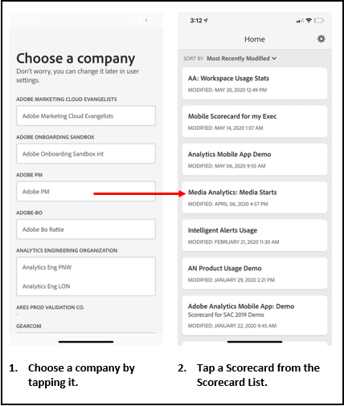

# Set up executive users with the app

In some cases, executive users may need some additional assistance to access and use the app. This section provides information to help you provide that assistance.

## Ensure app users have Adobe Analytics access

1. Set up new users in the [Experience Cloud Admin Console](/help/admin/admin-console/permissions/product-profile.md).

1. To be able to share scorecards, you must grant app users permissions to access scorecard components such as Analysis Workspace, the report suites that scorecards are based on, as well as segments, metrics and dimensions.

## App users' system prerequisites

To ensure that executive users have access to your scorecards on the app, make sure that:

* The minimum mobile OS requirements on their devices are iOS version 10 or higher, or Android version 4.4 (KitKat) or higher
* They have a valid login into Adobe Analytics.
* You have correctly created mobile scorecards for them and have shared these scorecards with them.
* They have access to the Components that the scorecard includes. Note that you can select an option when sharing your scorecards to **[!UICONTROL Share embedded components]**.

## Help executives download and install app

**For executive users on iOS:**

Click the following link (it is also available in Analytics under **[!UICONTROL Tools]** > **[!UICONTROL Analytics dashboards (Mobile App)]**) and follow the prompts to download, install, and open the app:

`[iOS link](https://apple.co/2zXq0aN)`

**For executive users on Android:**

Click the following link (it is also available in Analytics under **[!UICONTROL Tools]** > **[!UICONTROL Analytics dashboards (Mobile App)]**) and follow the prompts to download, install, and open the app:

`[Android link](https://bit.ly/2LM38Oo)`

Once downloaded and installed, executive users can sign into the app using their existing Adobe Analytics credentials; we support both Adobe and Enterprise/Federated IDs.

## Help executives access your scorecard 

1. Have executive users sign into the app.

   The **[!UICONTROL Choose a company]** screen appears. This screen lists the login companies to which the executive user belongs.

1. Have them tap the name of the login company or Experience Cloud Org that applies to the scorecard you shared. 

   The Scorecard list then shows all scorecards that have been shared with the executive under that login company.

1. Have them sort this list by **[!UICONTROL Most recently modified]**, if applicable.

1. Have them tap the name of the Scorecard to view it.

    

### Explain scorecard UI

Explain to the executive user how tiles appear in the scorecards you share.

Additional information on tiles:

* The granularity of the sparklines is dependent on the length of the date range:
* One day shows an hourly trend
  * More than one day and less than a year shows a daily trend
  * One year or more shows a weekly trend
  * Percent value change formula is metric total (current date range) – metric total (comparison date range) / metric total (comparison date range).
  * You can pull the screen down to refresh the Scorecard.

1. Tap a tile to show how a detailed breakdown for the tile works.

    

    * Tap any point on a sparkline to see data associated with that point on the line.

    * A table is included to display data of dimensions added to the tile. Tap the down arrow to select dimensions. If no dimension was added to the tile, the table displays chart data.

1. To change date ranges for your Scorecard, tap the Date header and select the primary and comparison date range combination you want to view.

    

## Change app preferences

To change preferences, tap the **[!UICONTROL Preferences]** option shown above. In preferences, you can turn on biometric login or you can set the app for dark mode as shown below:

## Troubleshooting

If the executive user logs in and sees a message saying that nothing has been shared:

*  The executive user may have selected the wrong Analytics instance, or
*  The scorecard may not have been shared with the executive user. 

Verify that the executive user can log into the right Adobe Analytics instance and that the scorecard has been shared. 

>[!IMPORTANT]
>
>Starting in October 2020, Adobe is gradually rolling out a series of enhancements to optimize the performance of the “Adobe Analytics dashboards” app. These enhancements center on caching historic Analytics data that is used to populate scorecards with dates (excluding the current day). This data will be cached for up to 24 hours in a secure Microsoft Azure public cloud storage account. Please contact your CSM if you would like to opt out of these performance enhancement features.
