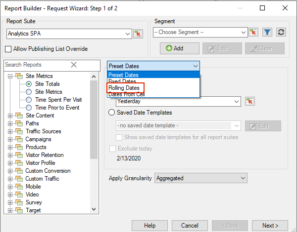
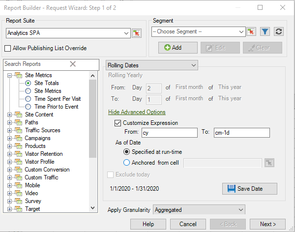

# Customized date expressions

You can specify a complex date range by building a custom expression.

When you build expressions, refer to a calendar to specify the number of weeks and days correctly. Excel has several built-in functions allowing you to calculate the number of days, workdays, months, and years between dates. You can use these functions in formulas to calculate other intervals, such as weeks and quarters.

**To enable custom expressions**

The following example shows how to enable a custom expression for **[!UICONTROL Rolling Dates]**.

1. On the [!UICONTROL Request Wizard: Step 1], instead of using **[!UICONTROL Preset Dates]**, select **[!UICONTROL Rolling Dates]**. 

   

1. Switch to rolling weekly, monthly, quarterly, or yearly. Notice how the options below change.
1. For more customization options, click **[!UICONTROL Show Advanced Options]**. 

   

1. For example, if you change the dates above to rolling monthly from the first day three months ago to the first day of this month, the dates in the advance options portion update themselves to reflect that:

   

1. Enable **[!UICONTROL Customize Expression]**. By selecting options under **[!UICONTROL Rolling Dates]**, you can easily see the syntax for custom date expressions.

   

   You can use Advanced Options to mix and match custom date expressions. For example, if you wanted to see data from the first of the year through the end of the last full month, you could enter the following: `From: cy` `To: cm-1d`. In the wizard, those dates are shown as 1/1/2020-1/31/2020.
