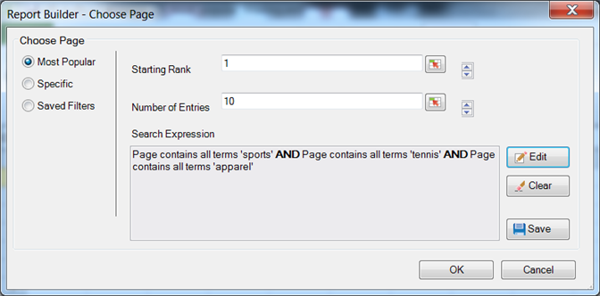

# Most popular filtering

Ranking and conditional filters that you configure using Boolean logic with AND/OR search expressions.

Most Popular filters are expression filters that you configure using Boolean logic with AND/OR conditions, such as [!UICONTROL Page does not contain]*`<product name>`* with conditions or groups of conditions like [!UICONTROL Includes All], [!UICONTROL Includes Any], or [!UICONTROL Excludes All]. You can [save](/help/analyze/report-builder/layout/c-filter-dimensions/saved-filters.md) these expressions for other request in this workbook, or in other workbooks.

**To create a Most Popular filter** 

1. Create or edit a request, and advance to the [!UICONTROL Request Wizard: Step 2].

1. On the [!UICONTROL Request Wizard: Step 2], click the link next to the dimension in the grid, then choose **[!UICONTROL Filter]**.

   

1. On the [!UICONTROL Choose Page] form, enable **[!UICONTROL Most Popular]**, then configure the following options:

   **Starting Rank:** The starting rank of a dimension. A default rank of 1 indicates the top item in the list of data reported. For example, for the dimension [!UICONTROL Page], a starting mark of 1 indicates the single most requested page of your site. You could specify 10 or another value as the starting rank cell, which produces a report starting with 10 as the highest. Metrics are arranged in descending order, so that line items with the greatest activity are reported first in the list. If you require more than 50,000 page names in one request, but have thousands of pages on which to report, you can copy the request and change the starting rank to retrieve the appropriate data in blocks of 50,000.

   **Number of Entries:** ( [!UICONTROL Pivot Layout] only) Defines how many items are reported for a particular metric over a date range. Some metrics may list hundred of entries for a metric, while others may show just a few. For example, for the dimension [!UICONTROL Site Section], a number of entries of 25 indicates that the report shows the 25 most visited pages.

   Arrows allow you to change the [!UICONTROL Starting Rank] and [!UICONTROL Number of Entries] of the first data point in the sheet. By default, the [!UICONTROL Starting Rank] is set to 1 and the [!UICONTROL Number of Entries] to 10. These values are adjustable from a minimum of one to a maximum of 50,000 for certain metrics. Each metric has its own ceiling on [!UICONTROL Number of Entries]. No negative values or zero are permitted in these fields. If you choose a [!UICONTROL Starting Rank] as 15 and [!UICONTROL Number of Entries] as 10, data requests for the metric return the 10 most visited pages, where the first most visited page is number 15 in the list for the specific date range. All the most requested pages ranked 15th to 25th are listed in descending order.

   >[!NOTE]
   >
   >Applying filters to existing requests causes changes in the data presented. Suppose you mapped the top ten [!UICONTROL Pages] to cells $A$1 through $A$10, with 1 for [!UICONTROL Starting Rank] and 10 for [!UICONTROL Number of Entries]. If you change these values to show 1 for [!UICONTROL Starting Rank] and only 3 for [!UICONTROL Number of Entries], the data previously filling cells $A$4 through $A$10 will no longer appear.

1. To create a search expression, click **[!UICONTROL Add]**.

1. On the [!UICONTROL Define Filter] form, configure the conditions appropriate for your needs.

   

   The select cell icon lets you locate a condition defined in the value of a cell.  

   The **Add Condition** link lets you add a condition to the expression. There is no limit to the number of conditions you can add.

1. Click **[!UICONTROL OK]**.

   

1. On the [!UICONTROL Choose Page] form, click **[!UICONTROL Save]** to save the expression.
1. Click **[!UICONTROL OK]**.
