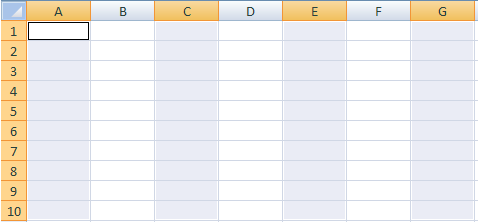

# Map metrics and dimensions to cells

Before you begin to map items to the spreadsheet, ensure that your spreadsheet is not protected. If the protection scheme for your worksheet prevents any user actions, you will not be able to select cells in the spreadsheet. First, unprotect the sheet and then add cell mappings.

The number of areas and cells to map differs according to the metric you select, the granularity, the date range, and the filters you set. For example, if you select [!UICONTROL Site Metric] > [!UICONTROL Traffic Report], set [!UICONTROL Week] granularity, and set the date range for the [!UICONTROL Last 2 Weeks], you're prompted to map three cells (when using [!UICONTROL Custom Layout]) on the [!UICONTROL Request Wizard: Step 2]. The request retrieves data for week one and data for week two, where each data point value equals the value of a page view. Your third cell serves as the row heading, which you can configure using [!UICONTROL Format Options].

If you mistakenly map incompatible locations on the spreadsheet, Report Builder issues an error.

For more information, see the following sections:

* [Select a Range of Cells](/help/analyze/report-builder/layout/map-metrics-and-dimensions-to-cells.md#section_1E37FB46DA194FB7A1050B8833A48AC6) 
* [Techniques for Selecting Cells](/help/analyze/report-builder/layout/map-metrics-and-dimensions-to-cells.md#section_760421C3D7F84D67A639174710C93B22) 
* [Issues When Mapping](/help/analyze/report-builder/layout/map-metrics-and-dimensions-to-cells.md#section_CC1BCF841291447EB3A994EB08F3A099)

## Select a Range of Cells {#section_1E37FB46DA194FB7A1050B8833A48AC6}

On the [!UICONTROL Request Wizard: Step 2], when you enable [!UICONTROL Custom Layout] for a trended request, you can map the request to a range of cells.

Click the **[!UICONTROL Range Selector]**  next to the item you want to map.

* **All Cells in Range:** Requires you to select a group of cells for a [!UICONTROL Custom Layout] style request.
* **First Cell of Range:** Lets you select the top-left cell of the range, and displays the [!UICONTROL Range] orientation to specify the horizontal or vertical orientation of input and output cells (column or row). Use this option to have Report Builder select cells for you.
* **Range Orientation:** Lets you orient the cell ranges as columns or rows.
* **Select Upper Cell Location of Range:** Displays the cell references.

## Techniques for selecting cells {#section_760421C3D7F84D67A639174710C93B22}

You select the data by clicking the **[!UICONTROL Range Selection]** icon  

and click-dragging the mouse over the desired range of cells of the spreadsheet. A continuous selection is outlined by a black border.

Separate selected rows have a thin white border around each row.

To map separate rows in one request, use the [!UICONTROL Control] key, then click and drag the cursor over the desired cells. You would do this if your request calls for four areas with ten cells each, rather than one continuous area with 40 cells together.

After you select cells, click the **[!UICONTROL Range Selector]** again on the [!UICONTROL Range Selection] form to return to the [!UICONTROL Request Wizard: Step 2].

## Troubleshooting mapping issues{#section_CC1BCF841291447EB3A994EB08F3A099}

If you mistakenly choose to map to a cell that already has an active mapping, no cell reference appears in the text box next to the range-picker icon. When you click [!UICONTROL OK], Report Builder displays the error, *The range selected intersects another request's range. Please change your selection.*

* If you still need to use the cell, right-click on the desired cell or cells, and select **[!UICONTROL Delete Request]**.

If you want to avoid this message, you can take two approaches:

* Plan the format of the report by adding formatting to the cells that have requests and mappings 
* Test for areas of the spreadsheet containing mappings

To test for areas with embedded requests, you can:

* Launch the [!UICONTROL Request Manager] and click on individual requests listed in the table. Clicking on the request highlights the cells of the spreadsheet where the request is mapped.
* Select cells in the spreadsheet you intend to use for a new mapping and click [!UICONTROL From Sheet]. The [!UICONTROL Request Manager] selects the request in the list which has an output item that intersects the selected cell. If no request is selected, then the cell is available.
* Select cells in the spreadsheet, right-click in the context menu and verify if [!UICONTROL Edit Request] is available. If so, there is a request associated with these cells.
