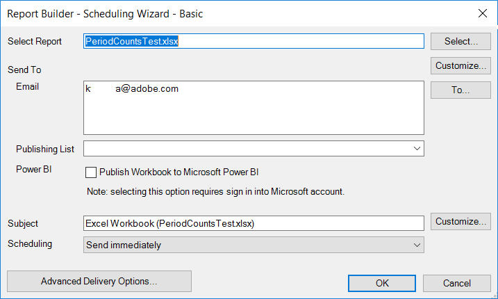

# Publish to Power BI - Overview

Microsoft Power BI is a suite of business analytics dashboards to analyze data and share insights. The Adobe Analytics integration with Power BI lets you visualize Report Builder Analytics data within Microsoft Power BI and easily share it across your organization.

Previously you, as an Analyst, would schedule Report Builder workbooks to be disseminated via email (or ftp). You can now give your business user stakeholders access (from within their Power BI accounts) to accurate and up-to-date data in a web-based environment that is accessible across platforms and devices.

Combining the report-generation capability of Report Builder with the visualization features of Power BI makes information more accessible to everyone in your organization. With Power BI, you can also integrate Adobe Analytics with other data sources (e.g. point of sale, CRM) to discover unique customer insights, associations, and opportunities.

## System requirements {#section_0B71092D853446F38FA36447DAC0D32B}

* Adobe Report Builder 5.5 [installed](/help/analyze/report-builder/setup/t-install-arb.md) 
* Active Microsoft account that enables you to sign in to Power BI

## Publish workbook to Power BI {#section_21CA66229EC240D49594A9A7D3FBA687}

Scheduled workbooks are formatted Excel spreadsheets populated with data from Adobe Analytics and sent on a regularly scheduled basis.

**Publish workbook in Report Builder**

1. In Report Builder, generate and save a workbook.
1. On the Report Builder Toolbar, click **[!UICONTROL Schedule]** > **[!UICONTROL New]**.

1. In the Basic Scheduling Wizard, check the box next to **[!UICONTROL Publish Workbook to Microsoft Power BI]**.

   

1. Specify your email and send immediately or specify the scheduling frequency (hourly, daily, etc.).
1. Click **[!UICONTROL OK]** to publish.
1. You will now be asked to log in to your Microsoft account. Provide your credentials.
1. The Report Builder workbook gets scheduled and published to Power BI.

   With each scheduled instance, and after the Report Builder scheduling process has refreshed the workbook with updated Analytics data, the workbook will be published to Microsoft Power BI.

**View Report Builder workbook data in Power BI**

1. In Power BI, double click the workbook under the [!UICONTROL Workbooks] menu.

   

1. You can now view the workbook dashboard data.  

1. You can then pin an area of this workbook in order to include it in any of your Power BI dashboards.

## Publish all formatted tables in the workbook as Power BI dataset tables {#section_7C54A54E75184DD6BAEF4ACCE241239A}

>[!NOTE]
>
>If the workbook contains a macro, the "Publish All Formatted Tables in the Workbook as Power BI Dataset Tables" will be disabled.

Instead of importing the entire workbook, you can import only the content of all formatted tables within the workbook.

**Use case**: You have an Excel workbook that pulls data from multiple Report Builder requests and creates a summary table with lots of formulas. You can import only the summary table into Power BI and create a visualization for it.

**Publish a formatted table in Report Builder**

1. In Report Builder, generate a table of data that includes a header row, followed by a row of data.
1. Select the table and select **[!UICONTROL Format as Table]** from the [!UICONTROL Home] menu. The table gets named by default (Table 1, Table 2, etc.), but you can change the name on the [!UICONTROL Design]menu.

1. On the Report Builder Toolbar, click **[!UICONTROL Schedule]** > **[!UICONTROL New]**.

1. In the Basic Scheduling Wizard, click **[!UICONTROL Advanced Scheduling Options]**.
1. In the [!UICONTROL Scheduling Wizard - Advanced], on the **[!UICONTROL Publishing Options]** tab, check the box next to **[!UICONTROL Publish all Formatted Tables as Power BI dataset tables]**.

   

1. (Optional) You can customize the name of the published asset in Power BI. This can be useful if you use versioning as part of the workbook name (e.g., myworkbook_v1.1.xlsx) and you don't want the version number to show up in the name of the published Power BI asset. It has the added advantage that the published asset will not change if the version number changes. (View [specifications](/help/analyze/report-builder/c-publish-power-bi/specifications-limits.md) here.)

**View the table data in Power BI**

1. In Power BI, go to the **[!UICONTROL Workspaces]** > **[!UICONTROL Datasets]** menu.

   

1. Select the dataset that you published and click the [!UICONTROL Create report] icon next to it. Notice that the tables will appear as Fields.

   

1. Select a table and its associated columns.

   

1. From the [!UICONTROL Visualizations] menu, you can select how to visualize a table in Power BI. For example, you could choose to present you data as a line graph:

   

1. From here, you can create visualizations from this dataset table.

## Publish all Report Builder requests as Power BI Dataset tables {#section_0C26057C7DBB4068A643FDD688F6E463}

You can turn all your requests into dataset tables and build visualizations on top of them.

>[!IMPORTANT]
>
>If the workbook contains more than 100 requests, only the first 100 requests will be published to Power BI. Plus, for each requests that is published to Power BI, only the first 10,000 rows of data will be published. So while these requests will be successfully delivered through scheduling, the scope of publishing to Power BI is limited.

1. In Report Builder, open or create a workbook with Report Builder requests.
1. On the Report Builder Toolbar, click **[!UICONTROL Schedule]** > **[!UICONTROL New]**.

1. In the Basic Scheduling Wizard, click **[!UICONTROL Advanced Scheduling Options]**.
1. In the [!UICONTROL Scheduling Wizard - Advanced], on the **[!UICONTROL Publishing Options]** tab, check the box next to **[!UICONTROL Publish all Report Builder Requests as Power BI Dataset Tables]** 

1. Click **[!UICONTROL OK]**.

**View the request data in Power BI**

Each scheduled Report Builder request will be published as a table in the dataset. Each request table is named after the primary dimension in the request and it has a [!UICONTROL Report Suite] and a [!UICONTROL Segments] column.

1. In Power BI, go to the **[!UICONTROL Workspaces]** > **[!UICONTROL Datasets]** menu.

1. Select the request that you published and click the [!UICONTROL Create report] icon next to it.

   Notice that the requests appear as tables in the [!UICONTROL Fields] menu.

   

   >[!NOTE]
   >
   >No matter how you configured your Report Builder request to be laid out on the worksheet (pivot layout, custom layout, some columns invisible), Report Builder will always publish your request in the same two-dimensional, single header row format: Date, Dimensions, Metrics, Report Suites, Segments.

1. Also notice that there is an additional table called **[!UICONTROL Legend]**. If you take a request out of the Report Builder context, it may be difficult to remember what each request stands for. The purpose of the Legend table is, for example, to show you the name of each request under Table ID. You can also add the other Legend columns to get a full view of the request.

   
