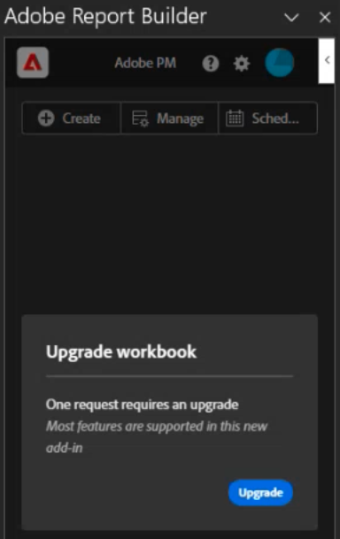
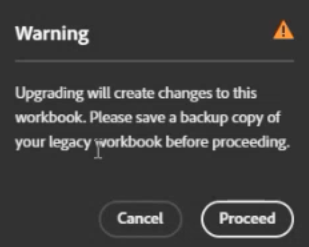

# Convert legacy Report Builder requests to datablocks

As part of the move to a new Report Builder technology, you can quickly convert your current legacy workbooks to Javascript-based workbooks. 

>[!IMPORTANT]
>
>Duplicate each request and rename it before you convert it.

>[!VIDEO](https://video.tv.adobe.com/v/3434957/?quality=12&learn=on)

1. Set up the new Report Builder by [following these instructions](/help/analyze/report-builder/report-builder-setup.md).

1. Open Excel and click the Adobe Report Builder icon at the top right. 

1. Click **[!UICONTROL Login]** and log in to Report Builder.

1. The Report Builder add-in detects if this workbook contains [Legacy Report Builder](/help/analyze/legacy-report-builder/home.md) requests.

    

1. If one or more legacy requests are found, click **[!UICONTROL Upgrade]** to upgrade a workbook. 

    >[!NOTE]
    >
    >You have to upgrade each request individually. Bulk upgrade is not supported.

1. A warning appears that alerts you to changes to the workbook if you upgrade. It also urges you to create a backup of your legacy workbook before proceeding.

    

1. Click **[!UICONTROL Proceed]** to continue with the upgrade.

    If the upgrade is successful, the following completion notice appears:

    

1. (Optional) Click **[!UICONTROL Download upgrade report]**. This report contains the status on each data block that was upgraded. 

You can now [manage the data block](/help/analyze/report-builder/manage-reportbuilder.md).