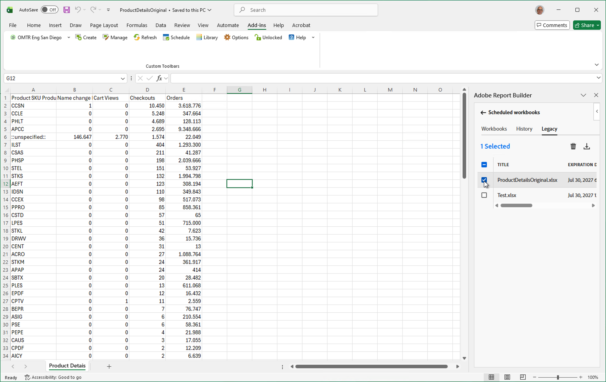
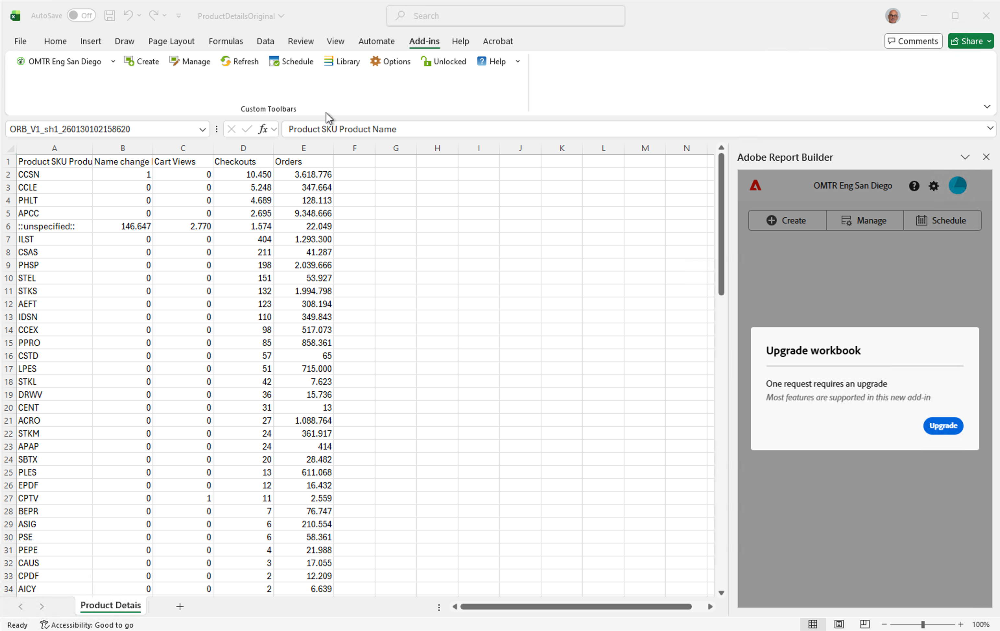
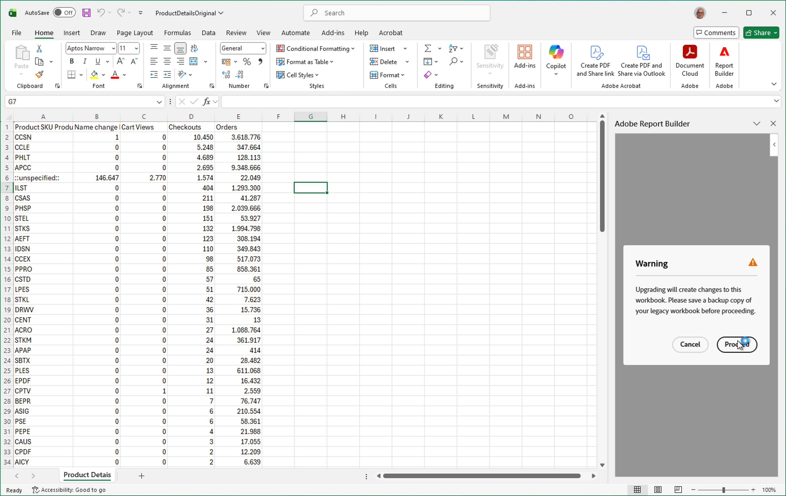
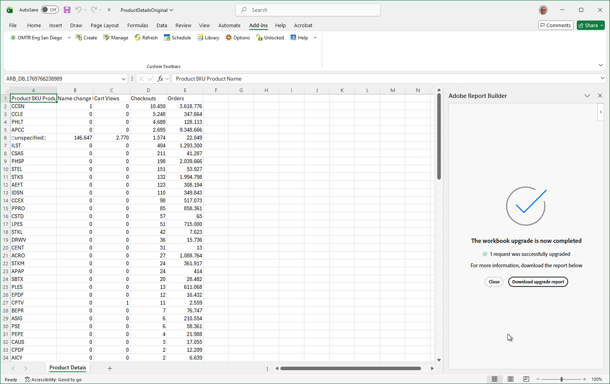
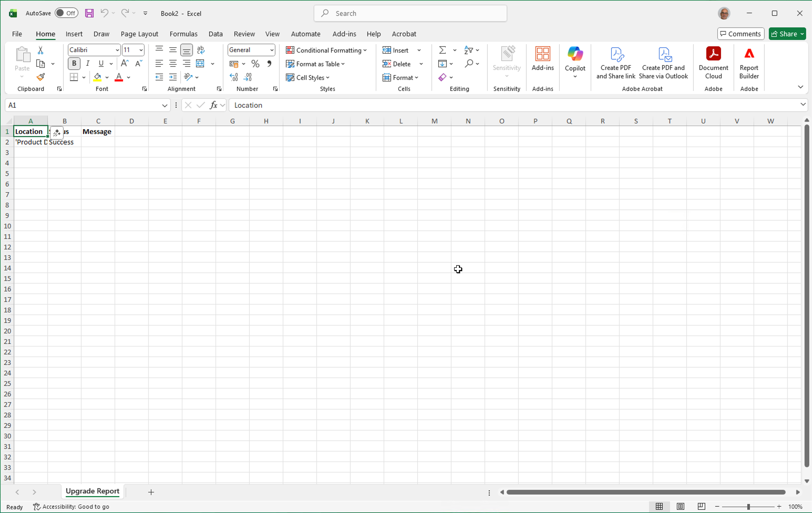
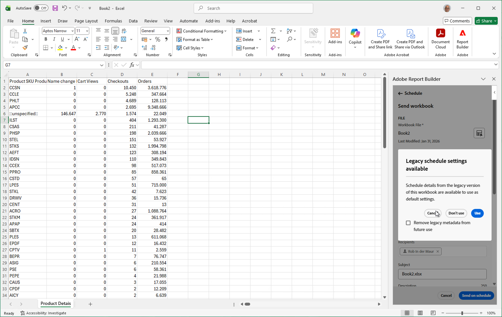

# Convert legacy Report Builder workbooks

As part of the move to a new Report Builder functionality, you can quickly convert your current legacy Report Builder based workbooks (legacy workbooks) to use the new Report Builder [datablocks](create-a-data-block.md) functionality. 

>[!IMPORTANT]
>
>Duplicate each workbook and rename one version before you convert the legacy workbook. That ensures that you always have a copy of the original legacy workbook, should you need it.

>[!BEGINSHADEBOX]

See  [Convert workbooks](https://video.tv.adobe.com/v/3434957?quality=12&learn=on){target="_blank"} for a demo video.

>[!ENDSHADEBOX]

>[!NOTE]
>
>To convert legacy workbooks, you must have first [set up the new Report Builder](/help/analyze/report-builder/report-builder-setup.md).

## Open a legacy workbook

To open a legacy workbook, you can:

* Open a legacy workbook directly from your local computer or network. When the legacy workbook is open in Excel:

  1. Select  **[!UICONTROL Report Builder]** from the Excel ribbon bar. 
  1. Select **[!UICONTROL Login]** and log in to Report Builder.
  1. Then [convert the legacy workbook](#convert-a-workbook).
  
* Open a scheduled legacy workbook from the **[!UICONTROL Schedule]** tab in the [Report Builder hub](report-builder-hub.md). To do so:

  1. Open Excel and select  **[!UICONTROL Report Builder]** from the Excel ribbon bar. 

  1. Select **[!UICONTROL Login]** and log in to Report Builder.

  1. Select **[!UICONTROL Schedule]** in the [Report Builder hub](report-builder-hub.md).
  1. Select the **[!UICONTROL Legacy]** tab. The tab lists the legacy Report Builder based scheduled workbooks.

     

  1. Select  the scheduled workbook you want to convert from the list, and select . The workbook is downloaded and opens in a new window in Excel. You can now [convert the legacy Report Builder workbook](#convert-a--workbook).

## Convert a legacy workbook

To convert your legacy workbook:

1. Once you open a legacy workbook, the new Report Builder detects if this workbook contains [legacy Report Builder](/help/analyze/legacy-report-builder/home.md) requests.

    {zoomable="yes"}

1. If one or more legacy requests are found, click **[!UICONTROL Upgrade]** in the **[!UICONTROL Upgrade workbook]** dialog to upgrade the workbook. 

    >[!NOTE]
    >
    >You have to upgrade each request individually. Bulk upgrade is not supported.

1. A **[!UICONTROL Warning]** dialog appears that alerts you to changes to the workbook if you upgrade. It also urges you to create a backup of your legacy workbook before proceeding.

    {zoomable="yes"}

1. Click **[!UICONTROL Proceed]** to continue with the upgrade.

    If the upgrade is successful, a **[!UICONTROL The workbook upgrade is now completed]** notification appears.

    

    * Select **[!UICONTROL Close]** to close the notification and continue to work in the workbook with updated requests for the new Report Builder. 

    * Select **[!UICONTROL Download upgrade report]** to download and open a new Excel workbook that shows the result of the upgrade. For an example, see below.

      

You can now [manage the data block](/help/analyze/report-builder/manage-reportbuilder.md).

## Schedule a converted legacy workbook

When you want to schedule a converted legacy workbook that you have downloaded and opened from the **[!UICONTROL Schedule]** tab in Report Builder hub, you have the option to use the schedule details from the legacy workbook.

1. Schedule a workbook. To schedule a converted legacy workbook with a legacy schedule:

   * Select **[!UICONTROL Send workbook]** from the Report Builder hub, or 
   * Select **[!UICONTROL Schedule workbook]** from the **[!UICONTROL Workbooks]** tab available in the **[!UICONTROL Schedules]** tab in Report Builder.

1. You are offered to use the schedule details from the legacy workbook as the default schedule settings.

   

   * Select **[!UICONTROL Use]** to use the legacy schedule details. The schedule details are prepopulated in the [Send workbook](schedule-reportbuilder.md#schedule-a-workbook) interface.
   * Select **[!UICONTROL Don't use]** to not use the legacy schedule details.
   * Select **[!UICONTROL Cancel]** to cancel.

   Select **[!UICONTROL Remove legacy metadata from future use]** to not use the legacy schedule details for this workbook in the future.

## Legacy Report Builder features not supported {#unsupported}

Some legacy Report Builder functionality is no longer available in the new Report Builder

* Real-time requests.

* Path/Fallout reporting.

* FTP option for scheduled reports.

* Visitors metrics. The following metrics will all be converted to *unique visitors*, even though the reporting result may not be an exact match: `visitorshourly`, `visitorsdaily`, `visitorsweekly`, `visitorsmonthly`, `visitorsquarterly`, and `visitorsyearly`. This also applies to `mobilevisitorshourly`, `mobilevisitorsdaily`, `mobilevisitorsweekly`, `mobilevisitorsmonthly`, `mobilevisitorsquarterly`, and `mobilevisitorsyearly`.
