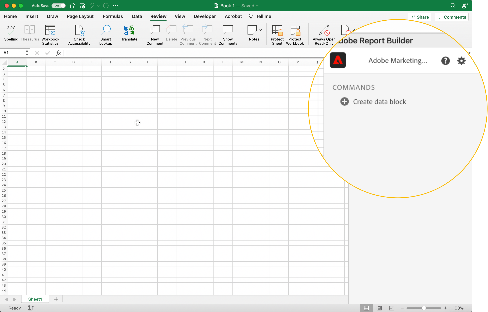
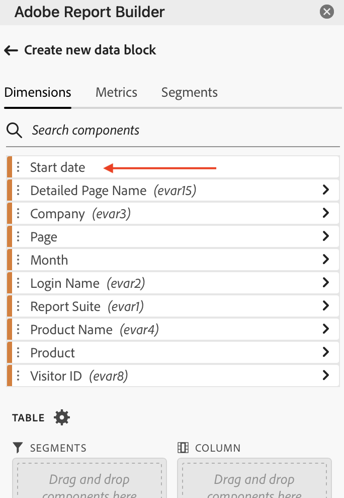
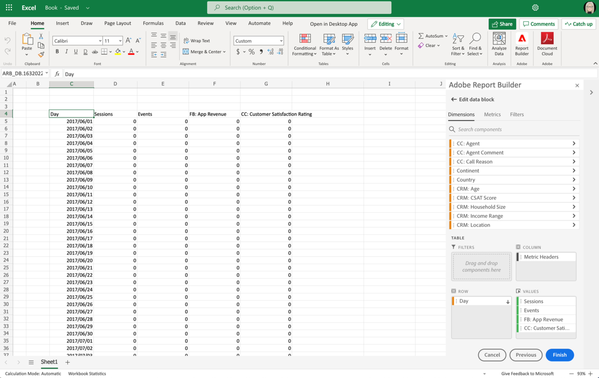
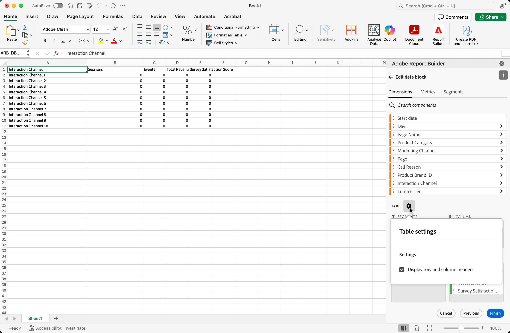
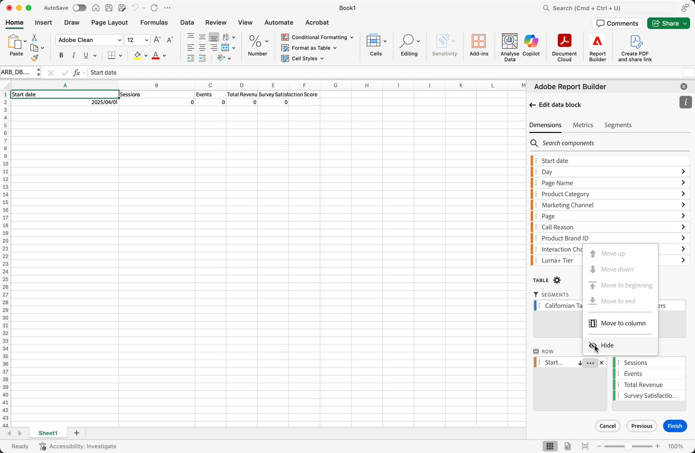
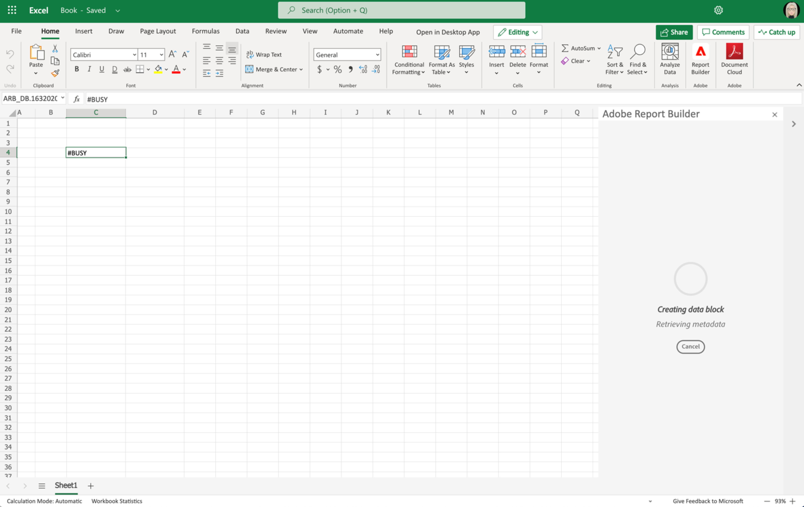
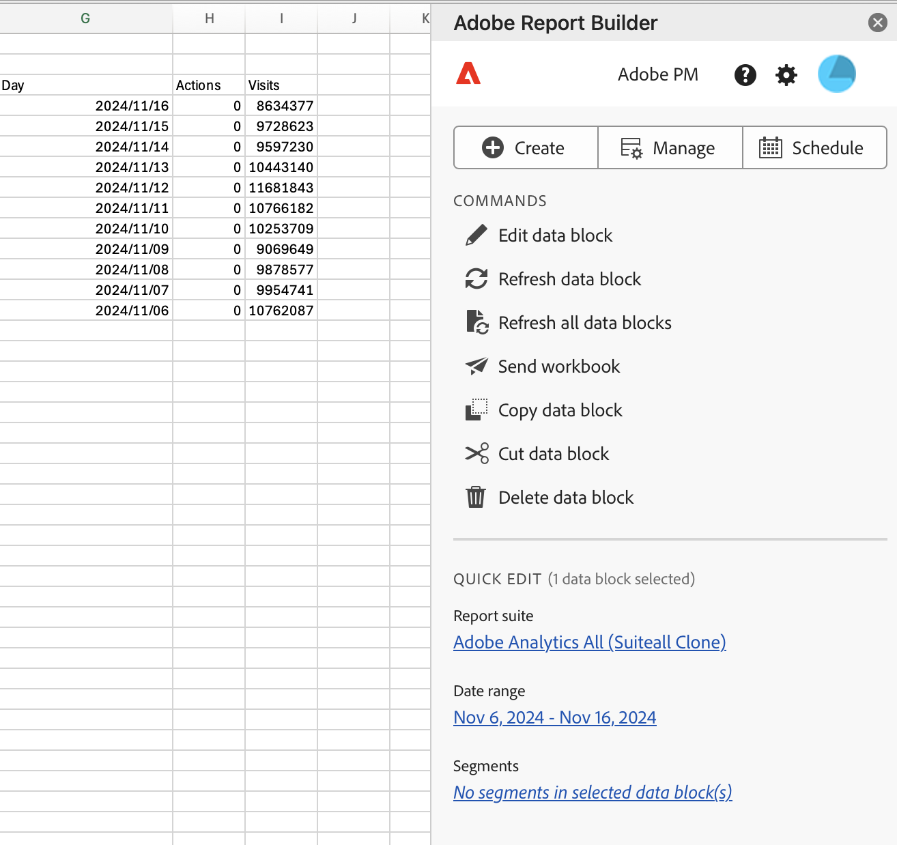

# Create a Data Block

A *data block* is the table of data created by a single data request. A Report Builder workbook can contain multiple data blocks. When you create a data block, first configure the data block and then build the data block.

## Configure the data block

Configure the initial data block parameters for the data block location, report suite, and a date range.

1. Click **[!UICONTROL Create]**.

    

1. Set the **[!UICONTROL Data block location]**.

    The data block location option defines the worksheet location where report builder adds the data to your worksheet.

    To specify the data block location, select a single cell in the worksheet or enter a cell address such as a3, \\\$a3, a\\\$3 or sheet1!a2. The cell specified marks the upper-left corner of the data block when the data is retrieved.

1. Choose a **Report Suite**.

    The report suites option allows you to choose a report suite from a drop-down menu or to reference a report suite from a cell location.

1. Set the **[!UICONTROL Date range]**.

    The Date range option allows you to choose a date range. Date ranges may be fixed or rolling. For information about data range options, see [Select a Date Range](select-date-range.md).

1. Click **[!UICONTROL Next]**.

    

    After you configure the data block, you can select dimensions, metrics, and segments to build your data block. The Dimensions, Metrics, and Filters tabs are displayed above the Table builder pane.

## Build the data block

To build the data block, select report components, and then customize the layout.

1. Add Dimensions, Metrics, and Filters.

    Scroll the component lists or use the **[!UICONTROL Search]** field to locate components. Drag and drop components to the Table pane or double-click a component name in the list to automatically add the component to the Table pane.

    Double-click a component to add it to a default section of the table.

    - Dimension components are added to the Row section or to the Column section if you have a dimension already in the columns.
    - Date components are added to the Column section.
    - Filter components are added to the Filters section.

    **Start date as a Dimension**

    Set the **[!UICONTROL Start date]** as a dimension to clearly identify the start date of your data block. This is helpful if you have a regularly scheduled report that has a rolling date range or if you have an unconventional date range and you need to be clear on the start date.

    {width="30%"}

1. Arrange the items in the Table pane to customize the layout of your data block.

    Drag and drop components in the Table pane to reorder components or right-click a component name and select from the options menu.

    When you add components to the table, a preview of the data block is displayed at the Data block location in the worksheet. The layout of the data block preview automatically updates as you add, move, or remove items in the table.

    

    **Display or hide row and column headers**

1. Click the **[!UICONTROL Table settings]** icon.

    {width="35%"}

1. Check or uncheck the option to Display row and column headers. The headers are displayed by default.

    **Hide or show dimension labels and metric headers**

1. Click the ellipsis icon on either the dimensions or the column headers to display the settings.

    {width="35%"}

1. Click Hide or Show to toggle the dimension labels or column headers. All labels are displayed by default.

1. Click **[!UICONTROL Finish]**.

    A processing message is displayed while the analytics data is retrieved.

    

    Report Builder retrieves the data and displays the completed data block in the worksheet.

    
