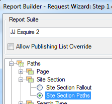
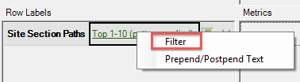
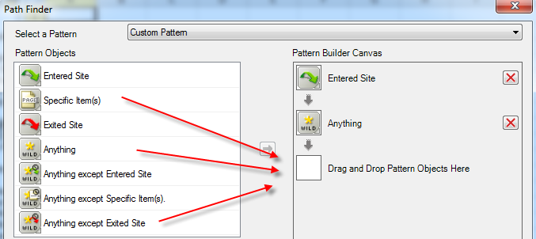
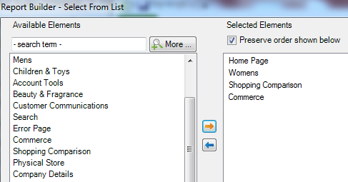

# Filter a Path Report Using the Request Wizard

Describes the steps involved in applying filters to a pathing report.

This example uses Site Section Paths.

1. In Adobe Report Builder, click **[!UICONTROL Create]** to open the Request Wizard.
1. Select the right report suite.
1. In the tree view on the left, select **[!UICONTROL Paths]** > **[!UICONTROL Site Sections]** > **[!UICONTROL Site Section Paths]**.

   

1. Specify the appropriate date/s.

1. Click **[!UICONTROL Next]**.
   
1. In Step 2 of the Wizard, under **[!UICONTROL Row Labels]**, click the **[!UICONTROL Top 1-10 (pattern applied)]** link. In a path report, a pattern is applied by default.

   

1. Select the **[!UICONTROL Filter]** option.

   

1. In the **[!UICONTROL Define 'Site Section Paths' Path Pattern]** dialog, you can specify
   *  The starting rank of the first report.
   *  The number of entries you want displayed in this report.
1. Click **[!UICONTROL Edit]** to define a path pattern.

1. If you want a custom pattern, drag and drop any **[!UICONTROL Pattern Objects]** from the list on the left into the **[!UICONTROL Pattern Build Canvas]** on the right.

   

1. You can also select a predefined pattern from the **[!UICONTROL Select a Pattern]** drop-down list and modify it. Here are the available patterns:

   

   Some of these patterns are specific to report builder: Entry Path's Next Item Pattern, Exit Path's Previous Item Pattern, Next Item Pattern.

## To edit a predefined pattern

You can edit a predefined pattern after selecting a pattern.
   
1. Continuing from the steps above, select the pattern. For example, select the **[!UICONTROL Exited Site Pattern]**: 
   
   

1. Define the site section path that the user follows before exiting. Click **[!UICONTROL Specific Item(s): 0 selected]**. You can define this path by selecting from a range of cells if you are editing an existing request, or by selecting from a list of sections.
   
1. To select from a range of cells from a previous request, select **[!UICONTROL From range of cells]** and click the cell selector icon. Then pick the cells from the report. 
   
   

1. To select from a list of site sections, select **[!UICONTROL From list]** and click **[!UICONTROL Add]**.
   
1. Move elements from the **[!UICONTROL Available Elements]** column to the **[!UICONTROL Selected Elements]** column by selecting them and clicking the orange arrow. The click **[!UICONTROL OK]**.

   

1. To save the pattern you just established, click **[!UICONTROL Save]**.
   
1. Click **[!UICONTROL OK]** three times and then click **[!UICONTROL Finish]** to generate the filtered path.
