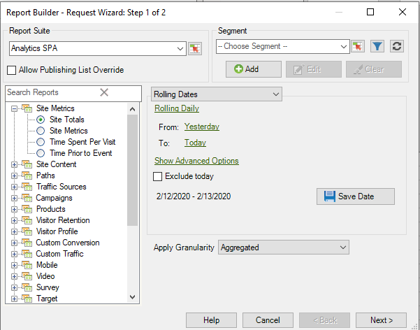

# Customized date expressions - overview

You can specify a complex date range by building a custom expression.

It is recommended that you refer to a calendar when building expressions in order to specify the number of weeks and days correctly. Excel has several built-in functions allowing you to calculate the number of days, workdays, months, and years between dates. You can use these functions in formulas to calculate other intervals, such as weeks and quarters.

**To enable custom expressions** 

1. On the [!UICONTROL Request Wizard: Step 1], instead of using "Preset Dates", select **[!UICONTROL Rolling Dates]**. Notice how the options below change.

   

1. Switch to rolling weekly, monthly, quarterly, or yearly.
1. For more customization options, click **[!UICONTROL Show Advanced Options]**. By selecting options in the top section, you can easily see the syntax for custom date expressions.

   

1. Enable **[!UICONTROL Customize Expression]**. By selecting options under **[!UICONTROL Rolling Dates]**, you can easily see the syntax for custom date expressions.

   

   You can use Advanced Options to mix and match custom date expressions. For example, if you wanted to see data from the first of the year through the end of the last full month they could write the following: From: cy To: cm-1d. You can see that in the wizard, it confirms those dates as being 1/1/2020-1/31/2020.

   For example, If you change the dates above to rolling monthly from the first day three months ago to the first day of this month, the dates in the advance options portion update themselves to reflect that:

   

