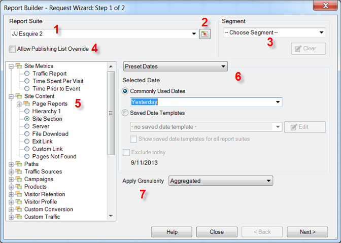

# Data requests - Request Wizard Step 1

On the Request Wizard: Step 1 form, you select the report suite, report type, segments, and configure dates.

 

1. **[!UICONTROL Report Suite]**: The list of report suites available to you based on your login credentials. See [Select Report Suites](/help/analyze/report-builder/data-requests/selecting-report-suites/t-select-report-suites.md).

1. **Range Selector**: Lets you select a report suite ID from a cell in Excel. See [Select Report Suites](/help/analyze/report-builder/data-requests/selecting-report-suites/t-select-report-suites.md).

1. **Segment**: Segments are custom subsets of data, or data filtered by rules that you create. Segments are based on hits, visits, and visitors. See the [Analytics Segmentation Guide](https://docs.adobe.com/content/help/en/analytics/components/segmentation/seg-home.html) for more information about segments.

   For example, you can run a [!UICONTROL Pages Report], and then apply a First Time Visits segment.

1. **Allow Publishing List Override**: When you schedule a report, you can choose a publishing list to use for distribution. Publishing lists are set up in **[!UICONTROL Analytics]** > **[!UICONTROL Admin tools]**. The report suite for this request is replaced by the report suite ID assigned to each recipient in the publishing list. See [Allow Publishing List Overrides](/help/analyze/report-builder/data-requests/allow-publishing-list-overrides.md).

1. **Report Type**: Specifies the base report you want to run in your data request. You run one report per request, and that report can have one-to-many dimensions and one-to-many metrics. Metrics and dimensions for a report type are displayed on the [!UICONTROL Request Wizard; Step 2] interface. See [Select Report Types](/help/analyze/report-builder/data-requests/c-report-types/select-report-types.md).

1. **Date Ranges**: Defines the time span covered by the request. Several types of request time periods are available, such as preset, fixed, and rolling. The maximum number of periods is 366. You can also choose a date range specified by a cell, and save date ranges as templates for later use.  See [Configuring Report Dates](/help/analyze/report-builder/data-requests/configuring-report-dates/custom-calendar.md) 

1. **Apply Granularity**: Specifies the level of time-based detail that is included in the report. See [Granularity](/help/analyze/report-builder/data-requests/configuring-report-dates/granularity.md).

>[!MORELIKETHIS]
>
>* [Create a Data Request](/help/analyze/report-builder/data-requests/t-create-a-data-request.md)
