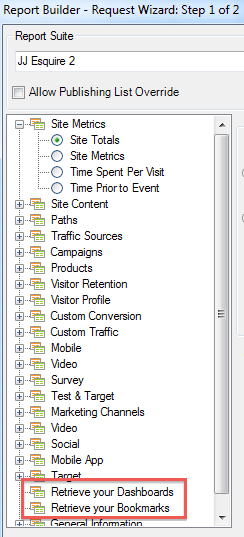

# Import bookmarked reports and dashboard reportlets

All bookmarked reports and dashboard reports are now listed as dimensions in the Request Wizard Step 1 and can be imported as Report Builder requests.

When you select a bookmarked report, the Request Wizard populates all the dimensions and metrics that define this bookmarked report. The date range, granularity and selected segment are also updated based on the selected bookmark.

This is how the Request Wizard Step 1 shows a dashboard and its reportlets:

When you click **[!UICONTROL Retrieve your Dashboards]** or **[!UICONTROL Retrieve your Bookmarks]**, your existing dashboard and/or bookmark data is retrieved and pasted in the worksheet.

>[!NOTE]
>
>In Report Builder, the list of available dashboards and bookmarks is limited to the user but also to the ones that apply to the report suite you selected in Step 1 of the wizard. By contrast, in marketing reports & analytics, you are given access to all bookmarks and dashboards that are accessible to you, regardless of which report suites these dashboard and bookmarks use.

>[!NOTE]
>
>Only data is imported, so if the bookmark contains a chart, or if the dashboard reportlet consists of only a chart, only the data that is used to populate the chart is imported.

Once you have created a request by importing a dashboard reportlet (or a bookmark), the request will then be associated to the reportlet's (or bookmark's) primary dimension. As a result, if you edit the request, the tree view no longer selects the dashboard reportlet tree view node (or bookmark node): it selects its primary dimension instead.

The imported bookmarklet will properly set the report suite, selected segment, dimension and selected metrics to the same parameters exposed in the Reports & Analytics bookmark.

>[!IMPORTANT]
>
>The date range will be set to the same date range, but as a static date range - even if this date range was a rolling date range in the Reports & Analytics bookmark.
