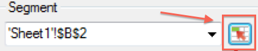

# Interactive controls

Interactive Controls allow you to edit segments and date ranges for one or more requests directly from the worksheet. This gives you more flexibility when updating report builder requests.

Interactive controls were created in response to a common workflow where analysts create workbooks and share these workbooks with the marketing organization. Interactive controls give marketers the ability to modify and refresh requests without having to have in-depth knowledge of how report builder works. (Note that in order to refresh a request, the workbook recipient must be a report builder user.) These controls work inside of scheduled workbooks. Two types of interactive controls are currently available:

* Rolling Date Range 
* Segments

>[!IMPORTANT]
>
>You must have Report Builder v5.0 installed for the interactive controls to work. >
>* If you are running Microsoft Excel on Windows but are running a lower version of report builder, or if you do not have report builder installed: You can change the value in the interactive control, but it will not refresh the associated request, nor update the request's associated parameters.
>* If you are running Excel on Mac, changing the value in the control will cause the following message to be displayed: "The macro 'Adobe.ReportBuilder.Bridge.FormControlClick.Event' cannot be found." 
>

>[!WARNING]
>
>Do not tamper with the name of the control. (To see the name, set the focus on the control and the control name appears right above the Excel grid, in the upper left corner.)

## Implement interactive date range control {#section_39B228F2D2C44985863D31424C953280}

1. In Step 1 of the Request Wizard select, for example, the **[!UICONTROL Page]** report.
1. Next to the **[!UICONTROL Commonly Used Dates]** drop down, click the **[!UICONTROL Control Settings]** icon:

   

1. In the Control Settings dialog, select all the date range items that you want displayed in the interactive control. In addition, specify the upper left cell location of the control.

   

1. Notice the option to "Automatically refresh linked requests upon item selection".

    * If checked, all requests that use this control are refreshed.
    * If not checked, the associated request parameters are updated, but the request is not refreshed.

1. Click **[!UICONTROL OK]**. The control appears in the cell location that you specified:

1. You can now change the date range and the request will refresh with that date range.

   

1. You can also copy the request and right click to use one of two Paste Request options:

    * **[!UICONTROL Paste Request]** > **[!UICONTROL Use Absolute Input Cell]**. This means that the copied request will point to the same interactive date range control as the original request.
    
    * **[!UICONTROL Paste Request]**> **[!UICONTROL Use Relative input Cell]**. This mean that the copied request will point to its own control.
    
      >[!NOTE]
      >
      >You can use the native Microsoft Excel Cut/Copy/Paste control functionality. Report builder automatically recognizes the newly added controls.

## Implement interactive segment control {#section_5003D3F724644280BF1BCD6E1B0CB784}

Implementing the interactive segment control is similar to implementing the date range control.

1. In Step 1 of the Request Wizard, next to the **[!UICONTROL Segment]** drop-down list, select the Segment Control Settings icon:

   

1. In the Segment Control Settings dialog, select the segments you want to include in the drop-down. In addition, specify the upper left cell location of the control.

   

1. The new interactive control will now appear in the workbook:

   
