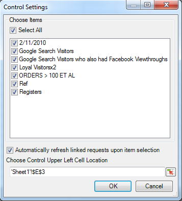

# Manage segments

How to add, edit, apply, and filter Adobe Analytics segments in Report Builder.

Report Builder features a segmentation panel in Step 1 of the Request Wizard that lets you create and manage segments.

## Add or edit segments {#section_B2BC136F9A53498D90C7C2ECC5DB892B}

>[!NOTE]
>
>To add or edit segments, the Report Builder segment interface launches the Analytics segment builder in a Microsoft Internet Explorer window. Your report builder session will stay active. Browsers other than Internet Explorer are not supported for this operation.

1. In the segment panel of Step 1 of the Request Wizard, click **[!UICONTROL Add]**.
1. An Internet Explorer window launches that opens the Analytics Segment Builder interface. For information on how to build segments, refer to [Analytics segmentation](https://experienceleague.adobe.com/docs/analytics/components/segmentation/seg-home.html).
1. After you have defined and saved the segment, go back to the Request Wizard.
1. Click the Refresh icon to refresh the segment list.

>[!IMPORTANT]
>
>This list is cached and your newly created segment will not appear unless you do a refresh.

## Create in-context segments {#section_6DD2C663B2854469AA1075438F907678}

You may have specific combinations of report dimensions that you would like to turn into a segment. You can create these segments from the Report Builder interface. For example, select a few pages from a Page request output, and create a segment based on these values.

1. Select the report output items you want to turn into a segment.
1. Right-click to select **[!UICONTROL Create In-Context Segment in]** and specify the right container (Hits Container, Visits Container, Visitor Container).

   

   For more information on containers, see the [Segmentation Guide](https://experienceleague.adobe.com/docs/analytics/components/segmentation/seg-home.html).

1. The Segment Builder UI will be now launched in Internet Explorer. The Segment Builder UI will be initialized with the container and the filter you specified.
1. After you have added a name and description to the segment, save it.
1. Go back to report builder and click the Refresh icon to refresh the list of segments.
1. You are now ready to apply this segment.

## Search for and apply segments {#section_CACA269B48E94CFD91C2D5A15E9C77B7}

Any segments that were created in Reports & Analytics, Report Builder, or Data Warehouse appear in this segment list. To refresh the list, click the Refresh icon ( .

You can apply one or multiple segments to any given request. This includes sequential segments.

1. Go to the **[!UICONTROL Segment]** drop-down list and click the small down arrow in the **[!UICONTROL Choose Segment]** box to display all the segments.

   

1. Check which segment(s) you want to apply.

>[!NOTE]
>
>Whether you are an Admin or a non-Admin, in Report Builder you can see only those segments that you own and those that have been shared with you. (In the Marketing Reports & Analytics user interface, the Admin can see all segments in the organization.)

## Filter segments {#section_376E986D3E684999A7CDB08E53854159}

**Filter** segments by clicking on the Filter icon:  

Available filters include: 

|  Filter Name  | Description  |
|---|---|
|  Tags  |Lets you filter on segments with specific tags. Note that Tag filters use the AND operator. If you check two tags, the right pane shows segments that have been tagged with **both** tags.  |
|  Owners  |Lets you filter segments by owner. Note that Owners filters use the OR operator. If you check two owners, the right pane shows segments that are owned by **either** owner.  |
| Other Filters > Only *report suite name* |If you apply the "Only *report suite name*" filter in the Segment Builder in [!DNL marketing reports & analytics], and then display the Advanced Filter in [!DNL report builder], the Advanced filter will display the segment for the selected report suite only.  |
|  Other Filters > Mine  | Shows all segments that you own.  |
|  Other Filters > Shared with Me  | Shows all segments that others shared with you.  |
|  Other Filters > Favorites  | Shows all segments you marked as Favorites.  |
|  Other Filters > Approved  | Shows all officially approved segments.  |

## Add a segment control to a workbook {#section_E3E5149A8464441FA5445A98DBD520AC}

Adding a segment control lets you switch segments from within a workbook instead of having to go into the Request Wizard.

1. Click the Control icon ( ) next to the segment drop-down.

   

1. Check all the segments that you want to appear in the segment control, or check **[!UICONTROL Select All]**.
1. Notice the option **[!UICONTROL Automatically refresh linked requests upon item selection]**.

    * If checked, all requests that use this control are refreshed.
    * If not checked, the associated request parameters are updated, but the requests are not refreshed.

1. Specify the upper left cell location of the segment control.
1. Click **[!UICONTROL OK]** and the segment control appears in the specified location.

   

## Refresh the list of segments {#section_22E4A86789444B4A998532396B476EFB}

Any time you add a new segment or edit an existing one, you should click the Refresh icon (  to refresh the cached list of segments.

## Manage segments across requests {#section_C3D63FCBE1A94369A319243313B03C93}

Prior to v5.4, Report Builder let users change segments on multiple requests. However, this process always replaced the existing segments. Users who wanted to add one new segment to each request could not do this, since adding the segment would remove the previous set of segments already assigned to each request.

Report Builder 5.4 lets you add, remove, replace, and replace all segment(s) within multiple requests:

1. Select multiple requests in a workbook.
1. Right-click and select **[!UICONTROL Edit Requests]** > **[!UICONTROL By Segment]**.

   

1. In the Edit Group dialog, select one of the four options: 

   |  Option  | Description  |
   |---|---|
   |  Add Segment  | Lets you choose one or more segments to add to the list of current segment/s.  |
   |  Replace Segment(s)  | Lets you choose which segment/s to replace with one or more segment/s.  |
   |  Replace All Segments by  | Lets you choose one or more segments to replace the current segment/s with.  |
   |  Remove Segment(s)  | Lets you remove segments from the requests.  |
