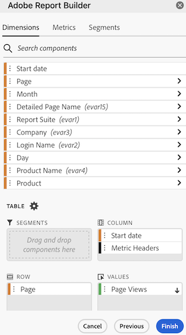

# Filter Dimensions

By default, each dimension item in the table returns the top 10 items for that dimension.

To change the dimension items returned for each dimension

1. Select a data block and click Edit data block in the COMMANDS panel.

1. Click Next to display the Dimensions tab.

1. Click the **...** icon next to a component name in the table.

    

1. Select **Filter dimension** in the pop-up menu to display the **Filter dimension** pane.

1. Select **Most popular** or **Specific**.

    

1. Select appropriate options based on the filter type chosen.

1. Click **Apply** to add the filter.

    Report Builder displays a notification to confirm the added filter.

To display applied filters, hover over a dimension. Dimensions with applied filters display a filter icon to the right of the Dimension name.

## Filter Type

There are two ways to filter dimension items: Most popular and Specific.

## Most popular

The Most popular option allows you to dynamically filter dimension items based on metric values. Most popular filtering returns the highest ranked dimension items based on metric values. By default, the first 10 dimensions items are listed, sorted by the first metric added to the data block.

 

### Page and Rows options

Use the **Page** and **Rows** fields to divide data into sequential groups or pages. This allows you to pull ranked row values other than the top-most values into your report. This feature is especially useful for pulling data beyond the 50,000 row limit.

#### Page and Rows defaults

- Page = 1
- Rows = 10

The Page and Rows default settings identify that each page has 10 rows of data. Page 1 returns the top 10 items, page 2 returns the next 10 items, and so on.

The table below lists examples of page and row values and the resulting output.

| Page | Row    | Output               |
|------|--------|----------------------|
| 1    | 10     | Top 10 items         |
| 2    | 10     | Items 11-20          |
| 1    | 100    | Top 100 items        |
| 2    | 100    | Items 101-200        |
| 2    | 50,000 | Items 50,001-100,000 |

#### Minimum and maximum values

- Starting page: Min = 1, Max: 50 million
- Number of rows: Min = 1, Max: 50,000

### Include "No value"

In Customer Journey Analytics, some dimensions collect a "no value" entry. This filter allows you to exclude these values from reports. For example, you can create a classification such as the Product Name classification based on the Product SKU key. If a specific product SKU has not been set up with its specific Product Name classification, its Product Name value is set to "no value".

Include "**No value**" is selected by default. Deselect this option to exclude entries with no value.

### Filter by Criteria

You can filter dimension items based on whether all criteria are met or if any criteria are met.

To set filtering criteria

1. Select an operator from the drop-down list.

    

1. Enter a value into the search field.

1. Click Add row to confirm the selection and add another criteria item.

1. Click the delete icon to remove a criteria item.

    You can include up to 10 criteria items.

### Change the filter and sort order

An arrow appears next to the metric used to filter and sort the data block. The direction of the arrow indicates whether the metric is sorted greatest to least or least to greatest.

To change the sort direction, click the arrow next to the metric. 

To change the metric used to filter and sort the data block,

1. Hover over the desired metric component in the Table builder to display additional options.

2. Click the arrow on the preferred metric. 

   

## Specific filtering

The Specific option allows you to create a fixed list of dimension items for each dimension. Use the **Specific** filtering type to specify the exact dimension items to include in your filter. You can select items from a list or from a range of cells.

### From list

1. Select the **From list** option to search for and select dimension items.

    When you select the **From list** option, the list is populated with dimension items with the most events first.

    

    The **Available items** list is ordered from dimension items with the most events to those with the least.

1. Enter a search term in the **Add item** field to search the list.

1. To search for an item not included in the last 90 days of data, click **Show items for the last 6 months** to extend the search.

    

    After data from the past 6 months loads, Report Builder updates the link to **Show items for last 18 months**.

1. Select a dimension item.

    Selected dimension items are automatically added to the **Selected items** list.

    

    To delete an item from the list, click the delete icon to remove the item from the list.

    To move an item in the list, drag and drop the item or click ... to display the move menu.

    

1. Click **Apply**

    Report Builder updates the list to show the specific filtering you applied.

### From range of cells

Select the **From range of cells** option to choose a range of cell that contain the list of dimensions items to match.

 

When you select a range of cells, consider the following restrictions:

- The range must have at least one cell.
- The range can't have more than 50,000 cells.
- The range must be in a single uninterrupted row, or column.

Your selection can contain empty cells or cells with values that don't match with a specific dimension item.

### From the Dimensions tab in the Table builder

From the **Dimensions** tab, click the chevron icon next to a dimension name to view the list of dimension items.

 

You can drag and drop items onto the **Table** or double-click an item name to add it to the **Table** builder.
