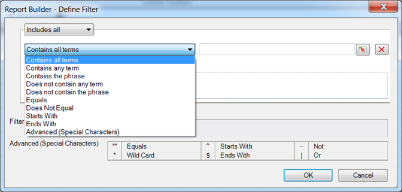

# Filter dimensions overview

You can filter on dimensions that you add to the Row Labels grid. Filters narrow the data returned by requests and can be applied from the Pivot or Custom Layouts. When you configure dimension filtering from the Pivot Layout, you can additionally specify the number of entries from cell.

The selected filter form is populated based on the element & metric that is selected in the report builder request.

## Define filter - values and special characters {#section_15840216A4044C40974945FAA435AD93}

Information about filters in the **[!UICONTROL Most Popular Filter]** > **[!UICONTROL Define Filter]** panel.

The following tables provide examples and information about filters: 

<table id="table_8AC3A26FF02143DBA949B30F2A46CF11"> 
 <thead> 
  <tr> 
   <th colname="col1" class="entry"> Filter </th> 
   <th colname="col02" class="entry"> Description </th> 
   <th colname="col2" class="entry"> Example Filter </th> 
   <th colname="col3" class="entry"> Match Results </th> 
  </tr> 
 </thead>
 <tbody> 
  <tr> 
   <td colname="col1"> 
Contains all terms 
 </td> 
   <td colname="col02"> 
Contains every space-delimited value in any order. 
 </td> 
   <td colname="col2"> 
a b c 
 </td> 
   <td colname="col3"> 
Matches  a b cand  b a c, and so on. 
 </td> 
  </tr> 
  <tr> 
   <td colname="col1"> 
Contains any term 
 </td> 
   <td colname="col02"> 
Contains at least one of the filters (space-delimited). 
 </td> 
   <td colname="col2"> 
A B C 
 </td> 
   <td colname="col3"> 
Matches  A1,  B2,  C3, but not  D4. 
 </td> 
  </tr> 
  <tr> 
   <td colname="col1"> 
Contains the phrase 
 </td> 
   <td colname="col02"> 
Contains the search filter and possibly other terms. 
 </td> 
   <td colname="col2"> 
abc 
 </td> 
   <td colname="col3"> 
Matches  abc and  abc def. 
 </td> 
  </tr> 
  <tr> 
   <td colname="col1"> 
Does not contain any term 
 </td> 
   <td colname="col02"> 
Returns everything unless it contains a value you enter. 
 </td> 
   <td colname="col2"> 
a b c 
 </td> 
   <td colname="col3"> 
Matches  d e f but not  c d e f. 
 </td> 
  </tr> 
  <tr> 
   <td colname="col1"> 
Does not contain the phrase 
 </td> 
   <td colname="col02"> 
Returns everything that does not contain your phrase. 
 </td> 
   <td colname="col2"> 
abc 
 </td> 
   <td colname="col3"> 
Excludes  abc,  abc def and matches  def 
 </td> 
  </tr> 
  <tr> 
   <td colname="col1"> 
Equals 
 </td> 
   <td colname="col02"> 
Returns an exact match. 
 </td> 
   <td colname="col2"> 
abc 
 </td> 
   <td colname="col3"> 
  abc is returned, and nothing else. 
 </td> 
  </tr> 
  <tr> 
   <td colname="col1"> 
Does not equal 
 </td> 
   <td colname="col02"> 
Returns anything that does not exactly match your entry. 
 </td> 
   <td colname="col2"> 
a 
 </td> 
   <td colname="col3"> 
Does not match  a. 
 
Matches  a b c. 
 
Matches  abc. 
 </td> 
  </tr> 
  <tr> 
   <td colname="col1"> 
Starts with 
 </td> 
   <td colname="col02"> 
Returns results that start with a specific value. 
 </td> 
   <td colname="col2"> 
abc 
 </td> 
   <td colname="col3"> 
Matches  abcd but not  1abc 
 </td> 
  </tr> 
  <tr> 
   <td colname="col1"> 
Ends with 
 </td> 
   <td colname="col02"> 
Returns results that end with the specific value. 
 </td> 
   <td colname="col2"> 
xyz 
 </td> 
   <td colname="col3"> 
Matches  wxyz but not  wxyz0 
 </td> 
  </tr> 
  <tr> 
   <td colname="col1"> 
Advanced (special characters) 
 </td> 
   <td colname="col02"> 
Lets you regex characters: 
 
 <code> "", ^, -, *, $, | </code> 
 </td> 
   <td colname="col2"> 
"^Home*Page$" | sports 
 </td> 
   <td colname="col3"> 
 This defines a filter that starts with  Home, and then looks for zero or more characters, and then ends with  Page. 
 
Also, any page with  sports in it. 
 
A few example matches: 
 
    <ul id="ul_72D76C5AFEAF405E8A0E4E3C604D10AE"> 
     <li id="li_4D490059B667450DA8A0103167C7B391">HomePage </li> 
     <li id="li_1351619156274092AEB2771D882AD357">Home and (other characters) Page </li> 
     <li id="li_940EAA99A8CF49308E8471065EB317B1">Home sports </li> 
     <li id="li_50A895F14A454BE9BF06EE0F07F99B3B">sports Page </li> 
     <li id="li_F3CE0D07941D4C2485D2DE0B73E00677">sports </li> 
     <li id="li_E84C15C061824A5D922D9900392F2996">xyz sports abc </li> 
    </ul> </td> 
  </tr> 
 </tbody> 
</table>

<table id="table_8BBB06C8860745DEA41B39673699DC0F"> 
 <thead> 
  <tr> 
   <th colname="col1" class="entry"> Special Characters </th> 
   <th colname="col2" class="entry"> Purpose </th> 
   <th colname="col3" class="entry"> Notes </th> 
  </tr> 
 </thead>
 <tbody> 
  <tr> 
   <td colname="col1"> " " </td> 
   <td colname="col2"> Equals </td> 
   <td colname="col3"> 
Not escaped unless it is not paired with another quote. For example,  17" Display is not a phrase. 
 </td> 
  </tr> 
  <tr> 
   <td colname="col1"> * </td> 
   <td colname="col2"> Wildcard </td> 
   <td colname="col3"> 
Same as the asterisk used in a regular expression. 
 </td> 
  </tr> 
  <tr> 
   <td colname="col1"> ^ </td> 
   <td colname="col2"> Starts with </td> 
   <td colname="col3"> </td> 
  </tr> 
  <tr> 
   <td colname="col1"> $ </td> 
   <td colname="col2"> Ends with </td> 
   <td colname="col3"> </td> 
  </tr> 
  <tr> 
   <td colname="col1"> - </td> 
   <td colname="col2"> Not </td> 
   <td colname="col3"> </td> 
  </tr> 
  <tr> 
   <td colname="col1"> | </td> 
   <td colname="col2"> Or </td> 
   <td colname="col3"> 
Supported only in the  Advanced (special characters) filter. 
 </td> 
  </tr> 
 </tbody> 
</table>
