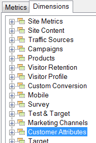

# Customer attributes

Customer attributes are stored in new type of element called VisAttr, which can be configured as a dimension or a metric.

 For more detailed information on how to upload customer attributes, see the [Experience Cloud help](https://experienceleague.adobe.com/docs/core-services/interface/customer-attributes/attributes.html).

* If it's configured as a metric, VisAttr is exposed both as metric and "dimension".

    

* It supports the same breakdown as an eVar (anything can be broken down by anything).
* VisAttr supports all eVar metrics.
* VisAttr as a metric supports "bucketization" (like Time Spent on Site: 0 to 30, 31 to 60, …) 
* VisAttr is available as a segmentation dimension.
