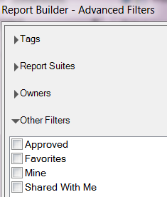
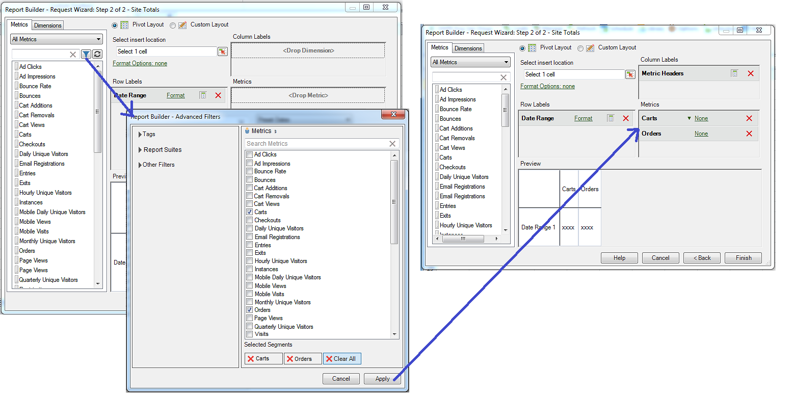

# Calculated Metrics

Report Builder 5.2 supports Adobe Analytics Unified Calculated Metrics. Among other innovations, all calculated metrics now have a global ID - they are no longer restricted to one report suite.

>[!NOTE]
>
>Existing workbooks might point to requests with legacy metric IDs. When you use Report Builder 5.2, these legacy metric IDs will be converted to the new global ID. If you share this workbook with a user of Report Builder v5.1 or earlier, that user will not be able to see the calculated metrics.

To find out more about how to create and manage calculated metrics with the new Calculated Metric Builder and Manager, refer to the [Calculated Metrics](https://experienceleague.adobe.com/docs/analytics/components/calculated-metrics/cm-overview.html) Guide.

In Step 2 of the Request Wizard, you can filter and apply calculated metrics.

## Filter Calculated Metrics {#section_376E986D3E684999A7CDB08E53854159}

**Filter** calculated metrics by clicking on the Filter icon:  

. The Advanced Filters dialog is populated with both standard and calculated metrics.

Available filters include:

|  Filter Name  | Description  |
|---|---|
|  Tags  |Lets you filter on calculated metrics with specific tags. Note that Tag filters use the AND operator. If you check two tags, the right pane shows metrics that have been tagged with **both** tags.  |
|  Report Suites  |If you apply the "Only *report suite name*" filter in the Calculated Metric Builder in [!DNL Reports & Analytics], and then display the Advanced Filter in [!DNL Report Builder], the Advanced filter will display the calculated metrics for the selected report suite only.  |
|  Owners  |Lets you filter metrics by owner. Note that Owners filters use the OR operator. If you check two owners, the right pane shows metrics that are owned by **either** owner.  |
|  Other Filters > Approved  | Shows all officially approved metrics.  |
|  Other Filters > Favorites  | Shows all metrics you marked as Favorites.  |
|  Other Filters > Mine  | Shows all metrics that you own.  |
|  Other Filters > Shared with Me  | Shows all metrics that others shared with you.  |

## Apply Calculated Metrics {#section_DF5CF349460A45FDA4B6E6BB8B52F18E}

After you have selected the filters, click **[!UICONTROL Apply]** to apply them to your request. The selected metric(s) are now added to the report layout.

