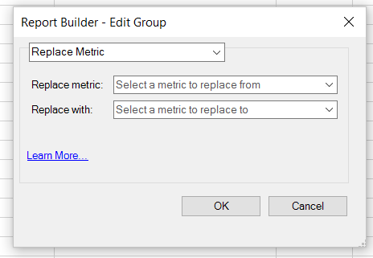

# Edit metrics across multiple requests

The Edit Metrics Across Multiple Requests feature lets you easily add, remove, or replace metrics in a pre-existing request or across a group of requests.

## Add metrics {#section_3FBDA9668039404895059618D70FCBCD}

Keep in mind that

* Metrics can be added only to Pivot Layout requests. If some of the selected requests are Custom Layouts, metrics cannot be added. The reason is that Report Builder does not know where in the spreadsheet to place the new metric, since the layout is customized.
* Accordingly, if you have selected only Custom Layout requests, the **[!UICONTROL Add Metric/s]** option is not available.
* Adding metric/s will increase the size of a request and may cause it to overlap with another request. Make sure your request has enough space around it to allow for adding metrics.
* If the metric added is already present in one of the selected requests, it will not be added to that request.

To add one or more metrics:

1. Select one or more requests in Excel and right-click to select **[!UICONTROL Edit Metrics]**. (Or, click **[!UICONTROL Manage]** > **[!UICONTROL Edit Multiple]** > `<choose metric>` > **[!UICONTROL Edit Group]** to select the group of requests to modify.) 
1. Select **[!UICONTROL Add Metric(s)]**and select the metrics to add.

   

1. Refresh the request to see actual data. Until you refresh, you will see offline data.

## Replace metric {#section_D773AAC7B30C4FBEBDB66B203C217818}

Keep in mind that

* Only 1:1 substitutions are allowed, not 1:many or many:1.
* If the metric selected to be replaced is not present in one of the selected requests, this request is left unchanged.
* The new metric will be placed in the same location as the substituted metric. This means:

    * **In a Pivot Layout**: if a pivot layout request outputs date, visit, visitors, daily unique and "visitors" is replaced by "revenue", the updated request layout will be: date, visit, revenue, daily unique.
    * **In a Custom Layout**: if the "visitors" metric was output in cell F11, the updated request layout will show "revenue" in the same cell F11.

* If the substituted metric had some operation applied to it (average, pre-pended text, post-pended text, microcharting), these operations will also be applied to the new metric.

To replace a metric

1. Select one or more requests in Excel and right-click to select **[!UICONTROL Edit Metrics]**. (Or, click **[!UICONTROL Manage]** > **[!UICONTROL Edit Multiple]** > **`<choose metric>`** > **[!UICONTROL Edit Group]** to select the group of requests to modify.) 

1. Select **[!UICONTROL Replace Metric]**.

   

1. Select which metric to replace and which metric to replace it with.
1. Refresh the request. Until you refresh, you will see offline data.

## Remove metrics {#section_D3CD5BAC7670416593B633B2B8423C60}

Keep in mind that

* If any of the metrics selected to be removed are not present in one of the selected requests, this request is left unchanged.
* In a Pivot Layout, removing a metric causes the layout to shift for metrics that are located after the removed metric.

  **Example**: if a pivot layout request outputs date, visits, visitors, daily unique, and you remove "visits", the updated layout for the request will show: date, visitors, daily unique.

To remove metrics:

1. Select one or more requests in Excel and right-click to select **[!UICONTROL Edit Metrics]**. (Or, click **[!UICONTROL Manage]** > **[!UICONTROL Edit Multiple]** > **`<choose metric>`** > **[!UICONTROL Edit Group]** to select the group of requests to modify.) 

1. Select **[!UICONTROL Remove Metric(s)]**.

   

1. Select one or more metrics to remove from the request.
1. Refresh the request. Until you refresh, you will see offline data.
