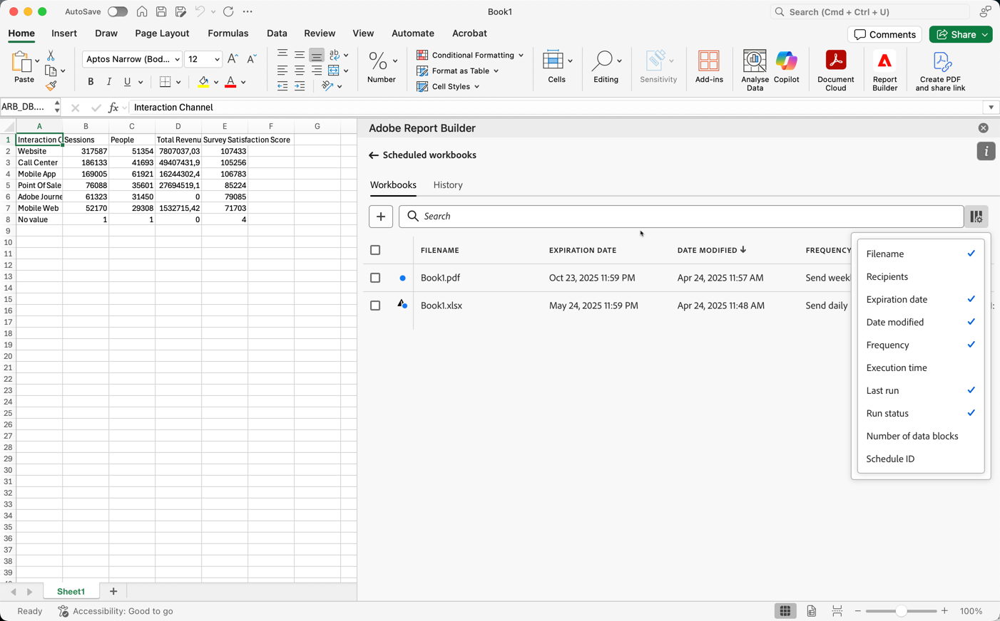
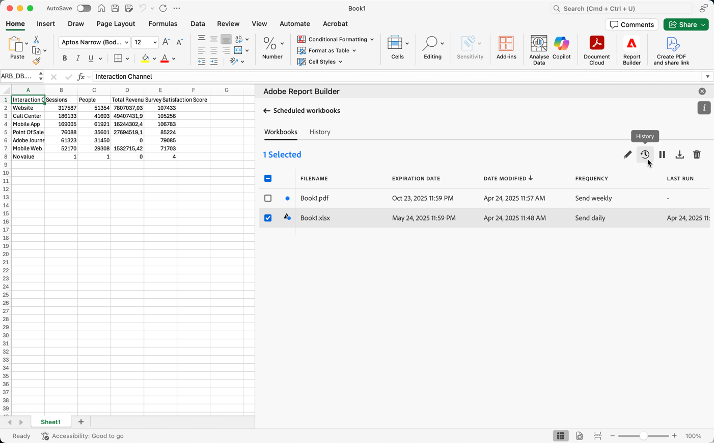

# Manage scheduled workbooks

You can schedule a workbook for sharing through email or by exporting to a cloud destination, as described in the following articles:

* [Schedule workbooks by sharing through email](/help/analyze/report-builder/schedule-reportbuilder.md)

* [Schedule workbooks by exporting to cloud destinations](/help/analyze/report-builder/report-builder-export.md)

The following sections describe how to manage workbooks after they are scheduled:

## View and manage scheduled workbooks

You can view and manage all scheduled workbooks in the **[!UICONTROL Workbooks]** tab.

1. Select **[!UICONTROL Schedule]** in the Report Builder hub 

1. Select the **[!UICONTROL Workbooks]** tab. You see a list of all scheduled workbooks.

   {zoomable="yes"}

   You can hover over the icon to see the status of a scheduled workbook.

   Use  to search for specific scheduled workbooks.
   Use  to define which columns to show.

1. Select one or more workbooks.

   {zoomable="yes"}
   
   The following options are available:

   | Option | Description |
   |---|---|
   |  | Edit the schedule for a selected workbook. |
   |  | Show the history of selected workbooks. |
   |  | Pause the schedule of selected workbooks. |
   |  | Resume the schedule of selected workbooks. |
   |  | Download the selected workbook into a new workbook. |
   |  | Delete the schedule of selected workbooks. |
 

## History and status of scheduled workbooks

You can view the history and status of scheduled workbooks in the **[!UICONTROL History]** tab.

1. Select **[!UICONTROL Schedule]** in the Report Builder hub.

1. Select the **[!UICONTROL History]** tab. You see a list of all scheduled workbooks.

   {zoomable="yes"}

   Use  to search for specific workbooks in the list.
   Use  to define which columns to show.

   The **[!UICONTROL History]** tab allows you to review the status of each scheduled task. A separate row documents the status change for each scheduled task.

   * A  indicates that the workbook was sent successfully. 
   * A  indicates that an error occurred.

Alternatively, you can select  for one or more selected workbooks in the **[!UICONTROL Workbooks]** tab. This action shows the **[!UICONTROL History]** tab with a list filtered by your selection. Select  to remove a filter.
