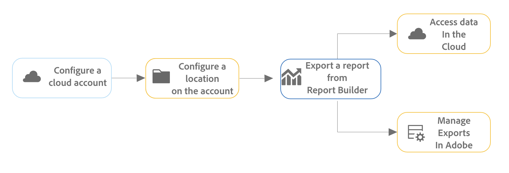

# Export reports from Report Builder

You can export Adobe Analytics reports from Report Builder to cloud providers like Google, Azure, Amazon, and Adobe. 

[Advantages of exporting reports from report builder to the cloud](#advantages-of-exporting-to-the-cloud) include the ability to utilize them in third-party tools or combine them with outside data. 

When exporting reports from Report Builder, consider the following:

* Before you export to the cloud, make sure that your data blocks, your environment, and your permissions meet the [export requirements](#export-requirements).

* Some [features](#unsupported-features) and [components](#unsupported-components) are not supported when exporting reports from Report Builder to the cloud.

## Understand the export process

Use the following process when exporting reports from Report Builder to the cloud:

1. [Configure a cloud account](/help/components/locations/configure-import-accounts.md)

1. [Configure a location on the account](/help/components/locations/configure-import-locations.md)

1. [Export a report from Report Builder](#export-a-report-from-report-builder)

1. Access data in your cloud account and [Manage exports in Adobe](/help/components/exports/manage-exports.md)

## Export a report from Report Builder {#export-from-report-builder}

<!-- markdownlint-disable MD034 -->

>[!CONTEXTUALHELP]
>id="export-manifest"
>title="Manifest file"
>abstract="When enabled, a manifest file is included with any successful export delivery. The manifest file enables you to confirm that all files were delivered successfully."

<!-- markdownlint-enable MD034 -->

>[!NOTE]
>
>Before you export data as described in this section, learn more about [the export process](#understand-the-export-process) in the section above.

To export reports from Report Builder:

1. If you haven't already, configure an export account and location, as described in [Configure cloud export accounts](/help/components/locations/configure-import-accounts.md).

1. In the Excel spreadsheet that contains the data that you want to export, open the **[!UICONTROL Adobe Report Builder]** right panel. 

1. Select [!UICONTROL **Schedule**].

  <!-- add screenshot -->

1. In the [!UICONTROL **Adobe Report Builder**] right panel, specify the following information:

   |Field name | Function | 
   |---------|----------|
   | **[!UICONTROL File]** | Displays the workbook file that is currently selected for export. Select the icon next to the file name to choose a different file. |
   | **[!UICONTROL Filename]** <!--should be File name --> | Allows you to change the filename before exporting the workbook. |
   | **[!UICONTROL File type]** | Choose the file type for the exported file. You can choose Excel, PDF, or CSV. |
   | **[!UICONTROL Append time stamp to file name]** | Select this option to include a timestamp of the export in the exported file name. |
   | **[!UICONTROL Filename preview]** <!--should be File name preview --> | Shows a preview of how the file name will appear after the export. |
   | **[!UICONTROL Password protect the workbook]** | Specify a password to protect the exported file so only people with the password can access it. 
Passwords must be at least 8 characters and contain at least 1 number and 1 special character (such as `!`,`@`,`#`, and `$`).
 |
   | **[!UICONTROL Email]** | Select this option to send the file to a specific email address. |
   | **[!UICONTROL Other deliveries]** | Select this option to send the file to a cloud account, then use the **[!UICONTROL Account]** and **[!UICONTROL Location]** drop-down menus to select the account and location. |
   | **[!UICONTROL Account]** | Select the cloud export account where you want the data to be sent. 
Or, if you haven't already configured a cloud account that you want to use, you can configure a new account:<ol><li>Select [!UICONTROL **Add account**], then specify the following information:<ul><li>[!UICONTROL **Location account name**]: Specify a name for the location account. This name appears when creating a location </li><li>[!UICONTROL **Location account description**]: Provide a short description of the account to help differentiate it from other accounts of the same account type.</li><li>**[!UICONTROL Make account available to all users in your organization]**: Select this option to allow other users in your organization to use the account. Consider the following when sharing accounts:<ul><li>Accounts that you share cannot be unshared.</li><li>Shared accounts can be edited only by the owner of the account.</li><li>Anyone can create a location for the shared account.</li></ul></li><li>[!UICONTROL **Account type**]: Select the type of cloud account you are exporting to. Available account types are Amazon S3 Role ARN, Google Cloud Platform, Azure SAS, Azure RBAC, Snowflake, and AEP Data Landing Zone.</li></ul><li>To finish configuring your account, continue Step 6 in [Configure cloud import and export accounts](/help/components/locations/configure-import-accounts.md), then expand the section that corresponds to the [!UICONTROL **Account type**] you selected:<ul><li>Amazon S3 Role ARN</li><li>Google Cloud Platform</li><li>Azure SAS</li><li>Azure RBAC</li><li>Email</li></ul></ol> |
   | **[!UICONTROL Location]** | Select the location on the account where you want the export data to be sent.
Or, if you haven't already configured the location that you want to use on the account that you selected, you can configure a new location:<ol><li>Select [!UICONTROL **Add location**], then specify the following information: <ul><li>[!UICONTROL **Name**]: The name of the location.</li><li>[!UICONTROL **Description**]: Provide a short description of the location to help differentiate it from other locations on the account.</li><li>**[!UICONTROL Make location available to all users in your organization]**: Select this option to allow other users in your organization to use the location. Consider the following when sharing accounts:<ul><li>Locations that you share cannot be unshared.</li><li>Shared locations can be edited only by the owner of the account.</li><li>Locations can be shared only if the account that the location is associated with is also shared.</li></ul></li><li>[!UICONTROL **Location account**]: Select the account where you want to create the location.</li></ul><li>To finish configuring your location, continue with the link below that corresponds to the account type that you selected in the [!UICONTROL **Location account**] field:<ul><li>[Amazon S3 Role ARN](/help/components/locations/configure-import-locations.md#amazon-s3-role-arn)</li><li>[Google Cloud Platform](/help/components/locations/configure-import-locations.md#google-cloud-platform)</li><li>[Azure SAS](/help/components/locations/configure-import-locations.md#azure-sas)</li><li>[Azure RBAC](/help/components/locations/configure-import-locations.md#azure-rbac)</li></ul> | 
   | **[!UICONTROL Show scheduling options]**  | Select this option to view additional options for scheduling the export. Leave this option unselected if you want to send the export only once. When this option is unselected, the export is initiated immediately. | 
   | **[!UICONTROL Starting on]**  | The day and time that the scheduled export should begin. 
This option is available only when choosing a scheduled export frequency.
 | 
   | **[!UICONTROL Ending on]** | The day and time that the scheduled export expires. The scheduled export no longer runs after the date and time that you set. 
This option is available only when choosing a scheduled export frequency.
 |  
   | **[!UICONTROL Frequency]** | Set the schedule for how often the export should occur. When sending on a schedule, options include [!UICONTROL **Send every day**], [!UICONTROL **Send every weekday**], and [!UICONTROL **Custom frequency**]. 

When selecting an export frequency, consider the following:
<ul><li>The options in the [!UICONTROL **Lookback window**] field change depending on what you select here.<!-- if they're doing Daily, then we might not let them look back to the last year... --></li><li>Additional configuration fields display depending on the option you choose.</li></ul>  |
   
   {style="table-layout:auto"}

1. Select [!UICONTROL **Send on schedule**] to export the workbook.

   Data is sent to the cloud account that you specified at the frequency that you specified.

1. (Optional) After you create the export, whether you chose to send it now or on a defined schedule, you can view and manage it on the [Exports page](/help/components/exports/manage-exports.md) and view it in the [Export logs](/help/components/exports/manage-export-logs.md).

## Manage exports

After data is exported from Analysis Workspace, you can edit, re-export, duplicate, tag, or delete existing exports, as described in [Manage exports](/help/components/exports/manage-exports.md). 

## Advantages of exporting to the cloud {#advantages}

Exporting Adobe Analytics data to the cloud allows you to: 

* Export to a shared location, such as Google Cloud Platform, Microsoft Azure, and Amazon S3.

* Store large amounts of historical data.

  This type of data can be used to detect long-term trends in order to gain business intelligence, and ultimately lead to better business decision-making.

* Include calculated metrics in the exported Adobe Analytics data. 

* Structure data output as concatenated values. 

* Export one-time or on a schedule.

* Export files in Excel, PDF, or CSV format. 

* Export data blocks that include multiple dimensions.

## Export requirements {#export-requirements}

### Minimum requirements

Make sure that your data blocks, your environment, and your permissions meet the following requirements:

* **Data blocks:** All data blocks must include at least one component to column, row, or value.

* **Environment:** Ensure that the [IP addresses](/help/technotes/ip-addresses.md) and [Domains](/help/technotes/domains.md) used by Adobe Analytics are allowed through their organization's firewall.

* **Permissions:** In the Adobe Admin Console, users must be assigned a product profile that has the [!UICONTROL **Full Table Export**] permission assigned to it in order to export full tables. For information about assigning a permission to a product profile in the Admin Console, see [Adobe Analytics permission in Admin Console](/help/technotes/access-control.md).

  >[!NOTE]
  >
  >  Users who are assigned the [Product Admin role](/help/technotes/access-control.md#product-admin-role) always have access to export reports from Report Builder. **(Does this apply to Report Builder???)**

### Unsupported features **(Does this apply to Report Builder???)**

The following features are not supported and are automatically removed from full-table exports:

* Percentages
* Totals
* Search filtering
* Static rows
* Date aligning
* Metrics from summary datasets
* Dynamic dimension items 

  Dynamic dimension items are created when you drop a dimension on a column header in a freeform table, resulting in the column being filtered dynamically by the top 5 dimension items. In Analysis Workspace, these top 5 dimension items update each time you load the project. In a full-table export, these dimension items become static. For more information, see [Dynamic vs static dimension items in freeform tables](/help/analysis-workspace/visualizations/freeform-table/column-row-settings/manual-vs-dynamic-rows.md).
* Dimensions in the first breakdown are converted and added as a secondary dimension in the row of the exported table; any other breakdowns are not included in the table
* Sorting is not supported for most data sets; data might be sorted for small data sets

### Unsupported components **(Does this apply to Report Builder???)**

The following components are not supported, and Analysis Workspace prompts you to remove them from your table when performing a full-table export:

* Calculated metrics that use basic or advanced functions in the metric definition (see [Basic functions](/help/components/calc-metrics/cm-functions.md) and [Advanced functions](/help/components/calc-metrics/cm-adv-functions.md) for more information)
* Components that have been restricted by an administrator from being exported (see the *Segment on Data Governance policies in data views* section in [Labels and policies](/help/data-views/data-governance.md) for more information)
* Any dimension that meets all of the following criteria:
  * Was created from a field that is part of an [array of objects](/help/use-cases/object-arrays.md) (similar to multi-value variables in Adobe Analytics)
  * Has [persistence enabled](/help/data-views/component-settings/persistence.md)
  * Is not using a [binding dimension](/help/use-cases/data-views/binding-dimensions-metrics.md)
* Multiple dimensions that are from fields referencing different [arrays of objects](/help/use-cases/object-arrays.md). (Multiple dimensions referencing the same array of objects are allowed.)
* More than 10 dimensions and 10 metrics per report (up to 10 dimensions and 10 metrics are supported)
* In table columns:
  * Date ranges
  * Dimensions
* In table rows:
  * Calculated metrics
  * Metrics
  * Date ranges
  * Segments

### Attribution behavior **(Does this apply to Report Builder???)**

Full table export supports calculated metrics that use a non-default attribution model (as described in the *Use non-default attribution model* section in [Column settings](/help/analysis-workspace/visualizations/freeform-table/column-row-settings/column-settings.md)). 

If a non-default attribution model is being used in a report, the allocation model being used in the report is either ignored or retained, depending on whether the report has a single dimension or multiple dimensions:

* **For reports that include metric attribution in a single dimension:** [Metric attribution](/help/data-views/component-settings/attribution.md) overrides the [allocation model](/help/data-views/component-settings/persistence.md) as is normally done when using metric attribution.  

  For example, a "first touch" metric attribution overrides a "most recent" dimension allocation.

* **For reports that include metric attribution on multiple dimensions at the same time:** [Metric attribution](/help/data-views/component-settings/attribution.md) is applied in addition to the dimension [allocation model](/help/data-views/component-settings/persistence.md).

  For example, a "first touch" metric attribution is applied in addition to a "most recent" dimension allocation. Additionally, metric attribution will be applied to post-allocated dimension item pairs as if they were single dimension items, rather than to each dimension item independently as is normally done in a Freeform table.

   >[!NOTE]
   >
   >Multi-dimensional reports are supported only when exporting data to the cloud, as described in this article.

