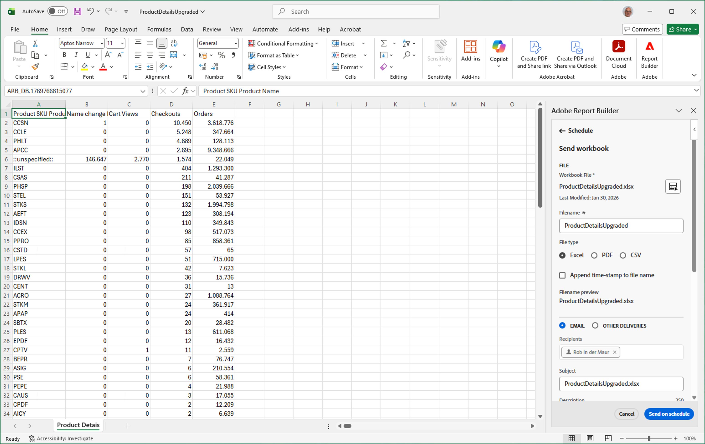

# Schedule workbooks by exporting to cloud destinations

You can export Adobe Analytics workbooks from Report Builder to cloud providers like Google, Azure, and Amazon. 

Alternatively, you can share workbooks with others using email, as described in [Schedule workbooks for sharing through email](/help/analyze/report-builder/schedule-reportbuilder.md).

[Advantages of exporting reports from report builder to the cloud](#advantages-of-exporting-to-the-cloud) include the ability to use reports in third-party tools or combine them with outside data. 

Before you export workbooks from Report Builder to a cloud destination, make sure that your data blocks, your environment, and your permissions meet the [export requirements](#export-requirements).

## Understand the export process

Use the following process when exporting workbooks from Report Builder to the cloud:

1. [Configure a cloud account](/help/components/locations/configure-import-accounts.md)

1. [Configure a location on the account](/help/components/locations/configure-import-locations.md)

1. [Export a report from Report Builder](#export-a-report-from-report-builder)

## Export a report from Report Builder

>[!NOTE]
>
>Before you export data as described in this section, learn more about [the export process](#understand-the-export-process) in the section above.

To export reports from Report Builder:

1. If you haven't already, configure an export account and location, as described in [Configure cloud export accounts](/help/components/locations/configure-import-accounts.md).

1. In the Excel spreadsheet that contains the data that you want to export, open the **[!UICONTROL Adobe Report Builder]** right panel. 

1. Select [!UICONTROL **Schedule**].

  <!-- add screenshot -->

1. On the **[!UICONTROL Workbooks]** tab, select the plus icon to create a new schedule

   

   Or
   
   To export the workbook on a schedule that you already created, select the schedule from the list of schedules, then select **[!UICONTROL Send on schedule]**. 

1. In the [!UICONTROL **Adobe Report Builder**] right panel, specify the following information to continue creating a new schedule:

   |Field name | Function |
   |---------|----------|
   | **[!UICONTROL File]** | Displays the workbook file that is currently selected for export. Select the workbook icon  next to the file name to choose the current workbook if it is not already selected. |
   | **[!UICONTROL Filename]** <!--should be File name --> | Allows you to change the filename before exporting the workbook.
The workbook file name defaults to the name of the workbook
 |
   | **[!UICONTROL File type]** | Choose the file type for the exported file. You can choose Excel, PDF, or CSV.
When you select **[!UICONTROL CSV]**, be aware that the scheduled workbook is sent as a ZIP attachment. Some corporate email administrations may block email with ZIP attachments. You see a warning accordingly.
 |
   | **[!UICONTROL Append time stamp to file name]** | Select this option to include a timestamp of the export in the exported file name. |
   | **[!UICONTROL Filename preview]** <!--should be File name preview --> | Shows a preview of how the file name will appear after the export. |
   | **[!UICONTROL Password protect the workbook]** | Specify a password to protect the exported file so only people with the password can access it. 
Passwords must be at least 8 characters and contain at least 1 number and 1 special character (such as `!`,`@`,`#`, and `$`).
 |
   | **[!UICONTROL Email]** | Select this option to send the file to a specific email address. For more information about this option, see [Schedule workbooks by sharing through email](/help/analyze/report-builder/schedule-reportbuilder.md). |
   | **[!UICONTROL Other deliveries]** | Select this option to send the file to a cloud account, then use the **[!UICONTROL Account]** and **[!UICONTROL Location]** drop-down menus that are described below to select the account and location. |
   | **[!UICONTROL Account]** | Select the cloud export account where you want the data to be sent. 
Or, if you haven't already configured a cloud account that you want to use, you can configure a new account:<ol><li>Select [!UICONTROL **Add account**], then specify the following information:<ul><li>[!UICONTROL **Location account name**]: Specify a name for the location account. This name appears when creating a location </li><li>[!UICONTROL **Location account description**]: Provide a short description of the account to help differentiate it from other accounts of the same account type.</li><li>**[!UICONTROL Make account available to all users in your organization]**: Select this option to allow other users in your organization to use the account. Consider the following when sharing accounts:<ul><li>Accounts that you share cannot be unshared.</li><li>Shared accounts can be edited only by the owner of the account.</li><li>Anyone can create a location for the shared account.</li></ul></li><li>[!UICONTROL **Account type**]: Select the type of cloud account that you are exporting to. Available account types are Amazon S3 Role ARN, Google Cloud Platform, Azure SAS, and Azure RBAC.</li></ul><li>To finish configuring your account, continue with Step 6 in [Configure cloud import and export accounts](/help/components/locations/configure-import-accounts.md), then expand the section that corresponds to the [!UICONTROL **Account type**] you selected. 
The following account types are available:
<ul><li>Amazon S3 Role ARN</li><li>Google Cloud Platform</li><li>Azure SAS</li><li>Azure RBAC</li></ul></ol> |
   | **[!UICONTROL Location]** | Select the location on the account where you want the export data to be sent.
Or, if you haven't already configured the location that you want to use on the account that you selected, you can configure a new location:<ol><li>Select [!UICONTROL **Add location**], then specify the following information: <ul><li>[!UICONTROL **Name**]: The name of the location.</li><li>[!UICONTROL **Description**]: Provide a short description of the location to help differentiate it from other locations on the account.</li><li>**[!UICONTROL Make location available to all users in your organization]**: Select this option to allow other users in your organization to use the location. Consider the following when sharing accounts:<ul><li>Locations that you share cannot be unshared.</li><li>Shared locations can be edited only by the owner of the account.</li><li>Locations can be shared only if the account that the location is associated with is also shared.</li></ul></li><li>[!UICONTROL **Location account**]: Select the account where you want to create the location.</li></ul><li>To finish configuring your location, continue with the link below that corresponds to the account type that you selected in the [!UICONTROL **Location account**] field:<ul><li>[Amazon S3 Role ARN](/help/components/locations/configure-import-locations.md#amazon-s3-role-arn)</li><li>[Google Cloud Platform](/help/components/locations/configure-import-locations.md#google-cloud-platform)</li><li>[Azure SAS](/help/components/locations/configure-import-locations.md#azure-sas)</li><li>[Azure RBAC](/help/components/locations/configure-import-locations.md#azure-rbac)</li></ul> |
   | **[!UICONTROL Show scheduling options]**  | Select this option to view additional options for scheduling the export. Leave this option unselected if you want to send the export only once. When this option is unselected, the export is initiated immediately. |
   | **[!UICONTROL Starting on]**  | The day and time that the scheduled export should begin. 
This option is available only when choosing a scheduled export frequency.
 |
   | **[!UICONTROL Ending on]** | The day and time that the scheduled export expires. The scheduled export no longer runs after the date and time that you set. 
This option is available only when choosing a scheduled export frequency.
 |
   | **[!UICONTROL Frequency]** | You can set the frequency to be hourly, daily, weekly, monthly, or yearly on a specific day. For example, you can set up a schedule to send the workbook on the first Sunday night of the month so that your recipients have the email in their inbox first thing on Monday morning.  |
   
   {style="table-layout:auto"}

1. Select [!UICONTROL **Send on schedule**] to export the workbook.

   Data is sent to the cloud account that you specified at the frequency that you specified.

   You see a confirmation toast at the bottom of the Report Builder hub and the scheduled workbook is listed under the Workbooks tab.

## Advantages of exporting to the cloud

Exporting Adobe Analytics data to the cloud allows you to: 

* Export to a shared location, such as Google Cloud Platform, Microsoft Azure, and Amazon S3.

* Store large amounts of historical data.

  This type of data can be used to detect long-term trends in order to gain business intelligence, and ultimately lead to better business decision-making.

* Include calculated metrics in the exported Adobe Analytics data. 

* Structure data output as concatenated values. 

* Export one-time or on a schedule.

* Export files in Excel, PDF, or CSV format. 

* Export data blocks that include multiple dimensions.

## Export requirements {#export-requirements}

### Minimum requirements

Make sure that your data blocks, your environment, and your permissions meet the following requirements:

* **Data blocks:** All data blocks must include at least one component to a column, row, or value.

* **Environment:** Ensure that the [IP addresses](/help/technotes/ip-addresses.md) and [Domains](/help/technotes/domains.md) used by Adobe Analytics are allowed through their organization's firewall.

<!--
## Manage exports

After data is exported from Analysis Workspace, you can edit, re-export, duplicate, tag, or delete existing exports, as described in [Manage exports](/help/components/exports/manage-exports.md). 

-->

## Manage scheduled workbooks

For information about managing workbooks that are already scheduled, see [Manage scheduled workbooks](/help/analyze/report-builder/manage-schedules-reportbuilder.md).
