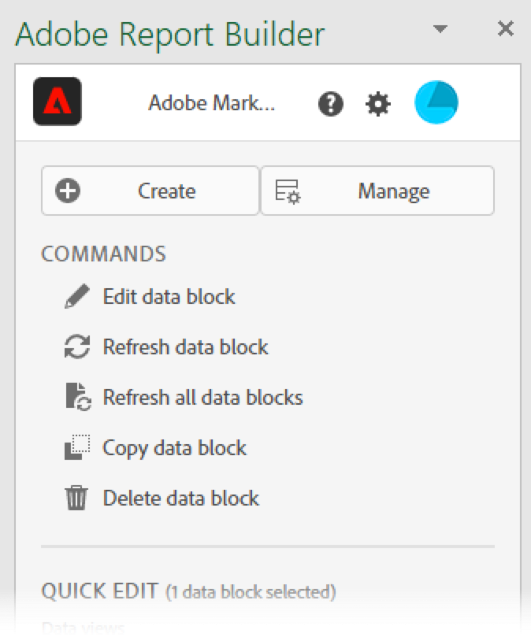
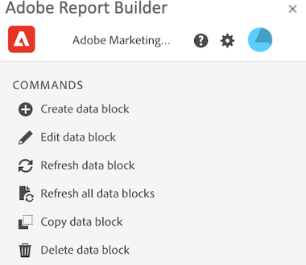
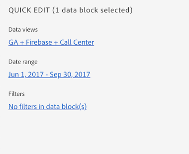
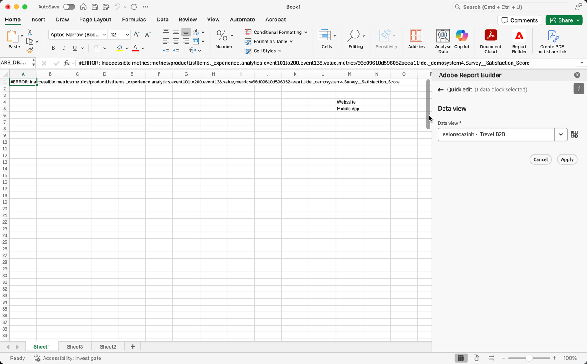

# Report Builder Hub

Use the Report Builder hub to create, update, delete, and manage data blocks.

The Report Builder hub contains the  Create and Manage buttons, the COMMANDS list, and the QUICK EDIT panels.




## Create and Manage buttons

Use the Create or Manage buttons to create new data blocks or to manage existing data blocks.

## COMMANDS panel

Use the COMMANDS panel to access commands that are compatible with the selected cells or a previous action.



### Commands

| Commands displayed      | Available when…   | Purpose          |
|------|------------------|--------|
| Create data block | One or more cells is selected in the workbook. | Used to create a data block |
| Edit data block | The selected cell or cells range is part of one data block only. | Used to edit a data block                       |
| Refresh data block      | The selection contains at least one data block. The command will refresh only the data blocks in the selection. | Used to refresh one or more data blocks         |
| Refresh all data blocks | The workbook contains one or more data blocks. | Used to refresh ALL data blocks in the workbook |
| Copy data block   | The selected cell or cell range is part of one or more data blocks. | Used to copy a data block   |
| Delete data block | The selected cell or cells range is part of one data block only. | Used to delete a data block |

## QUICK EDIT panel

When you select one or more data blocks in a spreadsheet, Report Builder displays the QUICK EDIT panel. You can use the QUICK EDIT panel to change parameters in a single data block or to change parameters in multiple data blocks at the same time.



The changes made using the Quick Edit sections apply to all selected data blocks.

### Report suites

Data blocks pull data from a selected report suite. If multiple data blocks are selected in a worksheet and they don't pull data from the same report suite, the **Report Suites** link displays *Multiple*.

When you change the report suite, all data blocks in the selection adopt the new report suite. Components in the data block are matched to the new report suite based on ID, for example, matching ```evars```). If a component isn't found in a data block, a warning message is displayed and the component is removed from the data block.

To change the report suite, select a new report suite from the drop-down menu.



### Date range

**Date range** shows the date range for the selected data blocks. If multiple data blocks are selected with multiple date ranges, the **Date range** link displays *Multiple*.

### Filters

The **Filters** link displays a summary list of the filters used by the selected data blocks. If multiple data blocks are selected with multiple filters applied, the **Filters** link displays *Multiple*.
