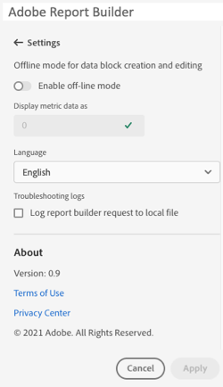
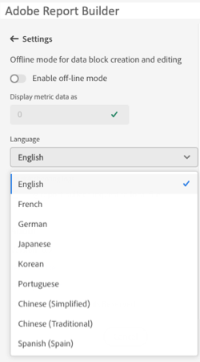

# Report Builder Settings

Use the **Settings** pane to configure application-level settings such as the language displayed by the UI or whether or not to work in off-line mode. The settings are applied immediately and they are set for all future sessions until they're changed.

To change Report Builder settings

1. Click the **Settings** icon.

1. Make changes to Enable off-line mode, select a Language, or enable Troubleshooting log settings.

1. Click **Apply**.

    

## Off-line mode

When creating and editing a data block in off-line mode, data is not retrieved. Instead, simulation data is used so that you can quickly create and edit a data block without waiting for the request to run. When you are back online, the *Refresh data block* command or *Refresh all data blocks* command refreshes the data blocks that you created with actual data.

To enable off-line mode

1. Click the **Settings** icon.

1. Select **Enable off-line mode**.

1. Enter a positive integer in the **Display metric data as** field.

1. Click **Apply**.

## Language

You can choose the language for the Report Builder UI. All supported Adobe Analytics languages are available.

To select the language used in the Report Builder UI

 1. Click Settings.

 1. Select a language from the **Language** drop down menu.

     

 1. Click **Apply.**

## Troubleshooting

Use the Troubleshooting setting to log all client/server data to a local file. Use this option to help resolve support tickets.

To enable the Troubleshooting option, select **Log report builder request to local file**.
