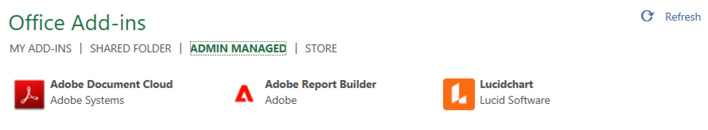
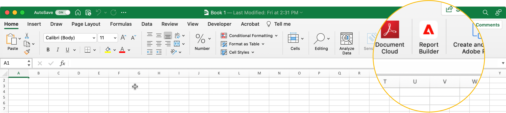
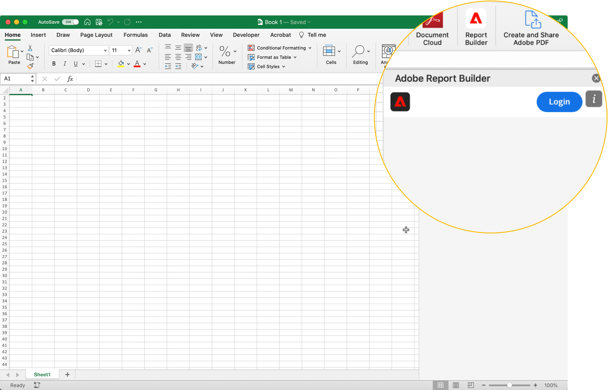
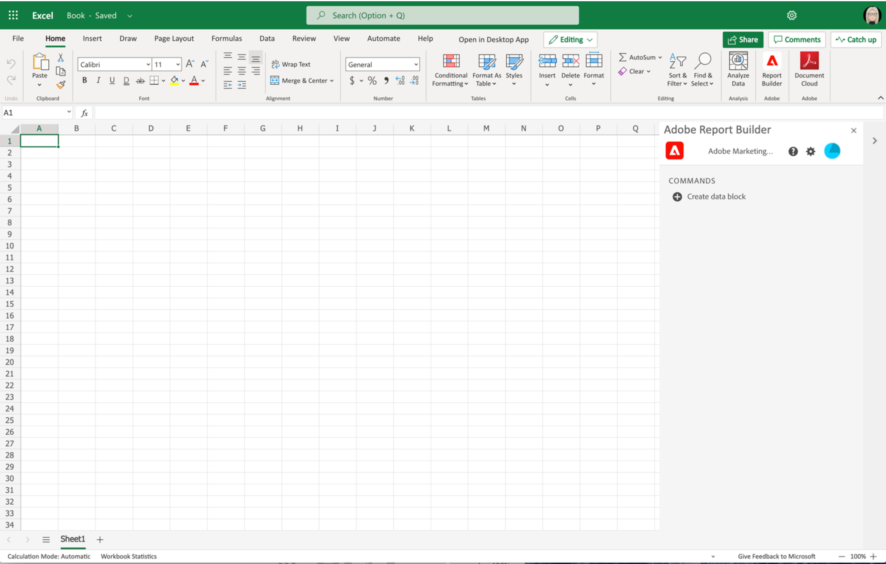
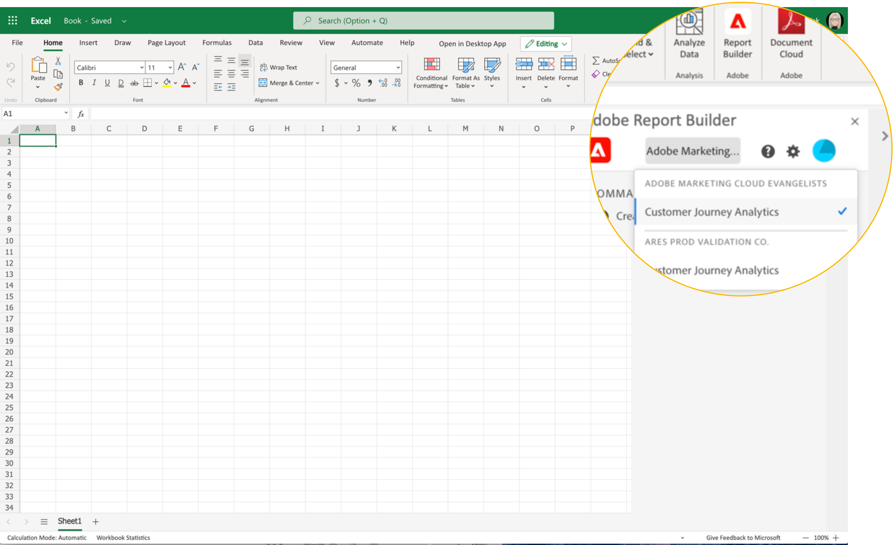
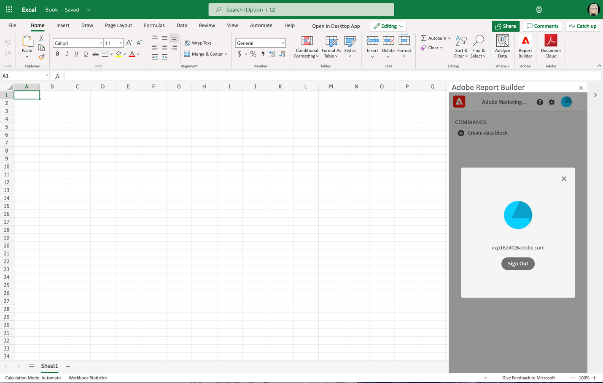

# Report Builder Set Up

You can quickly access Report Builder using the Excel Add-in menu.

## Requirements

Report Builder for Customer Journey Analytics is supported on the following operating systems and web browsers.

### macOS

- macOS Version 10.x or later
- All Excel Versions

### Windows

- Windows 10, version 1904 or later
- Excel Version 2106 or later

  All Windows desktop Excel users must install Microsoft Edge Webview2 to use the add-in. To install the controller:

  1. Go to <https://aka.ms/webview2installer>.
  1. Select and download the Evergreen Standalone Installer.
  1. Follow the installation prompts.

### Web Office

- Supports all browsers and versions

## Report Builder Excel Add-in

You must install the Report Builder Excel Add-in to use Report Builder for Customer Journey Analytics. Once you install the Report Builder Excel Add-in, you can access Report Builder from within an open Excel workbook.

### Download and install the Report Builder Add-in

To download and install the Report Builder Add-in

1. Launch Excel and open a new workbook.

1. Select Insert > Get Add-ins.

1. In the Office Add-ins dialog, select the Store tab.

1. Search for "Report Builder" and click Add.

1. In the License terms and privacy policy dialog box, click Continue.

**If the Store tab isn't displayed**

1. In Excel, select File > Account >Manage Settings.

1. Check the box next to "Enable optional connected experiences"

1. Restart Excel.

**If your organization blocks access to the Microsoft Store**

Reach out to your IT or security team to request approval for the Report Builder Add-in. After approval is granted, in the Office Add-ins dialog, select the Admin Managed tab.

After installing the Report Builder Add-in, the Report Builder icon is displayed in the Excel ribbon under the Home tab.

## Log in to Report Builder

After you install the Report Builder for Excel Add-in for your operating platform or browser, follow these steps to log in to Report Builder.

1. Open an Excel workbook.

1. Click the Report Builder icon to launch Report Builder.

1. From the Adobe Report Builder toolbar, click **Login**.

    

1. Enter your Adobe Experience ID account information. Your account information should match your Customer Journey Analytics credentials.

    

After you log in, your login icon and organization will appear at the top of the panel

## Switch organizations

When you first log in, you are logged in to the default organization assigned to your profile.

1. Click the name of the organization that is displayed when you log in.

1. Select an organization from the list of available organizations. Only organizations that you have access to are listed.

    

## Sign out

You can sign out from Report Builder from the user profile.

1. Save changes to any open workbooks.

1. Click the avatar icon to display your user profile.

    

1. Click **Sign Out**.
