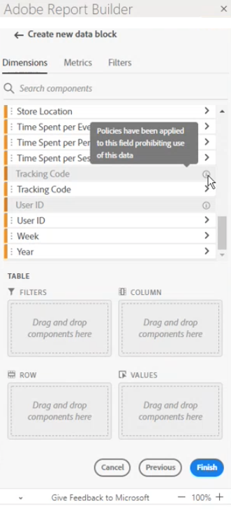
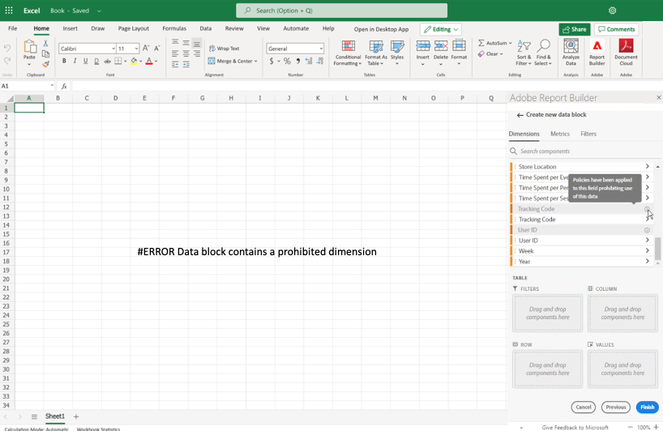

# Restricted labels in Report Builder

Generally, data governance-related settings in Adobe Analytics are inherited from Adobe Experience Platform. The integration between Adobe Analytics and Adobe Experience Platform Data Governance allows for labeling of sensitive Adobe Analytics data and enforcement of privacy policies.

Privacy labels and policies that were created on datasets consumed by Experience Platform can be surfaced in the Adobe Analytics report suites workflow. These labels stop or warn users who create metrics and/or dimensions from sensitive fields. For information about datasets, see [Datasets overview](https://experienceleague.adobe.com/docs/experience-platform/catalog/datasets/overview.html)

In addition, when data is exported from Adobe Analytics (via reporting, export, API, etc.), warnings or labels are added to notify users that a report contains sensitive information that needs to be treated in a specific way.

This integration allows you to manage compliance more easily. Data stewards in your organization can set policies to restrict usage. As a result, your Adobe Analytics users can more confidently use data, knowing that it complies with policies defined by data stewards.

For more information, see [Adobe Analytics and Data Governance](https://experienceleague.adobe.com/docs/analytics-platform/using/cja-privacy/privacy-overview.html)

## View restricted data in Report Builder

Two Adobe-defined policies are surfaced in Adobe Analytics that affect reporting, downloading, and sharing:

* Enforce Analytics policy
* Enforce Download policy

Components that are affected by these policies are grayed out. When you hover over a component that has a policy applied, a note is displayed to indicate the following: **Policies have been applied to this field prohibiting use of this data.** For more information see [Labels and policies](https://experienceleague.adobe.com/docs/analytics-platform/using/cja-dataviews/data-governance.html).

## Update reports containing restricted data

In cases where a user created a Report Builder report with data elements that are later restricted, when the report is refreshed, an error message is displayed.

