# Schedule Workbooks

After you saved your workbook and completed your analysis, you can easily share your workbook with others on your team using the scheduling feature. The Schedule feature allows you to create a schedule that automatically refreshes the data in the workbook and emails the Excel workbook .xlsx file as an attachment to your specified audience at a specific date and time. Setting up a schedule provides recipients with regular updates&ndash;automatically. You can also use the schedule feature to send out the workbook once without scheduling automatic updates.

You can create multiple schedules for a single workbook. For example, you can send a workbook to your team on a daily basis and you can send the workbook to your manager once a week by creating two different schedules.

The Schedule feature also allows you to set up password protection for a workbook and edit previously scheduled workbooks.

>[!VIDEO](https://video.tv.adobe.com/v/3413079/?quality=12&learn=on)

## Schedule a workbook

Use the Schedule task button in the Report Builder hub to quickly create a schedule so that you can automatically distribute a workbook Excel file (.xlsx) to an individual or a group.

1. Click the Schedule button in the Report Builder hub.

    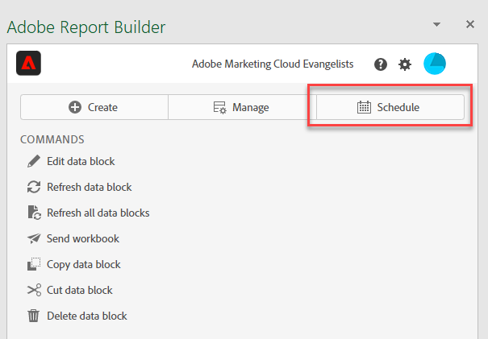{width="55%"}

1. Click Schedule Workbook or the plus button in the upper-left to create a new scheduled workbook.

    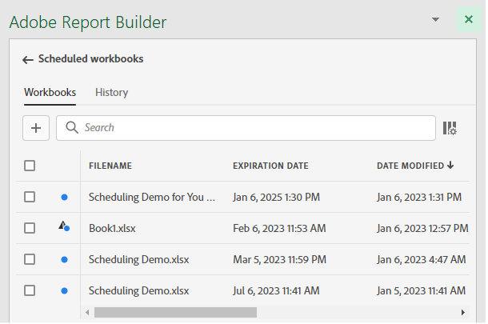{width="55%"}

    The scheduling pane displays some pre-defined information about the workbook such as the workbook name and the last date that the workbook was modified.

    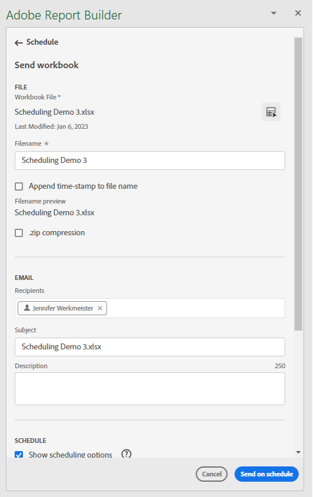{width="55%"}

1. (Optional) Enter a file name.

    The workbook file name defaults to the name of the workbook but you can change this if you want. If you\'re sending the same workbook to multiple audiences and you want to name it something a little bit more friendly for a certain audience, you can change the name.

1. (Optional) Select **Append time-stamp to file name**.

    You can append a timestamp to the file name to identify the date the workbook was updated. This is helpful to quickly see which version of a workbook was sent on a specific date. The **Filename preview** shows how the workbook file name will appear in the email when the workbook is distributed. The time-stamp format is YYYY-MM-DD.

1. (Optional) Select **.zip compression** to compress the file and set up password protection on the file.

    When you make this selection, you're prompted to enter a password to open the file. This is helpful if you have concerns about data security and you want to password protect the workbook. Protecting the file with a password requires you to select **.zip compression**. The password must be at least 8 characters and contain a number and a special character.

    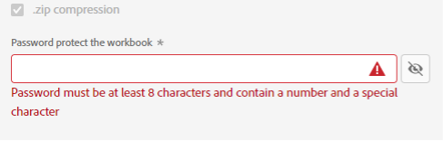{width="55%"}

1. Enter **Recipients**. You can enter the name of a person that is recognized in your organization, or you can enter an email address of a person inside or outside of your organization.

1. Enter the **Subject** of the email and a description for your recipients. The subject defaults to the workbook file name but you can modify the subject if needed. You can add details in the description section.

    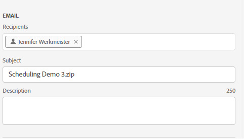{width="55%"}

1. Set up the scheduling options to set the date and time that you want the workbook emailed to your recipients.

    Choose the start and end date and time frames. This can be today's date or a date in the future.

    Choose the **Frequency** from the drop-down menu. You can set the frequency to be hourly, daily, weekly, monthly, or yearly on a specific day. For example, you can set up a schedule to send the workbook on the first Sunday night of the month so that your recipients will have the email in their inbox first thing on Monday morning.

    {width="55%"}

1. After you set the schedule, click **Send on schedule**.

    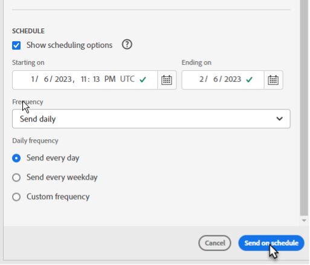{width="55%"}

    You'll see a confirmation toast at the bottom of the Report Builder hub and the scheduled workbook is listed under the Workbooks tab.

    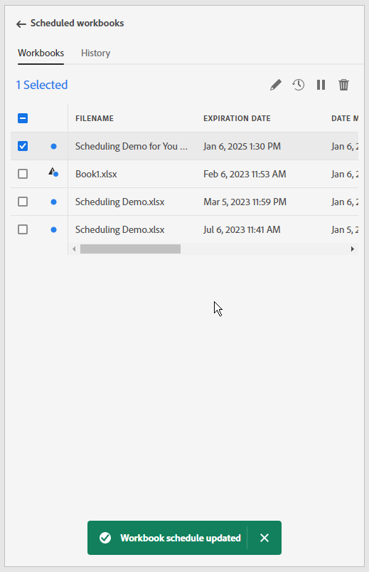{width="55%"}

## Send the workbook one-time only

You can also send out the workbook only once.

1. Un-check **Show scheduling options** 

    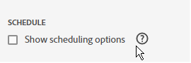{width="40%"}

1. Click **Send Now**.

## View and edit scheduled workbooks

You can view and manage all scheduled workbooks in one place under the Workbooks tab.

1. In the Schedule section of the Report Builder hub, click the Workbooks tab. Use this view to see a list of all scheduled workbooks.

1. Select a workbook. Several tools are displayed that allow you to edit the workbook, edit the schedule task, pause and restart the schedule task, download a scheduled task report, or delete the schedule task.

    {width="20%"}

* (Optional) Click the pencil icon to edit the workbook schedule task.

* (Optional) Click the clock icon to view a history of each scheduled task.

* (Optional) Click the pause icon to pause and restart the distribution schedule task. This is helpful if you need to modify the workbook before the workbook is sent. Click the pause icon again when you want to restart the distribution.

* (Optional) Click the download icon to download a copy of the workbook schedule task.

* (Optional) Click the trash can to delete the schedule task.

    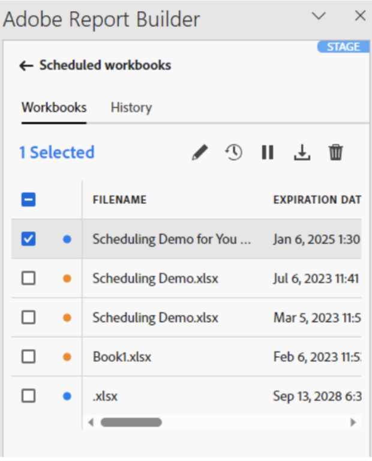{width="40%"}

## Review the status of scheduled tasks

The history view allows you to review the status of each scheduled task. There is a separate row documenting the status change for each scheduled task. In the example shown below, the *New Hourly Schedule* was initiated on January 5, at 3:04pm. By 3:05pm it successfully refreshed and was sent to recipients. The next workbook, *Bad workbook*, encountered an error during the refresh process. If a workbook failed to send, the history tab helps you troubleshoot by showing where in the process the error occurred. In this case, it is likely due to some data block error, perhaps a missing component, that kept the workbook from successfully refreshing.

A green checkmark indicates that the workbook was sent successfully. An exclamation point in a red triangle indicates that an error occurred.

You can choose which columns to display in the history tab by clicking the columns setting icon to the right of the search bar.

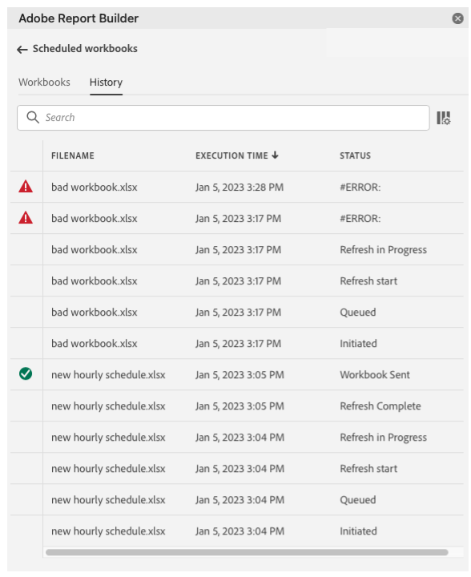{width="55%"}

You can filter down the history to see only that of a single scheduled workbooks by going to the workbooks tab, selecting the workbook and clicking the history icon. 

You can also view the history of a specific workbook from the Workbooks tab. On the Workbooks tab, select the workbook and then click the history icon.

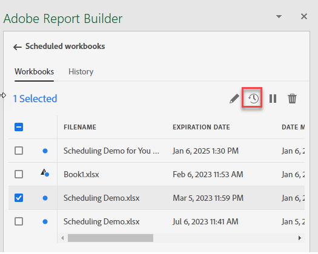{width="55%"}

The workbook filter will then appear at the top of the history. To view the history of all scheduled tasks again, click the x next to the filter. 

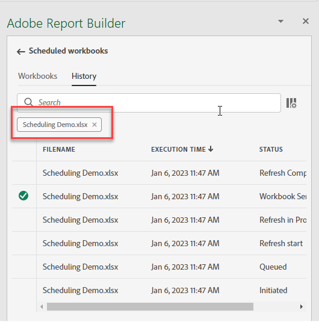{width="55%"}
