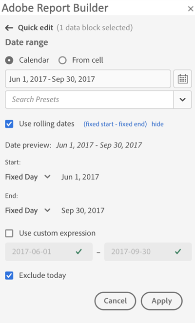
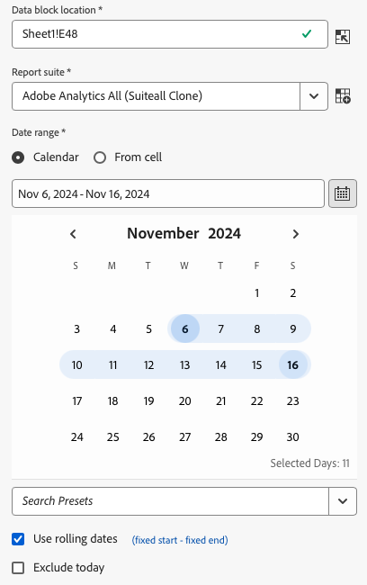
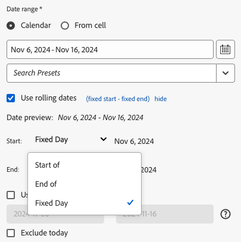
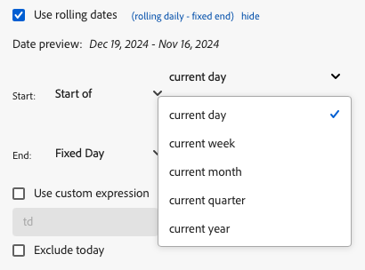
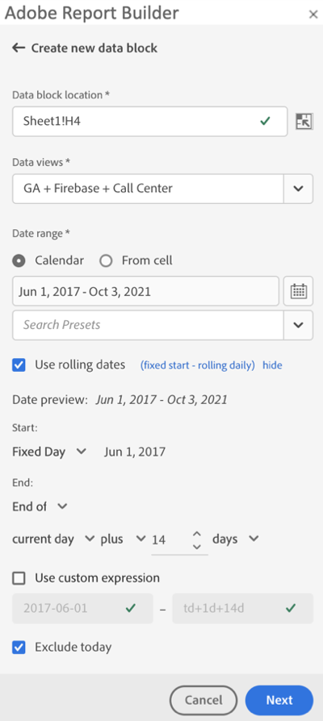
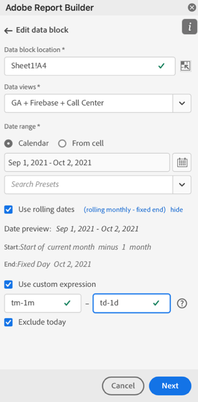
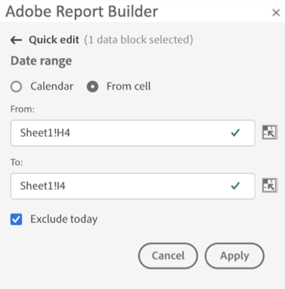

# Select a Date Range

To change the date range of an existing data block, select Edit a data block or use the QUICK EDIT panel.

Use the following options to change a date range for a data block.

**Calendar**

 The Calendar allows you to create static or rolling dates using the following options:

- Date range field
- Calendar
- Preset drop-down menu
- Rolling date mode
- Customize expressions


**From cell**

The From cell option allows you to reference dates entered in worksheet cells.

You have the option to exclude today on any selected date range.

 

## Use the Calendar

When you use the **Calendar**, the date range field displays the current date range for the data block request. You can enter dates directly into the date range field or use a data range selection option.

### Date range field

To enter dates directly into the date range field

1. Click the date range field next to the calendar icon.

1. Enter start and end dates for your date range.

### Calendar

To select dates using the calendar

1. Click the calendar icon to display a monthly calendar.

1. Click a start date.

1. Click an end date.

To set a date range in reverse, click the end date first and then click the start date.



### Preset drop down menu

The preset drop-down menu includes a standard set of preset date ranges and date range components for a data view that you saved or a data view that was shared with you.

### Rolling dates

The rolling dates option allows you to select a date range using rolling dates.

1. Select **Use rolling dates**.

1. Select a rolling expression for your start and or end date.

    

    **Start of** — Allows you to select the beginning of a day, week, month, quarter, or year.

    **End of** — Allows you to select the end of a day, week, month, quarter, or year.

    **Fixed day** — Allows you to fix a start or end date while the other date is rolling.

1. Choose day, week, month, quarter, or year as the rolling period.

    

1. Add or subtract days, weeks, months, quarters, or years from your rolling date.

    

1. Click Next to define the data range.

    Use the date preview to confirm the resulting date range is the desired range.

### Custom expressions

The custom expression option allows you to change the date range by building a custom expression or you can enter an arithmetic formula.

1. Select **Use rolling dates**.

1. Select **Use custom expression**.

    When you select the **Use custom expression** option, the standard rolling date range controls are disabled.

    

1. Enter a custom expression.

    For a sample list of custom expressions, see **Date expressions**.

1. Use the date preview to verify the resulting date range is the desired range.

#### Create a custom expression

1. Enter a **Date reference**.

1. Add **Date operators** to move the date to the past or future.

You can enter a custom date expression that includes multiple operators, such as ```tm-11m-1d```.

#### Date references

The following table lists date reference examples.

| Date Reference | Type         | Description                |
|----------------|--------------|----------------------------|
| 1/1/10         | Static Date  | Entered in ISO Date format |
| td             | Rolling Date | Start of current day       |
| tw             | Rolling Date | Start of current week      |
| tm             | Rolling Date | Start of current month     |
| tq             | Rolling Date | Start of current quarter   |
| ty             | Rolling Date | Start of current year      |

#### Date operators

The following table lists date operator examples.

| Date Operators | Unit    | Description   |
|----------------|---------|--------------------|
| +6d            | Day     | Add 6 days to the Date Reference |
| +1w            | Week    | Add one full week to the Date Reference |
| -2m            | Month   | Subtract 2 full months to the Date Reference |
| -4q            | Quarter | Subtract 4 quarters to the Date Reference |
| -1y            | Year    | Subtract one year to the Date Reference |

#### Date expressions

The following table lists date expression examples.

| Date Expression | Meaning                              |
|-----------------|--------------------------------------|
| td-1w           | First day of last week               |
| tm-1d           | Last day of previous month           |
| td-52w          | Same day, 52 weeks ago               |
| tm-11m-1d       | Last day of the same month last year |
| "2020-09-06"    | Sept 9th, 2020                       |

## Date range from cell

The date range can be specified in worksheet cells. Use the **Date range from cell** option to choose the data block start and end date from selected cells. When you select the **From cell** option, the panel displays **From** and **To** fields where you can enter a cell location.



## Exclude today

Choose the **Exclude today** option to exclude today from a selected date range. Choosing to include today may pull incomplete data for today.

When selected, the **Exclude today** option excludes the current day from all date range modes including calendar, rolling dates, or custom expressions.

## Valid date ranges

The following list describe valid date range formats.

- The start and end dates must be in the following format: YYYY-MM-DD

- The start date must be earlier to or equal to the end date. Both dates can be set to the future.

- When using rolling dates, the start date must be today or in the past. It must be in the past if **Exclude today** is checked.

- You can create a static date range set for the future. For example, you may need to set a future date for a marketing campaign launch next week. This option creates a workbook monitoring for a campaign ahead of time.

## Change the date range

You can edit the date range of an existing data block by selecting Edit data block in the COMMANDS panel or by selecting the date range link in the QUICK EDIT panel.

**Edit data block** — Allows you to edit multiple data block parameters, including date range, for a single data block.

**Quick Edit: Date range** — Allows you to edit the date range of one or more data blocks.

To edit the date range from the QUICK EDIT panel

1. Select cells within one or more data blocks in a worksheet.

1. Click the **Date range** link in the QUICK EDIT panel.

1. Select the date range using any of the date selection options.

1. Click **Apply**.


Report Builder applies the new date range to all data blocks in the selection.
