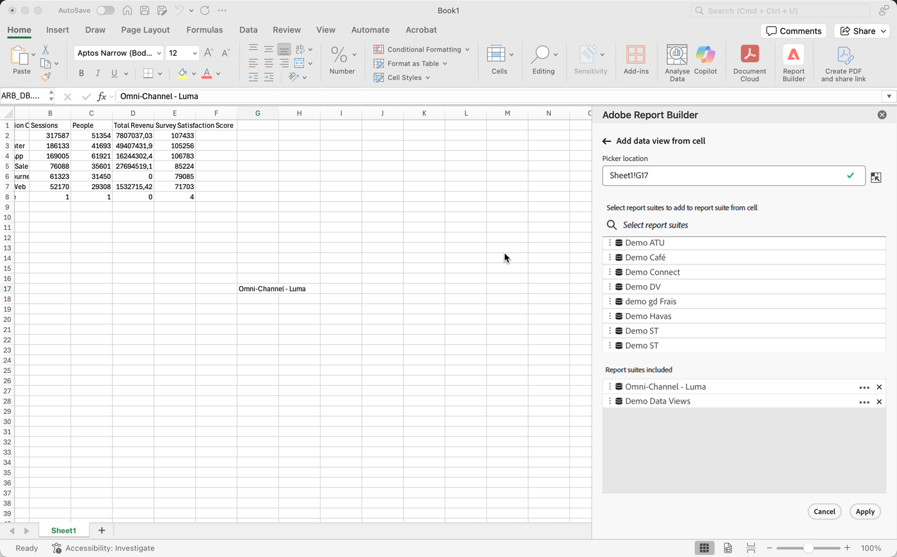
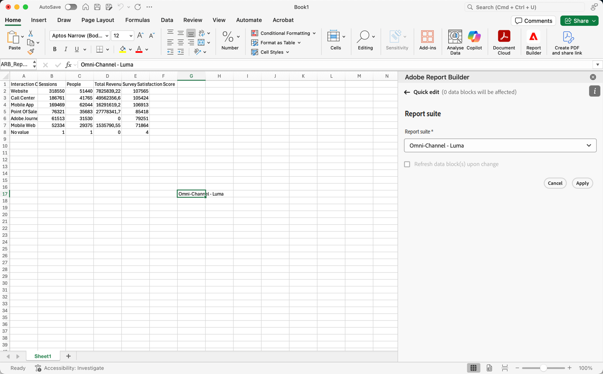

# Select a report suite

You can select a report suite from the drop-down menu or select a report suite from a cell and automatically update your data block with a new report suite.

## Select report suite from a cell

Selecting a report suite from a cell makes it easy to refresh data blocks using different report suites. Instead of creating completely new reports with separate data blocks, you can refresh data blocks with a report suite selected from a cell. 

Selecting a report suite from a cell is helpful when you have:

* Multiple report suites that are similar or identical to each other in structure.  
* Complicated data block formats that include customized components and layouts.

To select a report suite from a cell, first build a data block and assign multiple report suites to a cell outside of your data block. Then, use the **[!UICONTROL Report suite from cell]** panel to refresh your data blocks from different report suites.

1. Create a data block. For information about creating a data block, see [Create a data block](/help/report-builder/create-a-data-block.md).

1. Select  in **[!UICONTROL Report suites]**.

1. Select a cell using  outside of the data block.

1. Add one or more report suites from the **[!UICONTROL Select report suites to add to report suite from cell]** using drag and drop. Alternatively, you can double select a report suite to add the report suite to the **[!UICONTROL Report suites included]** list. 

   * You can use  **[!UICONTROL _Select report suites_]** to search for report suites.
   * Use  to open a context menu so you can move report suites up or down in the **[!UICONTROL Report suites included]** list.
   * Use  to delete a report suite from the **[!UICONTROL Report suites included]** list.

   {zoomable="yes"}

1. Select **[!UICONTROL Apply]** to apply the selected report suites to the selected cell.

## Change the report suite from a cell

1. Select the report suite cell location in your sheet.
1. In the Report Builder hub, select the **[!UICONTROL Report suites from cell]** link in **[!UICONTROL Quick edit]**.
1. Select a report suite from the **[!UICONTROL Report suite]** drop-down menu.

   {zoomable="yes"}
1. Optional, select **[!UICONTROL Refresh data block(s) upon change]**.

1. Select **[!UICONTROL Apply]**. Report Builder refreshes the data block based on the selected report suite.
