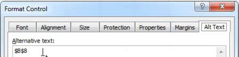

# Invoke Report Builder functionality from Microsoft Excel functions

This ability further integrates Report Builder usage within the natural Excel workflow, without requiring you to access the Report Builder user interface.

For example, you may want to automatically refresh Report Builder requests whose input filter is based on data pulled in Excel from other sources. You can now do this using the string RefreshRequestsInCellsRange(..) function. All calls are asynchronous. They return immediately and do not wait for a call to fully execute.

>[!NOTE]
>
>You must have Report Builder 5.0 (or later) installed for this functionality to work.

Here is a table with the list of exposed functions: 

|  Function Name  | Description  |
|---|---|
|  string AsyncRefreshAll()  | Refreshes all Report Builder requests present in a workbook.  |
|  string AsyncRefreshRange(string rangeAddressInA1Format)  | Refreshes all Report Builder requests present in the specified cell range address (a string expression representing a range of cell in A1 format, for example "Sheet1!A2:A10").  |
|  string AsyncRefreshRangeAltTextParam()  | Refreshes all Report Builder requests present in the specified cell range that is passed through the Alternative Text of the Ms Form Control.  |
|  string AsyncRefreshActiveWorksheet()  | Refreshes all Report Builder requests present in the active worksheet.  |
|  string AsyncRefreshWorksheet(string worksheetName)  | Refreshes all Report Builder requests present in the specified worksheet (the worksheet name as it appears on the tab.)  |
|  string AsyncRefreshWorksheetAltTextParam();  | Refreshes all Report Builder requests present in the specific worksheet name that was passed through the Alternative Text of the Ms Form Control  |
|  string GetLastRunStatus()  | Returns a string that describes the status of the last run.  |

To access these functions within report builder, go to [!UICONTROL Formulas] > [!UICONTROL Insert Function]. At the bottom of the list of categories, you will find Adobe.ReportBuilder.Bridge:


## Use these functions in a formula {#section_034311081C8D4D7AA9275C1435A087CD}

For example, the formula 

```
=IF(OR(ISTEXT(P5),ISBLANK(P5)),AsyncRefreshRange("P9"),"")
```

says "If the value in cell P5 is text or is blank, refresh the range that is in cell P9."

## Use Report Builder functions with format control {#section_26123090B5BD49748C8D8ED7A1C5ED84}

You can now assign a macro to a control you created and that control can be a function that refreshes a workbook request. For example, the function AsyncRefreshActiveWorksheet will refresh all requests in a worksheet. Sometimes, though, you may want to refresh only certain requests, not all.

1. Set the macro parameter.
1. Right-click the control and select **[!UICONTROL Assign Macro]**.
1. Enter the report builder function name (no parameters or parentheses.)


## Pass parameters to Report Builder functions via format control {#section_ECCA1F4990D244619DFD79138064CEF0}

The two functions that take a parameter can be used with Format Control, but only via the Alt Text field:

* AsyncRefreshRange(string rangeAddressInA1Format) 
* AsyncRefreshWorksheet(string worksheetName)

1. Right-click the control and select **[!UICONTROL Format Control]**.

   

1. Click the [!UICONTROL Alt Text] tab.

   

1. Under [!UICONTROL Alternative text], enter the cell range that you want refreshed.
1. Open the list of report builder parameters under [!UICONTROL Formulas] > [!UICONTROL Insert Function]> [!UICONTROL Adobe.ReportBuilder.Bridge].

1. Pick one of the two functions that end with AltTextParam and click **[!UICONTROL OK]**.
