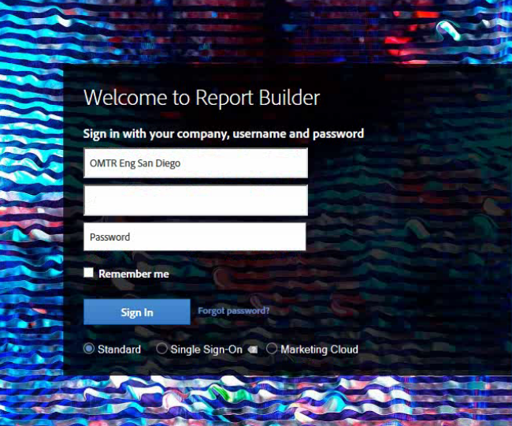

# Report Builder Sign-In

Information about the three ways to sign in to Report Builder.

Currently, the following login options are available when you click **[!UICONTROL Sign In]** to Report Builder.

* [Standard](/help/analyze/report-builder/setup/login.md#section_6D54B8ADAE7F416BB83F5082B3771CFA) 
* [Single Sign-On](/help/analyze/report-builder/setup/login.md#section_6970A5F926774976B85FFE576610E85F) 
* [Experience Cloud and Single Sign-On](/help/analyze/report-builder/setup/login.md#section_1FA230F35AB54021A874A7A28DE4C850)

## Standard {#section_6D54B8ADAE7F416BB83F5082B3771CFA}

Use this login if you want to sign in to Report Builder using your Adobe Analytics credentials.

**Report Builder login - field definitions** 

| Field | Definition |
|--- |--- |
|Company|The Company login credential that you use for Adobe Analytics.|
|Username|The Username login that you use for Adobe Analytics. Scheduled tasks for a user are linked to the username. You can view your scheduled tasks from any computer if you log in to report builder with the same login credentials.|
|Password|Your Analytics password.|
|Remember me|Login information is encrypted and stored in a user profile file on the machine where Report Builder is installed. Because login information is saved, anyone using the same PC as the report creator who opens a spreadsheet containing a report can refresh and edit the data. If you share your computer with others and you wish to keep the spreadsheet data private, do not enable this option.  To disable your automatic login setting, click **[!UICONTROL Log in With Different Credentials]** on the Toolbar and disable **[!UICONTROL Remember Me]**.|
|Use a Proxy Server|Enable if you are accessing the Internet through a proxy server and are required to provide a proxy username and password.|

## Single sign-on {#section_6970A5F926774976B85FFE576610E85F}

This (legacy) single sign-on logs you in to Adobe Analytics only, not the entire Experience Cloud.

You can also type in a domain and the system will recognize the domain and redirect you to your company's sign-in page to log in to Adobe Analytics.

## Experience Cloud {#section_1FA230F35AB54021A874A7A28DE4C850}

The Experience Cloud login lets you use your Enterprise ID (email and password) to log in to the Adobe Experience Cloud. Click **[!UICONTROL Sign In]** > **[!UICONTROL Sign in with an Enterprise ID]** to be redirected to your company's single sign-on page. For more information on Enterprise ID, click [here](https://helpx.adobe.com/enterprise/kb/enterprise-id-faq.html#whatis).

> [!NOTE] The Experience Cloud login is session based and the token expires after 30 days.

