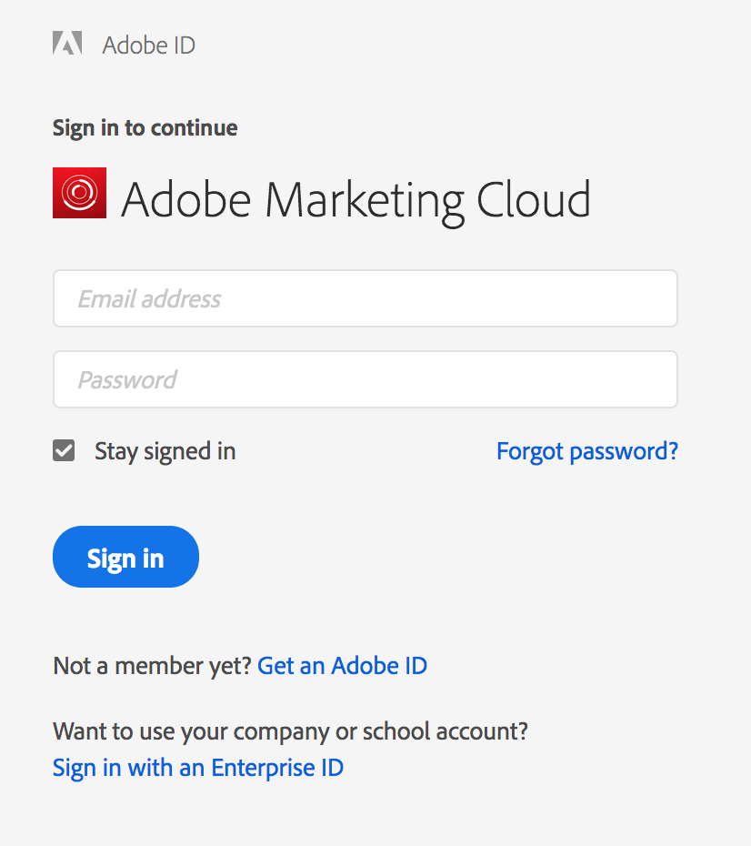

# Report Builder Sign-In

>[!IMPORTANT]
>
>Report Builder version 5.6.47 and later supports Experience Cloud login only and does not support legacy logins such as Site Catalyst Single Sign-on or the Standard Login. **By July 22, 2021, all Report Builder users must update the Report Builder Add-in to version 5.6.47 or later which includes a critical update to the log-in process.**

To log in to Report Builder, use your Experience Cloud login account.

## Experience Cloud {#section_1FA230F35AB54021A874A7A28DE4C850}

The Experience Cloud login lets you use your Enterprise ID (email and password) to log in to the Adobe Experience Cloud. Click **[!UICONTROL Sign In]** > **[!UICONTROL Sign in with an Enterprise ID]** to be redirected to your company's single sign-on page. For more information on Enterprise ID, click [here](https://helpx.adobe.com/enterprise/kb/enterprise-id-faq.html#whatis).

>[!NOTE]
>
>The Experience Cloud login is session based and the token expires after 30 days.

## Sign in to Report Builder

To sign in to Report Builder

1. In Excel, click **[!UICONTROL Add-Ins]**.
1. Click **[!UICONTROL Sign In]**. Other actions that sign you in include:

    * Click **[!UICONTROL Create]**.
    * [Select a request in the Request Manager](/help/analyze/report-builder/manage-requests/r-arb-manage-requests.md), then click **[!UICONTROL Add]** or **[!UICONTROL Manage]**.
    * Double-click a request in Excel.

1. Complete the fields on the [!UICONTROL Login] page, then click **[!UICONTROL OK]**.
