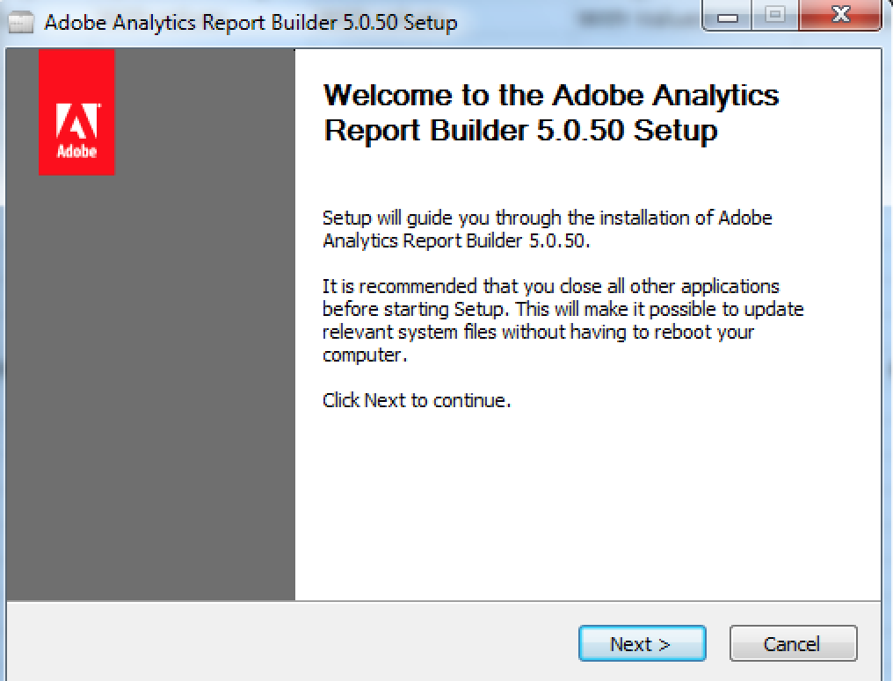

# Upgrade Report Builder

When you upgrade Report Builder, keep in mind the following guidelines:

*  The old version will be removed.

*  All existing reports will continue to work.

* All personal settings, including authentication settings, will continue to work.

To upgrade Report Builder

1. Log in to your current version of Report Builder.
1. Go to the **[!UICONTROL Options]** menu to upgrade to the latest version. Your current version number is shown towards the bottom of the Options dialog.

   

1. If a new version is available, click **[!UICONTROL Update...]**. The button will show which version you are updating to, for example: *Update to version 5.0.50* 

   >[!NOTE]
   >
   >If this button is greyed out, no new version of Report Builder is available.

1. (Optional) Select the **[!UICONTROL Update when a new version is available]** checkbox. In the future, this will start the update process automatically when a new version becomes available.
1. When the setup screen appears, click **[!UICONTROL Next >]**.

   

1. Once the upgrade is complete, log back in to report builder.

## Manual upgrade instructions {#section_27A0200010DC4747A718F1A65B180599}

You can always get the latest version of Report Builder from Adobe Analytics.

1. Log in to Adobe Analytics and go to **[!UICONTROL Tools]**.
1. Click **[!UICONTROL Report Builder]**.
1. On the **[!UICONTROL Overview]** screen, select the 32-bit or 64-bit version.
1. Click **[!UICONTROL Download Now!]**.
