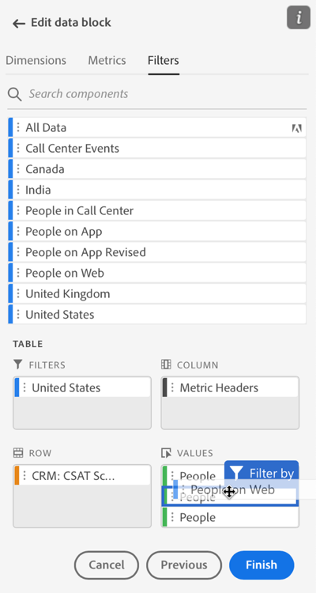
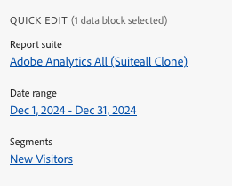
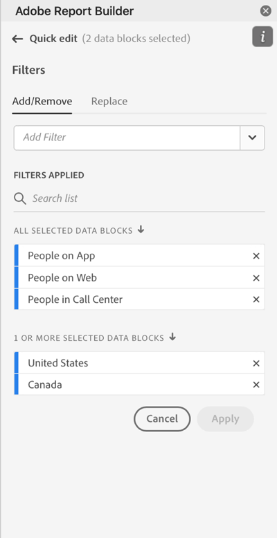
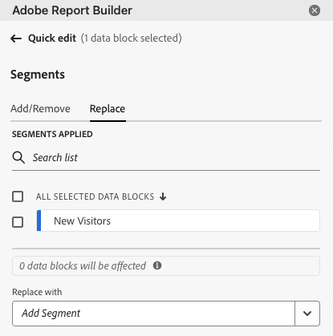
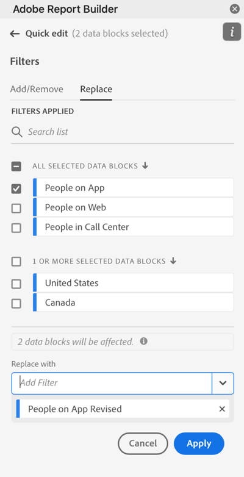
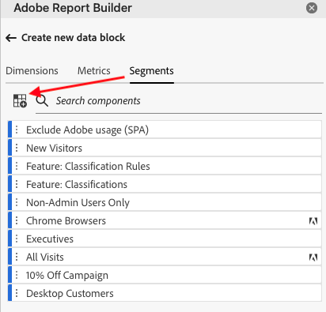
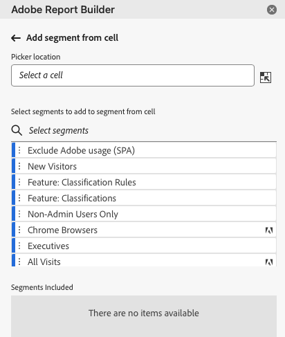
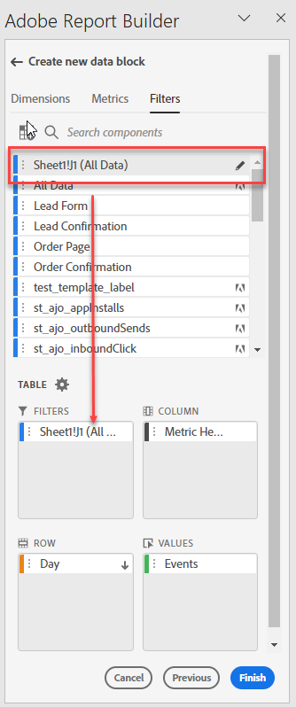
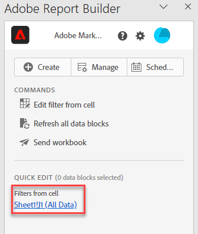

# Work with Segments in Report Builder

You can apply segments when you create a new data block or when you select the **Edit data block** option from the COMMANDS panel.

## Apply segments to a data block

To apply a segment to the entire data block, double-click a segment or drag and drop filters from the components list into the Segments section of the Table.

## Apply segments to individual metrics

To apply segments to individual metrics, drag and drop a segment onto a metric in the table. You can also click the **...** icon to the right of a metric in the Table pane and then select **Segment metric**. To view applied segments, hover over or select a metric in the Table pane. Metrics with applied segments display a filter icon.

## Quick edit segments

You can use the Quick edit panel to add, remove, or replace segments for existing data blocks.

When you select a range of cells in the spreadsheet, the **Segments** link in the Quick edit panel displays a summary list of the segments used by the data blocks in that selection.

To edit segments using the Quick edit panel

1. Select a range of cells from one or multiple data blocks.

    

1. Click the Segments link to launch the Quick edit - Filters panel.

    

### Add or remove a segment

You can add or remove segments using the Add/Remove options.

1. Select the **Add/Remove** tab in the Quick edit-segments panel.

    All segments applied to the selected data blocks are listed in the Quick Edit-segments panel. Segments applied to all data blocks in the selection are listed under the **Applied to all selected data blocks** heading. Segments applied to some but not all data blocks are listed under the **Applied to 1 or more selected data blocks** heading.

    When multiple segments are present in the selected data blocks, you can search for specific segments using the **Add Filter** search field.

    

1. Add segments by selecting segments from the **Add segment** drop down menu.

    The list of searchable segments includes all segments accessible to the report suites that are present in one or more of the selected data blocks as well as all the segments that are available globally in the organization.

    Adding a segment applies the segment to all data blocks in the selection.

1. To remove segments, click the delete icon **x** to the right of segments in the **Segments applied** list.

1. Click **Apply** to save changes and return to the hub panel.

    Report Builder displays a message to confirm the applied segment changes.

### Replace a segment

You can replace an existing segment with another segment to change how the data is segmented.

1. Select the **Replace** tab in the Quick edit-segment panel.

    

1. Use the **Search list** search field to locate specific segments.

1. Choose one or more segments that you want to replace.

1. Search for one or more segments in the Replace with field.

    Selecting a filter adds it to the **Replace with**... list.

    

1. Click **Apply**.

    Report Builder updates the list of segments to reflect the replacement.

### Define data block segments from cell

Data blocks can reference segments from a cell. Multiple data blocks can reference the same cell for segments, allowing you to easily switch segments for multiple data blocks at a time.

To apply segments from a cell

1. Navigate to Step 2 in either the data block creation or editing process. See [Create a Data Block](./create-a-data-block.md).
1. Click the **Segments** tab to define filters.
1. Click **Create segment from cell**.

    

1. Select the cell from which you want the data blocks to reference a segment.
   
1. Add the segment choice you wish to add to the cell by either double clicking the segment, or by dragging and dropping it into the Segments Included section. 
   
   Note: Only one choice may be selected for the given cell at one time.

    

1. Click **Apply** to create the reference cell.

1. From the **Segments** tab, add the newly created reference cell segments to your data block.

    

1. Click **Finish**.

    Now this cell can be referenced by other data blocks in their segments. To apply the reference cell as a segment to other data blocks, simply add the cell reference to their segments from the Segments tab. 

#### Use the reference cell to change data block segments

1. Select the reference cell in your spreadsheet.

1. Click the link under **Segments from Cell** in the Quick Edit menu.

    

1. Select your segment from the drop-down menu.

    

1. Click **Apply**.
