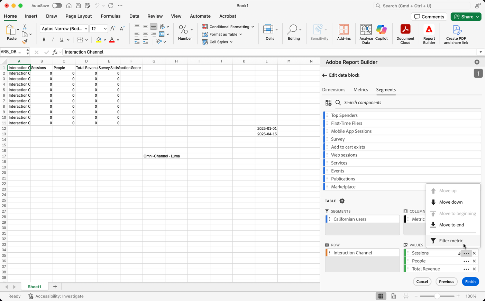
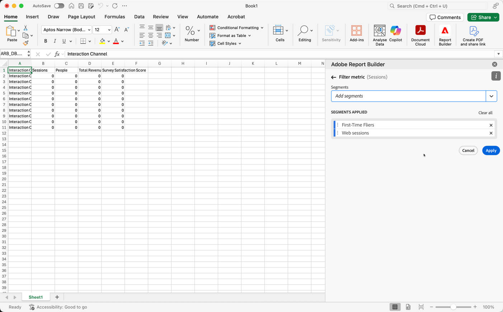
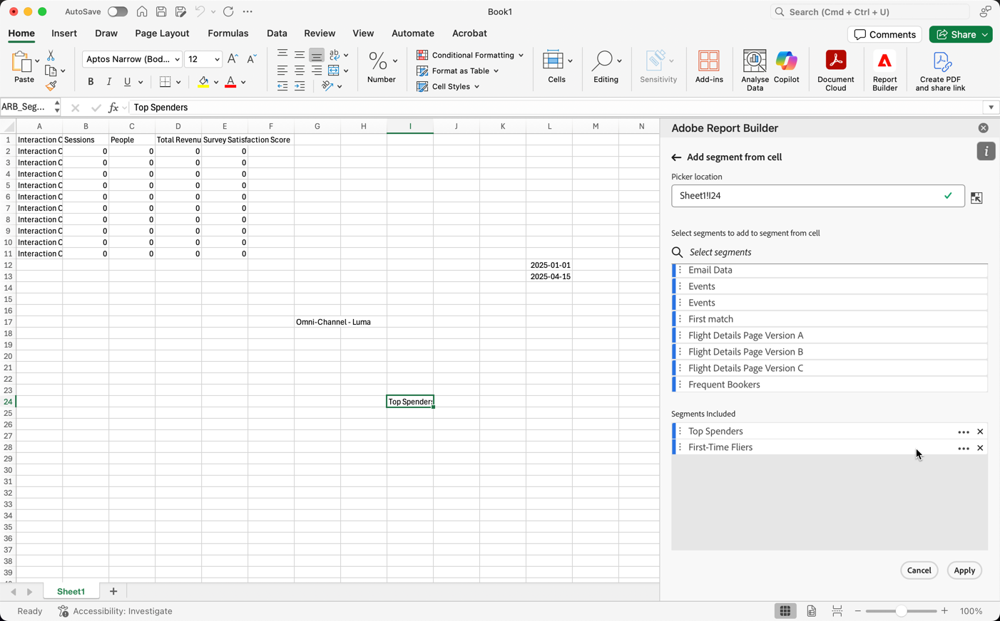
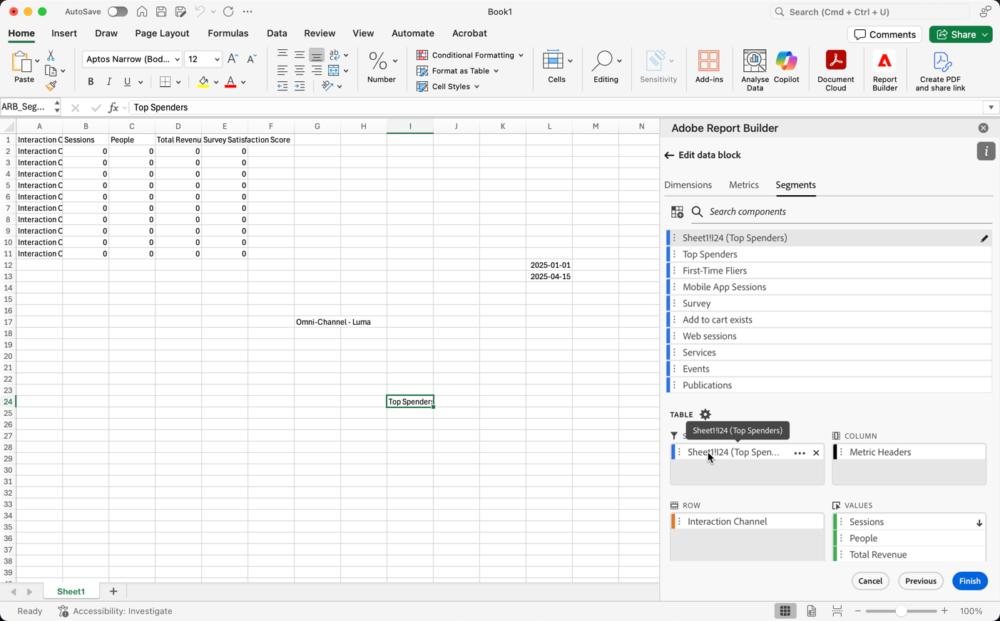
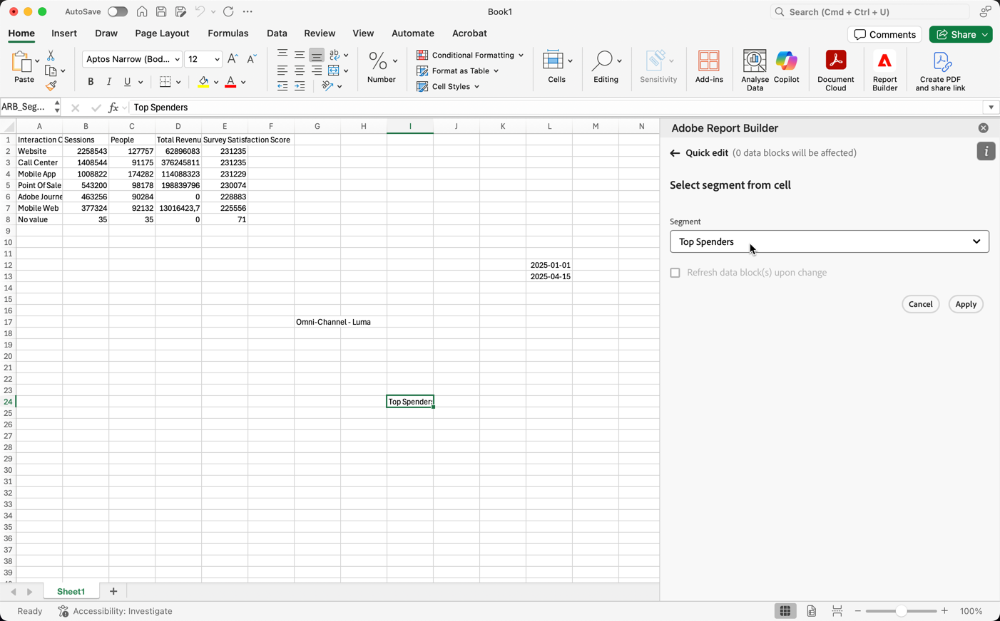

# Work with segments 

You can apply segments when you create a new data block or when you select **[!UICONTROL Edit data block]** from the **[!UICONTROL Commands]** panel.

## Apply segments to a data block

To apply a segment to the entire data block, Double select a segment or drag and drop segments from the components list into the segments section of the Table.

## Apply filters to individual metrics

To apply filters using segments to individual metrics:

* Drag and drop one or more segments from **[!UICONTROL Segments]** onto a metric in the table. 
   
* Alternatively:

  1. Select  for a specific metric in the **[!UICONTROL Table]** pane and then select **[!UICONTROL Filter metric]**. 

     {zoomable="yes"}

  1. Select one or more segments from **[!UICONTROL Segments]** drop-down menu. The segments are added to the **[!UICONTROL Segments applied]** list.

     
  1. Select  to remove a segment from the **[!UICONTROL Segment applied]** list. Or select **[!UICONTROL Clear all]** to remove all segments from the **[!UICONTROL Segment applied]** list.
  1. Select **[!UICONTROL Apply]**.

To view applied filters, hover over or select a metric in the Table pane. Metrics with applied segments display a segment icon.

## Quick edit segments

You can use the **[!UICONTROL Quick edit]** panel to add, remove, or replace segments for existing data blocks.

When you select a range of cells in the spreadsheet, the **[!UICONTROL Segments]** link in the **[!UICONTROL Quick edit]** panel displays a summary list of the segments used by the data blocks in that selection.

To edit segments using the **[!UICONTROL Quick edit]** panel:

1. Select a range of cells from one or multiple data blocks.

1. Select the **[!UICONTROL Segments]** link to launch the **[!UICONTROL Quick edit]** **[!UICONTROL Segments]** panel.

### Add or remove segments

You can add or remove segments using the Add/Remove options.

1. Select the **[!UICONTROL Add/Remove]** tab in the **[!UICONTROL Quick edit]** **[!UICONTROL Segments]** panel.

    
   1. Select one or more segments from **[!UICONTROL Segments]** drop-down menu. The segments are added to the **[!UICONTROL Segments applied]** list.
   1. Select  to remove a segment from the **[!UICONTROL Segment applied]** list.
   1. Select **[!UICONTROL Apply]**.

Report Builder displays a message to confirm the applied segment changes.

### Replace segments

You can replace an existing segment with another segment to change how the data is segmented.

1. Select the **[!UICONTROL Replace]** tab in the **[!UICONTROL Quick edit]** **[!UICONTROL Segments]** panel.

1. Use the **Search list** search field to locate specific segments.

1. Select one or more segments that you want to replace.

1. Search for one or more segments from the Replace with drop-down menu to add the segment to the **[!UICONTROL Replace with]** list.

1. Select **[!UICONTROL Apply]**.

Report Builder updates the list of segments to reflect the replacement.

## Define data block segments from cell

Data blocks can reference segments from a cell. Multiple data blocks can reference the same cell for segments, allowing you to switch segments easily for multiple data blocks at a time.

To apply segments from a cell:

1. [Create a new data block](create-a-data-block.md#create-a-data-block) or edit an existing data block.
1. Select the **[!UICONTROL Segments]** tab to define segments.
1. Select .
   
   {zoomable="yes"}

1. Select the cell from which you want the data blocks to reference a segment.
   
1. Double select to add a segment to the cell. Alternatively, drag and drop one or more segments into the **[!UICONTROL Segments included]** section. 

1. Select **[!UICONTROL Apply]** to create the reference cell.

1. From the **Segments** tab, add the newly created reference cell segment to your data block.

    {zoomable="yes"}

1. Select **[!UICONTROL Finish]**.

To apply the reference cell as a segment to other data blocks, use the cell reference as one of the segments in the **[!UICONTROL Segments]** list in the **[!UICONTROL Table]** tab. 

### Use a reference cell to change data block segments

1. Select the reference cell in your spreadsheet.

1. Select the link under **[!UICONTROL Segments from cell]** in the **[!UICONTROL Quick Edit]** menu.

    {zoomable="yes"}

1. Select your segment from the drop-down menu.

1. Select **[!UICONTROL Apply]**.

<!--
You can apply segments when you create a new data block or when you select the **Edit data block** option from the COMMANDS panel.

## Apply segments to a data block

To apply a segment to the entire data block, double-click a segment or drag and drop filters from the components list into the Segments section of the Table.

## Apply segments to individual metrics

To apply segments to individual metrics, drag and drop a segment onto a metric in the table. You can also click the **...** icon to the right of a metric in the Table pane and then select **[!UICONTROL Segment metric]**. To view applied segments, hover over or select a metric in the Table pane. Metrics with applied segments display a filter icon.

## Quick edit segments

You can use the Quick edit panel to add, remove, or replace segments for existing data blocks.

When you select a range of cells in the spreadsheet, the **[!UICONTROL Segments]** link in the Quick edit panel displays a summary list of the segments used by the data blocks in that selection.

To edit segments using the Quick edit panel

1. Select a range of cells from one or multiple data blocks.

    

1. Click the link underneath **[!UICONTROL Segments]** to launch the Quick edit - Filters panel.

    

### Add or remove a segment

You can add or remove segments using the Add/Remove options.

1. Select the **[!UICONTROL Add/Remove]** tab in the Quick edit-segments panel.

    All segments applied to the selected data blocks are listed in the Quick Edit-segments panel. Segments applied to all data blocks in the selection are listed under the **[!UICONTROL Applied to all selected data blocks]** heading. Segments applied to some but not all data blocks are listed under the **[!UICONTROL Applied to 1 or more selected data blocks]** heading.

    When multiple segments are present in the selected data blocks, you can search for specific segments using the **[!UICONTROL Add Filter]** search field.

    

1. Add segments by selecting segments from the **[!UICONTROL Add segment]** drop down menu.

    The list of searchable segments includes all segments accessible to the report suites that are present in one or more of the selected data blocks as well as all the segments that are available globally in the organization.

    Adding a segment applies the segment to all data blocks in the selection.

1. To remove segments, click the delete icon **x** to the right of segments in the **[!UICONTROL Segments applied]** list.

1. Click **[!UICONTROL Apply]** to save changes and return to the hub panel.

    Report Builder displays a message to confirm the applied segment changes.

### Replace a segment

You can replace an existing segment with another segment to change how the data is segmented.

1. Select the **[!UICONTROL Replace]** tab in the Quick edit-segment panel.

    

1. Use the **[!UICONTROL Search list]** search field to locate specific segments.

1. Choose one or more segments that you want to replace.

1. Search for one or more segments in the Replace with field.

    Selecting a filter adds it to the **[!UICONTROL Replace with]**... list.

1. Click **[!UICONTROL Apply]**.

    Report Builder updates the list of segments to reflect the replacement.

### Define data block segments from cell

Data blocks can reference segments from a cell. Multiple data blocks can reference the same cell for segments, allowing you to easily switch segments for multiple data blocks at a time.

To apply segments from a cell

1. Navigate to Step 2 in either the data block creation or editing process. See [Create a Data Block](./create-a-data-block.md).
1. Click the **[!UICONTROL Segments]** tab to define filters.
1. Click **[!UICONTROL Create segment from cell]**.

    

1. Select the cell from which you want the data blocks to reference a segment.
   
1. Add the segment choice you wish to add to the cell by either double clicking the segment, or by dragging and dropping it into the **[!UICONTROL Segments Included]** section. 
   
   Note: Only one choice may be selected for the given cell at one time.

    

1. Click **[!UICONTROL Apply]** to create the reference cell.

1. From the **[!UICONTROL Segments]** tab, add the newly created reference cell segments to your data block.

    

1. Click **[!UICONTROL Finish]**.

    Now this cell can be referenced by other data blocks in their segments. To apply the reference cell as a segment to other data blocks, simply add the cell reference to their segments from the Segments tab. 

#### Use the reference cell to change data block segments

1. Select the reference cell in your spreadsheet.

1. Click the link under **[!UICONTROL Segments from Cell]** in the Quick Edit menu.

    

1. Select your segment from the drop-down menu.

    

1. Click **[!UICONTROL Apply]**.
-->