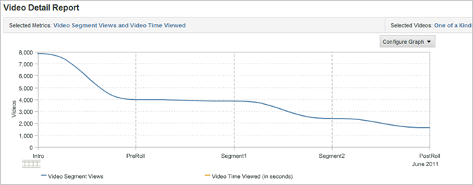
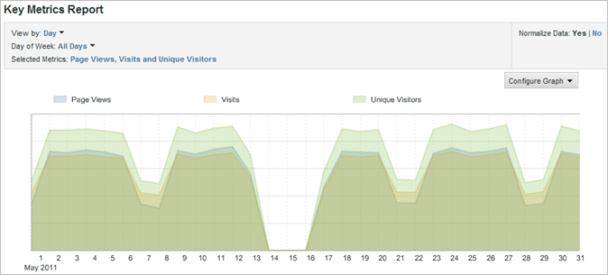
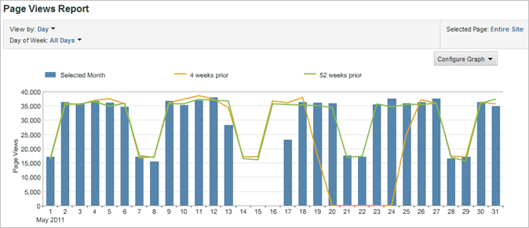
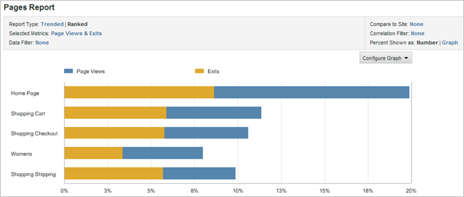
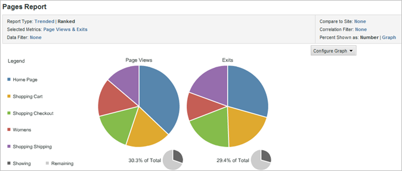
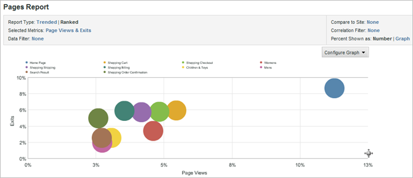

# Change report graphs

{{ra-eol}}

You can customize the graph so that it is most useful for the intended audience.

The type of graphs available depend on the type of report you run. For example, Trend Line graphs are useful for trended reports, but you can also use a Vertical Bar graph with trend lines that clearly illustrate trends over days, weeks, months, and so on. Alternatively, you can choose a Pie chart to illustrate percentages for the pages viewed.

To change a report graph:

1. Run a report.
1. Click **[!UICONTROL Configure Graph]**.
1. Select a graph type.

   **[!UICONTROL Trend Line]**: Trend lines show daily trends for the report metrics and are useful for trending one metric over time per line.

   

   **[!UICONTROL Smooth Line]**: You use this graph type with the [!UICONTROL Video Detail Report]. It shows the numbers or percentages of views for specific segments of a video. A rise in views for a specific segment of the video indicates that viewers rewound and viewed that section of the video multiple times. If using percentages, the percentage shown in the graph is a percentage of all segments viewed, not a percentage of viewers who saw the segment. For example, in the graph the sum of all the report segments is 39. The number of views for the 0 to 10-seconds segment is 10. Therefore, the percentage of views for this segment is approximately 26 percent.

   

   **[!UICONTROL Area]**: The Area graph is similar to the Trend Line graph but fills in the area below the lines. You must be viewing a trended report to display the Area graph.

   

   **[!UICONTROL Stacked Area]**: Stacked Area charts are useful when trending a number of products or campaigns over time. For example, if you trend the top five products showing revenue, you can quickly see how much total revenue those products bring in over time. You can refine the view by using a search filter to include or exclude specific products.

   

   **[!UICONTROL Vertical Bar]**: The Vertical Bar chart shows relative percentages for the report metrics.

   

   **[!UICONTROL Stacked Vertical Bar]**: By stacking similar items you can get a quick view of the total influence of an item. For example, in a [!UICONTROL Campaign Report], you can stack similar success metrics and see which campaign is generating the most total success. Stacking makes it easier to find campaigns that are not the top performers in one metric but are top performers in a combination of metrics.

   

   **[!UICONTROL Horizontal Bar]**: The Horizontal Bar chart is similar to the Vertical Bar chart, but the columns are horizontal.

   

   **[!UICONTROL Stacked Horizontal Bar]**: The Stacked Horizontal Bar chart is similar to the Vertical Bar chart, but the columns are horizontal.

   

   **[!UICONTROL Pie]**: The Pie chart shows the top metric value percentages in relation to each other, and shows the percentage of the selected metrics in relation to the whole. You can display the Pie chart for ranked reports.

   

   **[!UICONTROL Scatter]**: The Scatter graph shows a scatter display of the metrics you select in relation to each other. Scatter graphs let you visualize data in two dimensions, so that you can identify which items are outliers.

   

   **[!UICONTROL Bubble]**: The Bubble graph shows a bubble display of the metrics you select in relation to each other. The location of the bubbles shows the relationships between the metrics on the horizontal and vertical axis, while the size of the bubble portrays the main report metric. Bubble graphs let you visualize data in two dimensions, so that you can identify which items are outliers.

   
