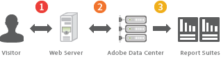

# About Data Collection{#about-data-collection}

Learn about how data is collected for Adobe Analytics.

Every page Adobe tracks has a small snippet of Adobe-authorized JavaScript code. Your account manager provides this code.

At a high level, the data collection process flows as follows:

1. A visitor visits a web page that contains the data collection code. 
1. As the page loads, data collection code sends an image request (called a web beacon) to Adobe data collection servers. The image request contains the data you want to collect about the visitor's interaction with your website. 
1. Adobe stores the data in report suites. You can log in to access report suite data and generate reports related to visitor activity on your website.

Data collection is very quick and does not noticeably affect page load times. Collected data includes page views that result from clicking the browser **Reload** or **Back** buttons. The JavaScript code runs even when the page is retrieved from cache.

See [Data Collection in Marketing Reports](http://marketing.adobe.com/resources/help/en_US/reference/index.html?f=usecase_sending_data_to_sc) in [Analytics Reference Help](https://marketing.adobe.com/resources/help/en_US/reference/index.html). 
