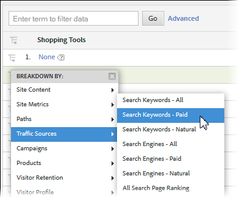

# Subrelations

{{ra-eol}}

Full subrelations are enabled on all conversion reports, so you can break down any eVar by another eVar. The Breakdown By menu in the report table matches the standard Analytics reporting menu, keeping selections consistent

 

## How Subrelations Work {#section_5BD862BB74FE411B96B59204520E4631}

To help illustrate how subrelations work, consider the following example:

1. A user comes to your site via Campaign_A and arrives on the home page.
1. The user searches for 'cats', and is shown the search results. eVar1 keeps track of internal search terms.
1. The user subscribes to a mailing list, which is tracked using event1.
1. A different user comes to your site also via Campaign_A and arrives on your home page.
1. This user searches for 'kittens', and is shown search results (eVar1), and also subscribes to the mailing list (event1).

If you pulled a Tracking code report, you would see the following:

If you pulled an eVar1 report, you would see the following:

If you subrelated the Campaign report by eVar1, you would get the following:

If you subrelated the eVar1 report by Campaigns, you would get the following:

Due to the persistent nature of conversion variables, there are two data columns used to store eVar values; the value that is fired, and the value that persists. If we were to look at a raw data export for this example, it would look like this (simplified for this example):

Our backend works by allowing post_campaign and post_evar1 to persist the values defined in campaign and evar1. Subrelation reports specifically only look at the hits containing success events (rows highlighted in light yellow). They then populate the subrelation reports based on the persisted values (in this case post_campaign and post_evar1, cells highlighted in bright yellow).

In essence, subrelations follow these steps to populate your report:

* Isolate the image requests containing the success event(s) you are viewing in the report.
* Return the persisted values from each conversion variable used in the subrelation.
* Organize the values based on the order of subrelation. If a variable does not have a persisted value (such as if an eVar was never defined or expired), it will be bucketed under 'None'.
