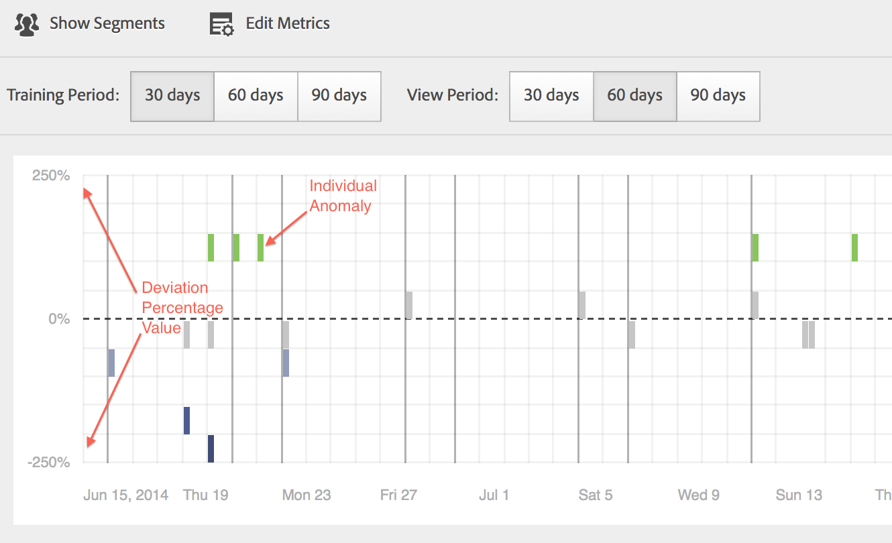

# Run different report types

Steps on running the different report types.

## Run a ranked report {#task_C570BA4A213F4F2EB7B30E012934BE7D}

In a ranked report, the table shows the rankings of the report pages in relation to the metric, according to number or percentage. Ranked reports can display multiple metrics in a report.

1. Generate a report, such as a [!UICONTROL Pages Report] ( **[!UICONTROL Reports]** > **[!UICONTROL Site Content]** > **[!UICONTROL Pages]**).
1. In the report header, click **[!UICONTROL Ranked.]**
1. To rank the report, click a column heading in the table.

   Ranked reports can have up to 200 items listed in the table (such as products, categories, web pages, and so on) and ten metrics (revenue, orders, views, and so on).

## Run a trended report {#task_F03B4E760B9E4EA29FC3F654E6316887}

Trended reports display metrics over time. You use this report type when you want to see how a segment performs from one time period to the next.

Most Conversion and Traffic reports have a Trended view available. Using the [!UICONTROL Calendar], you can show improvement for any time period breakdowns, including days of a month, weeks of a year, weeks of a quarter, months of a year, and so on. Trended reports show trends for a single metric (revenue, orders, views, and so on) for up to five items (such as products, categories, web pages, and so on).

**To run a trended report** 

1. Run a conversion or traffic report, such as **[!UICONTROL Reports]** > **[!UICONTROL Site Content]** > **[!UICONTROL Pages]**.
1. Under **[!UICONTROL Report Type]**, click **[!UICONTROL Trended.]**

## Run a Fallout report {#task_8FD97C8260464F9DA731A93DB8F80184}

The [!UICONTROL Fallout Report] shows the number of visitors who visited a pre-specified sequence of pages. It also shows conversion and fallout rates between each step.

Check out the new [Fallout Analysis](https://experienceleague.adobe.com/docs/analytics/analyze/analysis-workspace/visualizations/fallout/fallout-flow.html) panel in Analysis Workspace! 

1. In [!UICONTROL Adobe Analytics], click **[!UICONTROL Reports]** > **[!UICONTROL Paths]** > **[!UICONTROL Pages]** > **[!UICONTROL Fallout]**.
1. On the [!UICONTROL Fallout Report] page, click **[!UICONTROL Launch the Fallout Report Builder]**.

   

1. On the [!UICONTROL Define Checkpoints] page, specify the checkpoints that you want to use for the report.
1. Click **[!UICONTROL Run Report]**.

   

>[!MORELIKETHIS]
>
>* [Fallout Report Description](https://experienceleague.adobe.com/docs/analytics/components/variables/dimensions-reports/reports-fallout.html)

## Run a Page Flow report {#task_133E8B87C3F04DA0A42D10CBA499305B}

Page Flow reports show the order in which your visitors access pages and navigate through your site. This report helps answer

Check out the new [Flow visualization](https://experienceleague.adobe.com/docs/analytics/analyze/analysis-workspace/visualizations/fallout/fallout-flow.html) in Analysis Workspace!

Run a [Paths](https://experienceleague.adobe.com/docs/analytics/components/variables/dimensions-reports/reports-paths.html) report.

For example, click **[!UICONTROL Reports]** > **[!UICONTROL Paths]** > **[!UICONTROL Pages]** > **[!UICONTROL Next Page Flow]**.

You read this report from left to right, beginning with the selected page. The pages that were viewed after the selected page are illustrated as a branch extending to the right.

The percentage that each subsequent page was viewed is displayed beside the name of the page. The width of the line connected to each next-page depicts this relative percentage.

**[!UICONTROL Path Views]**: Indicates the number of times a page was viewed, when constrained to the displayed paths.

For example, the Privacy Policy page could have 10,000 total page views, but only 500 of those page views occurred immediately following the Home Page. Thus, the term path view is used.

The relative percentage is depicted by the relative width of the line. By default, this report displays five 2nd-level branches and five 3rd-level branches. You can expand the number of branches to view up to ten 2nd-level branches and five 3rd-level branches. Doing so increases the height of the report and most likely requires scrolling to view the entire graph.

## Run a marketing channel report {#task_64ADED5CC75248319E06E3E029B47F78}

Marketing Channel reporting provides an overview report of the first and last-touch channel allocation, with standard reporting metrics like revenue, orders, and cost. These reports enable you to analyze how much revenue each channel generates.

See the [Marketing Channel](/help/components/c-marketing-channels/analyze-mc.md) help system for more information.

## Run an Anomaly Detection report {#task_4808C96327354D789C075823F5C3A049}

Describes how to interpret the Summary and Individual Metric charts in Anomaly Detection.

Check out the new [Anomaly Detection and Contribution Analysis](https://experienceleague.adobe.com/docs/analytics/analyze/analysis-workspace/virtual-analyst/anomaly-detection/anomaly-detection.html) features in Analysis Workspace!

**[!UICONTROL Reports]** > **[!UICONTROL Site Metrics]** > **[!UICONTROL Anomaly Detection]** .

>[!NOTE]
>
>You can also run Anomaly Detection from within Analysis Workspace projects. [More...](https://experienceleague.adobe.com/docs/analytics/analyze/analysis-workspace/virtual-analyst/anomaly-detection/anomaly-detection.html)

For information on setting up Anomaly Detection, refer to the [Reference Guide](https://experienceleague.adobe.com/docs/analytics/analyze/reports-analytics/getting-started.html#Setting_up_Anomaly_Detection).

Anomaly Detection shows two types of charts: A summary chart and individual metrics charts. Individual metric charts are only shown if at least one anomaly has been detected for that metric.

<table id="table_88163CD8FC164342855D90D01F9C581A"> 
 <thead> 
  <tr> 
   <th colname="col1" class="entry"> 
Type of chart 
 </th> 
   <th colname="col2" class="entry"> 
What is does 
 </th> 
  </tr> 
 </thead>
 <tbody> 
  <tr> 
   <td colname="col1"> 
Summary chart 
 
 
 </td> 
   <td colname="col2"> 
 
     <ul id="ul_D26DA3024CD7468291369F549557B28A"> 
      <li id="li_1C22B6E02FFB479FB71EFAD89EB37A4E">Each box represents one anomaly, tracked per day, that corresponds to a metric below. </li> 
      <li id="li_8FC587D3FF4E452D83263CC7A10B6675">Green indicates anomalies above the trend line, blue below the trend line. </li> 
      <li id="li_25135AB691BF443599AF2A3A60E2E71A">Indicates the strength of the anomaly: The greater the anomaly, the darker the color of the data point and the farther away from the trend line. </li> 
      <li id="li_0C42AFA8897D420D8AB1A5D0F65B3B3A">Clicking on individual anomalies brings that anomaly's individual metric chart (underneath the summary chart) to the top. </li> 
      <li id="li_85C0F426952547B5A75D6BD31DE19CA5">The deviation percentage values (left of chart) are calculated as follows: 
       <ul id="ul_BEC0A88BFFAC4CF78BC9885FEB749694"> 
        <li id="li_1BAB2F50482745B69937DFAF1E09982E">If the upper bounds and the expected value are the same, the deviation % is 100% </li> 
        <li id="li_CA48064F5788448C8646CCE196161237">Otherwise the deviation % is ((actual value - upper bound value) / (upper bound value - expected value)) * 100 </li> 
        <li id="li_4090357A0D214BC7B1C3DE0615875554">If the lower bounds and the expected value are the same, the deviation % is -100% </li> 
        <li id="li_EF694E1A4E874ECD94E1E8F7302E494F">Otherwise the deviation % is ((lower bound value - actual value) / (expected value - lower bound value)) * -100 </li> 
       </ul> </li> 
      <li id="li_5C05EF7023484CC993E96D63E842B65C">Clicking  Show Segments  brings up the segment rail that lets you apply segments to an anomaly detection report. <a href="https://experienceleague.adobe.com/docs/analytics/components/segmentation/seg-home.html"  > More </a> on segmentation. </li> 
      <li id="li_1B41CABF13D1407886C68EE3BC201E60">Clicking  Edit Metrics lets you select and unselect metrics for which you want to detect anomalies. </li> 
     </ul> 
 </td> 
  </tr> 
  <tr> 
   <td colname="col1"> 
Individual metric chart 
 
 
 </td> 
   <td colname="col2"> 
 
     <ul id="ul_739C5687013743A29B63089FDA763F45"> 
      <li id="li_456A0BDA4D4E46CE9CC1C3DBAA1E2220">Displays anomalous data points for individual trended metrics (including calculated metrics) as dots. </li> 
      <li id="li_89FD847C65F04F48BCA7CD38D0EC51CD">Shows the most recent anomaly on top, and secondarily ranks by number of anomalies. </li> 
      <li id="li_98B97A9706DE4455B8D8850904CBDE03">Displays a solid line to indicate actual data currently collected. This is compared to the forecast and margin of error to derive whether data points are anomalous. </li> 
      <li id="li_0EEA38DDDC344BF3879430E67D74EB72">Displays a dotted line that represents a forecast based on historical data (i.e., the training period). </li> 
      <li id="li_035BD2725D004AEDB630BF8DFF4DA4F3">Displays upper and lower 95% confidence intervals/bounds in a gray shade. </li> 
      <li id="li_021A3D1F2EDB4319B9B39620EF1C038A">Lets you collapse and expand individual reports by clicking the double up or down arrows next to the metric name. </li> 
      <li id="li_722E4B9FC21047AC96D7B143197E293D">Changes the order in which the metric charts appear by reacting to drill-downs in the overview report (see above) </li> 
      <li id="li_A2441169B185475AA68A64F81E6E40B8">Lets you filter charts by using search terms, such as "page" for all page-related metrics. </li> 
      <li id="li_F1BBBFCA8E2A43C29658E4FCAA36C904">Lets you display all metrics you defined or only those with anomalies. </li> 
     </ul> 
 </td> 
  </tr> 
 </tbody> 
</table>

## Setting up Anomaly Detection {#task_AF347B34F56E44A6AE70E019B6EB2F08}

Steps to select report suites, metrics, and training/view periods for anomaly detection.

<!-- 

t_anomaly_config.xml

 -->

You set up Anomaly Detection independently for each report suite.

1. Navigate to  **[!UICONTROL Analytics > Reports > Site Metrics > Anomaly Detection]** .
1. Select the report suite for which you want to track daily anomaly detection. To display a list of report suites, click the Report Suite selector drop-down menu.
1. To select the metrics and/or define filtered metrics, click **[!UICONTROL Edit Metrics]** at the top right of the screen:  .

   You can pick metrics from the list (including calculated metrics) of all metrics or from a list of tracked metrics. You can also filter on specific terms to narrow down the list. 1. Once the report has been generated, define the **[!UICONTROL Training Period]** and the **[!UICONTROL View Period]** for anomaly detection. (Think of the training period as the "learning period" for the algorithm.)

   

   Keep in mind that:

* The training period ends right before the view period starts.
* The default for both is 30 days, and you can extend them to 60 or 90 days.
* Extending the training period puts your data in a larger context and may reduce the size of an anomaly.

   The Anomaly Detection metrics report refreshes every time you change a parameter.
1. (Optional) Apply segments to the report by clicking **[!UICONTROL Show Segments]** and selecting one or more existing segments or creating a new segment and applying it.

   

   See the [Analytics Segmentation Guide](https://experienceleague.adobe.com/docs/analytics/components/segmentation/seg-home.html) for more information on creating and managing segments. 1. (Optional) Favorite or bookmark the report.
1. (Optional) Change the end date of the View Period. The default is yesterday.
1. You can now start interpreting the report. [Viewing Anomaly Detection charts](/help/analyze/reports-analytics/t-running-report-types.md#task_4808C96327354D789C075823F5C3A049).

## Run a Real-Time report {#task_5D25929C918E40B18965222FA94176B0}

Describes how to view and interpret real-time reports.

<!-- 

reports_realtime.xml

 -->

**[!UICONTROL Reports > Site Metrics > Real-Time]** .

Real-Time reporting offers two main reports - an overview report and a detail report. They each consist of a number of reportlets.

For information on configuring real-time reports, see the [Analytics Reference Guide](https://experienceleague.adobe.com/docs/analytics/landing/home.html#RealTime_Reports_Configuration).

1. Take a look at the **[!UICONTROL Overview]** report and its components:  

   <table id="choicetable_8586BECF55E843B2B5CD41205567EA32"> 
   <thead class="chhead sthead"> 
   <th class="choptionhd"> UI Component </th> 
   <th class="chdeschd"> Description </th> 
   </thead> 
   <tr class="chrow strow"> 
   <td class="choption"><strong>Select Report Suite</strong></td> 
   <td class="chdesc stentry"> Shows the report suite that this real-time report covers. To change the report suite, see <a href="https://experienceleague.adobe.com/docs/analytics/admin/admin-tools/real-time-reports/t-realtime-admin.html"  > Real-Time Reports Configuration </a>. </td> 
   </tr> 
   <tr class="chrow strow"> 
   <td class="choption"><strong>Switch among reports</strong></td> 
   <td class="chdesc stentry"> Lets you switch among the reports you have set up (maximum of 3.) </td> 
   </tr> 
   <tr class="chrow strow"> 
   <td class="choption"><strong>Select time range</strong></td> 
   <td class="chdesc stentry"> Lets you choose the overall time range to be used by all reportlets in the report. </td> 
   </tr> 
   <tr class="chrow strow"> 
   <td class="choption"><strong>Configure reports</strong></td> 
   <td class="chdesc stentry"> This gear icon link is visible only if you have Admin rights. Clicking it takes you to the Report Suite Manager under   Admin Tools   &gt;  Report Suites   &gt;  Edit Settings   &gt;  Real-Time  . </td> 
   </tr> 
   <tr class="chrow strow"> 
   <td class="choption"><strong>Full-screen view</strong></td> 
   <td class="chdesc stentry"> The full-screen view icon is visible only if your monitor has a specific aspect ratio (either 16:9 or 16:10) AND if your browser supports it. Note that you cannot interact with the screen while it is in full-screen mode (press  Esc  to exit). Full-screen mode does not time out. </td> 
   </tr> 
   <tr class="chrow strow"> 
   <td class="choption"><strong>Site Traffic Reportlet</strong></td> 
   <td class="chdesc stentry"> The blue trend line data shows the traffic total for the overall site. The X axis uses literal labels (15 minutes ago, 10 minutes ago) except for the current value, which is shown as a real-time expression. </td> 
   </tr> 
   <tr class="chrow strow"> 
   <td class="choption"><strong>Site Total Reportlet</strong></td> 
   <td class="chdesc stentry"> Presents a count of the Site Total for the real-time report's selected metric for the last N minutes. "N" is configurable through the Time Range selector. 
The arrow color and direction are based on the following algorithm: 
      <ul id="ul_9F40CEA33798467393CB1266BB36D500"> 
      <li id="li_CCD01A44F912487DA5681EA50113643C">Significant Gain (Up arrow): &gt; 100% </li> 
      <li id="li_7402491A9A614851B7F2AE0C77BD9A97">Gain (Up Right arrow): between 5 % and 100% </li> 
      <li id="li_BCA79C08B5714D4B9315068112C66107"> Flat (Right arrow): between 5% and -5% </li> 
      <li id="li_234ECBD7D83A4AE680E4A70BF288681F"> Loss (Down Right arrow): between -5% and -100% </li> 
      <li id="li_10C5EA8803604C1CA714D3DB27478B31"> Significant Loss (Down arrow): &lt; -100% </li> 
      </ul> 
 
If the site total is reported in "instances", these instances reflect the dimension in the primary reportlet. If an instance-specific name exists (such as "Page Views",) the site total reports that name. 
 </td> 
   </tr> 
   <tr class="chrow strow"> 
   <td class="choption"><strong>Primary Reportlet</strong></td> 
   <td class="chdesc stentry"> Report for the Real-Time report's primary dimension and for its metric. Presents a trend line for that element for the selected time range. The metric total represents the sum for the full trend line. The arrow indicates if the item is strongly gaining, gaining, flat, losing or strongly losing. </td> 
   </tr> 
   <tr class="chrow strow"> 
   <td class="choption"><strong>Search Dialog</strong></td> 
   <td class="chdesc stentry"> The search impacts all reportlets. Search persists as you view the report. </td> 
   </tr> 
   <tr class="chrow strow"> 
   <td class="choption"><strong>Sort by... Most Popular/Gainers/ Losers</strong></td> 
   <td class="chdesc stentry"> You can toggle to sort by  Most Popular (default),  Gainers  (dimensions showing the most growth), and  Losers  (dimensions that are on a downward trajectory.) 
Here is the formula that is used to determine gainers or losers: Real-Time looks at the earliest sample and the next-to-latest sample and does a simple "% change" calculation. So if "Last 15 minutes" is selected, and n represents the current minute, n-1 is compared to n-15. Real-Time does not currently do any weighting. The current minute is ignored because it is not complete and would likely produce a false % change. 
 
This formula is consistent across all metrics used in the real-time report. 
 </td> 
   </tr> 
   <tr class="chrow strow"> 
   <td class="choption"><strong>Secondary 1 Reportlet</strong></td> 
   <td class="chdesc stentry"> Presents Real-Time Reports for the second provisioned report's dimension and for the metric. 
The secondary 1 reportlet shows the top 4 categories; the 5th one is an aggregation of all remaining values. For each category, the total raw view of that category is provided. In addition, the total for all categories is shown in the center. 
 
 Hovering on a section highlights the associated category, and displays the category trend line below the donut. 
 
 Hovering on a line item highlights the line item plus the associated section and displays the category trend line below the donut. 
 </td> 
   </tr> 
   <tr class="chrow strow"> 
   <td class="choption"><strong>Secondary 2 Reportlet</strong></td> 
   <td class="chdesc stentry"> Presents Real-Time Reports for the third provisioned report's dimension and for the metric. Hovering on top of the item label slides the label to the right and reveals a trend line for the hovered item. </td> 
   </tr> 
   </table>    
   
1. Click a list item in the Primary Reportlet to launch the **[!UICONTROL Details]** view for that list item:  

   | **Item Trend Reportlet** | Presents the trend line of the item that was selected in the Overview Report for the last N minutes. N is configurable through the Time Range selector.  |
   |---|---|
   | **Item Total Reportlet** | Presents a total metric count for the item that was selected in the Overview Report for the last N minutes. N is configurable through the Time Range selector.  |
   | **Correlated Secondary 1 Reportlet** | This reportlet is very similar to the Secondary 1 Reportlet. The only difference is the data source used to populate this report: in this example, it shows the correlation (or breakdown) between a specific page (the one you selected in the primary reportlet of the Overview report) and the instances viewed.  |
   | **Correlated Secondary 2 Reportlet** | This reportlet is very similar to the Secondary 2 Reportlet. The only difference is the data source used to populate this report: in this example, it shows the correlation (or breakdown) between a specific page (the one you selected in the primary reportlet of the Overview report) and the language dimension.  |
